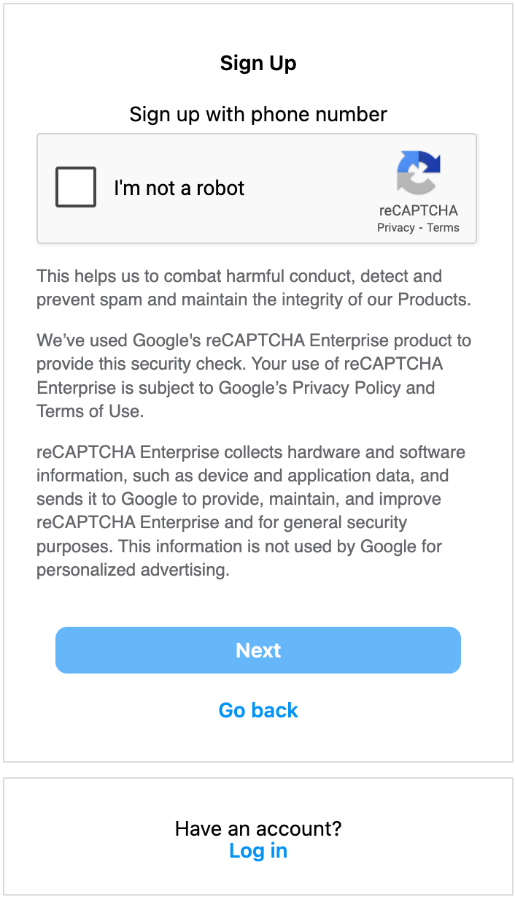
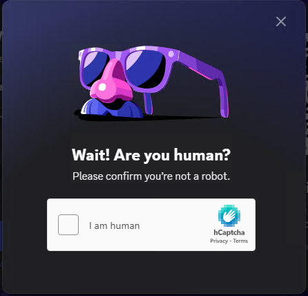
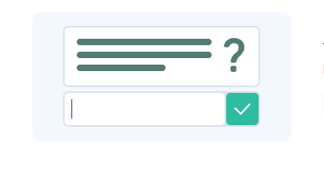
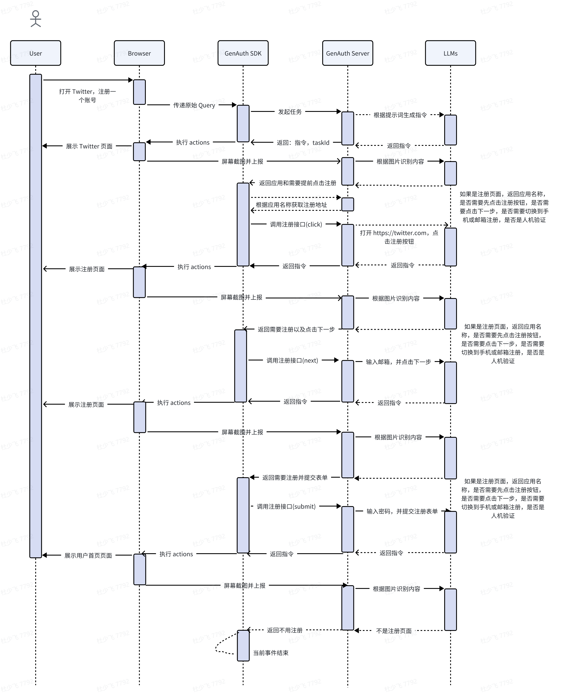

# AgentAuth Server API 文档

本文档详细说明了 GenAuth SDK 与 AgentAuth Server 端交互的 API 列表，包括业务事件、浏览器事件以及核心的 RESTful 接口。

## 1. 业务事件列表 (Server to SDK)

这些事件由 GenAuth Server 端主动发送给 SDK 端，SDK 端需要订阅并处理这些消息。

| 事件名称         | 事件作用                                   | 备注            |
| :--------------- | :----------------------------------------- |:--------------|
| `message`        | 服务端响应的消息事件                       | 展示思考过程使用      |
| `browser_event`  | 需要执行浏览器浏览器事件                   | 执行 CDP 指令使用   |

**浏览器事件输出示例 (JSON)**

```json
{
  "actions": [
    {"method": "navigate", "value": "https://www.instagram.com"},
    {"method": "wait", "selector": "#kw", "options": {"timeout": "5s"}},
    {"method": "insertText", "selector": "#kw", "value": "AI"},
    {"method": "click", "selector": "#su"}
  ]
}
```

## 2. 浏览器事件列表 (CDP 指令，由 `browser_event` 携带)

这些是 GenAuth Server 端生成的浏览器自动化指令，SDK 端通过 `browser_event` 事件接收并使用 `chromedp` 或类似工具执行。

| 事件名称     | 事件作用                               |
| :----------- | :------------------------------------- |
| `navigate`   | 导航，打开某个网页地址                 |
| `click`      | 点击某个菜单或按钮                     |
| `wait`       | 等待某个元素加载完，需要自己定制代码处理 |
| `insertText` | 输入数据到某个元素                     |
| `scroll`     | 鼠标滚动，上或下                       |

## 3. 思考过程消息事件 (由 `message` 携带)

SDK 调用 Server 的业务接口后，Server 会把整个思考过程通过 SSE 响应给客户端。

*   **请求参数**: 无
*   **响应参数**:
    ```json
    {
        "taskId": "b9c2d2b7-eae0-4d37-a86e-b8606a74ffb4",
        "action": "message",
        "otherData": "",
        "message": "正在生成思考过程"
    }
    ```
### 3.1 开始分析当前页面

*   **请求参数**: 无
*   **响应参数**:
    ```json
    {
        "taskId": "b9c2d2b7-eae0-4d37-a86e-b8606a74ffb4",
        "action": "message",
        "otherData": "",
        "message": "开始分析当前页面，地址：https://www.instagram.com/accounts/emailsignup/"
    }
    ```

### 3.2 结束分析当前页面

*   **请求参数**: 无
*   **响应参数**:
    ```json
    {
        "taskId": "b9c2d2b7-eae0-4d37-a86e-b8606a74ffb4",
        "action": "message",
        "otherData": "{\"current_page\":\"register\",\"application_name\":\"Instagram\",\"login_step\":\"none\",\"switch_page\":\"none\",\"login_type\":\"none\",\"register\":{\"register_type\":\"email\",\"register_step\":\"submit\"},\"human_machine\":\"none\",\"country\":\"US\"}",
        "message": "结束分析当前页面"
    }
    ```
### 3.3 开始自动化注册或登录流程

*   **请求参数**: 无
*   **响应参数**:
    ```json
    {
        "taskId": "b9c2d2b7-eae0-4d37-a86e-b8606a74ffb4",
        "action": "message",
        "otherData": "{\"current_page\":\"register\",\"application_name\":\"Instagram\",\"login_step\":\"none\",\"switch_page\":\"none\",\"login_type\":\"none\",\"register\":{\"register_type\":\"email\",\"register_step\":\"submit\"},\"human_machine\":\"none\",\"country\":\"US\"}",
        "message": "开始自动化注册流程，整个过程可能需要几分钟的时间~"
    }
    ```
### 3.4 租赁临时邮箱或手机号

*   **请求参数**: 无
*   **响应参数**:
    ```json
    {
        "taskId": "b9c2d2b7-eae0-4d37-a86e-b8606a74ffb4",
        "action": "message",
        "otherData": "",
        "message": "租赁邮箱中，请耐心等待~"
    }
    ```
### 3.5 完成租赁

*   **请求参数**: 无
*   **响应参数**:
    ```json
    {
        "taskId": "b9c2d2b7-eae0-4d37-a86e-b8606a74ffb4",
        "action": "message",
        "otherData": "",
        "message": "已完成邮箱租赁，将继续为您操作剩下的步骤~"
    }
    ```
### 3.6 填充邮箱或手机号

*   **请求参数**: 无
*   **响应参数**:
    ```json
    {
        "taskId": "b9c2d2b7-eae0-4d37-a86e-b8606a74ffb4",
        "action": "message",
        "otherData": "",
        "message": "邮箱注册成功，自动填充中：ejirtbuu157@outlook.com"
    }
    ```
### 3.7 读取验证码

*   **请求参数**: 无
*   **响应参数**:
    ```json
    {
        "taskId": "b9c2d2b7-eae0-4d37-a86e-b8606a74ffb4",
        "action": "message",
        "otherData": "",
        "message": "读取邮箱验证码中"
    }
    ```
### 3.8 等待读取验证码

*   **请求参数**: 无
*   **响应参数**:
    ```json
    {
        "taskId": "b9c2d2b7-eae0-4d37-a86e-b8606a74ffb4",
        "action": "message",
        "otherData": "",
        "message": "第1次读取邮箱验证码，间隔 5 秒，最长读取 15 分钟，邮箱账号:ejirtbuu157@outlook.com"
    }
    ```

### 3.9 输入验证码

*   **请求参数**: 无
*   **响应参数**:
    ```json
    {
        "taskId": "b9c2d2b7-eae0-4d37-a86e-b8606a74ffb4",
        "action": "message",
        "otherData": "",
        "message": "执行输入邮箱验证码中"
    }
    ```
### 3.10 人机验证分析

*   **请求参数**: 无
*   **响应参数**:
    ```json
    {
        "taskId": "b9c2d2b7-eae0-4d37-a86e-b8606a74ffb4",
        "action": "message",
        "otherData": "",
        "message": "正在分析当前人机验证类型"
    }
    ```
### 3.11 人机验证破解

*   **请求参数**: 无
*   **响应参数**:
    ```json
    {
        "taskId": "b9c2d2b7-eae0-4d37-a86e-b8606a74ffb4",
        "action": "message",
        "otherData": "",
        "message": "正在破解当前 recaptcha 人机验证"
    }
    ```

  
## 3. 核心 API 列表

### 3.1. 连接 SSE

用于 SDK 连接 Server 端，使用 SSE 协议接收实时事件。

*   **请求地址**: `/server/v1/sse`
*   **请求方法**: `GET`
*   **请求参数**: 无
*   **响应参数**:
    ```json
    {
        "apiCode": 1000,
        "message": "连接成功",
        "data": {
            "action": "connected",
            "sessionId": "258cf6cb-0859-4743-81d4-716121efe886"
        }
    }
    ```
    | 参数      | 类型    | 备注                        |
        | :-------- | :------ |:--------------------------|
    | `apiCode` | `int`   | `10000`：成功，`50000`：业务内部异常 |
    | `message` | `varchar` | 连接成功                      |
    | `data`    | `object`  | 当前 `sessionId`            |

---

### 3.2. Ping 包

服务端定时向 SDK 端发送 Ping 包事件，维持连接和检测连接状态，客户端订阅该事件。

*   **请求参数**: `{"ping":"keep-alive"}`
*   **响应参数**: 无

---

### 3.3. 连接成功事件

SDK 连接 Server 成功后，Server 会返回当前连接信息，客户端需要订阅该事件。

*   **请求参数**: 无
*   **响应参数**:
    ```json
    {"apiCode":10000,"message":"连接成功","data":{"action":"connected","sessionId":"162a4e39-6fce-4761-977b-a67e57a32ed3"}}
    ```

---

### 3.4. 转换自然语言到浏览器指令消息事件

SDK 调用 Server 的发起任务接口后，Server 会把自然语言转浏览器指令过程通过 SSE 响应给客户端。

*   **请求参数**: 无
*   **响应参数**:
    ```json
    {
        "taskId": "b9c2d2b7-eae0-4d37-a86e-b8606a74ffb4",
        "action": "message",
        "otherData": "",
        "message": "转换自然语言到浏览器指令中"
    }
    ```

---

### 3.5. 浏览器指令消息事件

SDK 调用 Server 的发起任务接口后，Server 会把浏览器指令过程通过 SSE 响应给客户端。

*   **请求参数**: 无
*   **响应参数**:
    ```json
    {
        "taskId": "b9c2d2b7-eae0-4d37-a86e-b8606a74ffb4",
        "action": "browser_event",
        "otherData": "{\"actions\":[{\"method\":\"navigate\",\"selector\":\"\",\"value\":\"https://www.instagram.com/accounts/signup/\",\"options\":null},{\"method\":\"wait\",\"selector\":\"input[name=\\\"username\\\"]\",\"value\":\"\",\"options\":{\"timeout\":\"134\"}},{\"method\":\"insertText\",\"selector\":\"input[name=\\\"username\\\"]\",\"value\":\"jackdu@outlook.com\",\"options\":null},{\"method\":\"wait\",\"selector\":\"input[name=\\\"password\\\"]\",\"value\":\"\",\"options\":{\"timeout\":\"167\"}},{\"method\":\"insertText\",\"selector\":\"input[name=\\\"password\\\"]\",\"value\":\"Passokkdm@!.\",\"options\":null},{\"method\":\"wait\",\"selector\":\"button[type=\\\"submit\\\"]\",\"value\":\"\",\"options\":{\"timeout\":\"112\"}},{\"method\":\"click\",\"selector\":\"button[type=\\\"submit\\\"]\",\"value\":\"\",\"options\":null}]}",
        "message": "已生成浏览器指令"
    }
    ```

---

### 3.6. 开始任务接口

用于发起一个自动化任务。

*   **请求地址**: `/server/v1/task/start`
*   **请求方法**: `POST`
*   **请求参数**:

    | 参数          | 类型      | 备注                  |
    | :------------ | :-------- |:--------------------|
    | `sessionId`   | `varchar` | 连接 ID               |
    | `tenantId`    | `varchar` | 租户连接池 ID    |
    | `text`        | `varchar` | 用户原始 Query 数据       |
    | `genAuthUserId` | `varchar` | 当前登录的 GenAuth 用户 ID |
    | `type`        | `varchar` | `task`，发起任务         |

*   **请求示例**:
    ```json
    {"sessionId":"162a4e39-6fce-4761-977b-a67e57a32ed3","text":"I want to become an Instagram user. Please help me register an account on Instagram","type":"task","genAuthUserId":"jackdu"}
    ```
*   **响应示例**:
    ```json
    {
        "apiCode": 10000,
        "message": "成功",
        "data": {
            "taskId": "5b5eca40-d9db-42c5-8559-f0db606d8e53",
            "action": "message",
            "otherData": "",
            "message": "对话任务发起成功"
        }
    }
    ```

---

### 3.7. 截图上报接口 (SDK to Server)

SDK 把当前截图上报到 Server，用于判断当前是否需要登录或者注册，如果需要则响应登录或注册操作码，SDK 需调用对应接口。

*   **请求地址**: `/server/v1/task/create-screenshot`
*   **请求方法**: `POST`
*   **请求类型**: `form-data`
*   **请求参数**:
* 
    | 参数            | 类型      | 备注                         |
    | :-------------- | :-------- | :--------------------------- |
    | `sessionId`     | `varchar` | 连接 ID                      |
    | `taskId`        | `varchar` | 任务 ID                      |
    | `screenshot`    | `file`    | 图片文件                     |
    | `url`           | `varchar` | 当前浏览器地址               |
    | `tenantId`      | `varchar` | 租户连接池 ID         |
    | `genAuthUserId` | `varchar` | IDaaS 用户 ID                |
*   **响应内容**:
    ```json
    {
        "apiCode": 10000,
        "message": "成功",
        "data": {
            "current_page": "login/register/human_machine/none",
            "application_name": "Twitter",
            "login_step": "click_code/click_next/click_code/submit/none",
            "switch_page": "none/click_switch_phone/click_switch_email",
            "login_type": "phone+code/email+p/u+p/email+code/phone+code/email/phone/none",
            "human_machine": "none/recaptcha/hcaptcha/funcaptcha",
            "app_id": "0o9s98de-f2f5-49a1-8a84-e15bab519cbc",
            "country":"china/other"
        }
    }
    ```

---

### 3.8. 客户端获取应用地址接口 (SDK to Server)

SDK 发现当前页面需要登录，那么调用获取应用登录和注册接口，在登录和注册接口以及获取可视 HTML 时会用到该链接。

*   **请求地址**: `/server/v1/client/urls`
*   **请求方法**: `POST`
*   **请求参数**:
* 
    | 参数              | 类型      | 备注                         |
    | :---------------- | :-------- | :--------------------------- |
    | `applicationName` | `varchar` | 应用名称                     |
    | `tenantId`        | `varchar` | 租户连接池 ID       |
*   **响应内容**:
    ```json
    {
        "apiCode": 10000,
        "message": "成功",
        "data": {
            "registration_Url": "https://www.instagram.com/r.php",
            "login_url": "https://www.instagram.com/login/",
            "success": true
        }
    }
    ```

---

### 3.9. 客户端登录接口 (SDK to Server)

SDK 把当前截图上报到 Server，发现需要登录，那么就需要调用登录接口。

*   **请求地址**: `/server/v1/client/login`
*   **请求方法**: `POST`
*   **请求参数**:
* 
    | 参数            | 类型      | 备注                             |
    | :-------------- | :-------- |:-------------------------------|
    | `sessionId`     | `varchar` | 连接 ID                          |
    | `taskId`        | `varchar` | 任务 ID                          |
    | `applicationName` | `varchar` | 应用名称                           |
    | `appId`         | `varchar` | 应用 ID                          |
    | `loginUrl`      | `varchar` | 应用地址                           |
    | `html`          | `varchar` | 当前页面可视 Html 或有隐藏值的 Html        |
    | `genAuthUserId` | `varchar` | 当前 IDaaS 用户ID                  |
    | `tenantId`      | `varchar` | 租户连接池 ID                       |
    | `processEvent`  | `object`  | 当前流程事件，示例见下                    |
*   **`processEvent` 示例**:
    ```json
    {
        "current_page": "login",
        "application_name": "Instagram",
        "login_step": "click_code",
        "switch_page": "none",
        "login_type": "phone+code",
        "human_machine": "none"
    }
    ```
*   **响应内容**:
    ```json
    {
        "apiCode": 10000,
        "message": "成功",
        "data": {
            "actions": [
                {
                    "method": "wait",
                    "selector": "#username",
                    "value": "",
                    "options": {
                        "timeout": "10s"
                    }
                },
                {
                    "method": "insertText",
                    "selector": "#username",
                    "value": "ejirtbuu157@outlook.com",
                    "options": null
                },
                {
                    "method": "wait",
                    "selector": "#password",
                    "value": "",
                    "options": {
                        "timeout": "10s"
                    }
                },
                {
                    "method": "insertText",
                    "selector": "#password",
                    "value": "123456",
                    "options": null
                },
                {
                    "method": "click",
                    "selector": "#loginButton",
                    "value": "",
                    "options": null
                }
            ]
        }
    }
    ```

---

### 3.10. 客户端注册接口 (SDK to Server)

SDK 把当前截图上报到 Server，发现需要注册，那么就需要调用注册接口。

*   **请求地址**: `/server/v1/client/register`
*   **请求方法**: `POST`
*   **请求参数**:
* 
    | 参数            | 类型      | 备注                         |
    | :-------------- | :-------- | :--------------------------- |
    | `sessionId`     | `varchar` | 连接 ID                      |
    | `taskId`        | `varchar` | 任务 ID                      |
    | `applicationName` | `varchar` | 应用名称                     |
    | `registerUrl`   | `varchar` | 应用注册地址                 |
    | `html`          | `varchar` | 当前页面可视html，只传递视觉能看到的html，需要客户端获取 |
    | `genAuthUserId` | `varchar` | 当前 IDaaS 用户ID            |
    | `tenantId`      | `varchar` | 租户连接池 ID       |
    | `processEvent`  | `object`  | 当前流程事件，示例见下                    |
* **`processEvent` 示例**:
  ```json
  {
      "register": {"register_type": "email","register_step": "click_next"}
  }
  ```
*   **响应内容**:
    ```json
    {
        "apiCode": 10000,
        "message": "成功",
        "data": {
            "actions": [
                {
                    "method": "wait",
                    "selector": "input[name='name']",
                    "value": "",
                    "options": {
                        "timeout": "1000"
                    }
                },
                {
                    "method": "insertText",
                    "selector": "input[name='name']",
                    "value": "jackdu",
                    "options": null
                },
                {
                    "method": "wait",
                    "selector": "input[name='phone_number']",
                    "value": "",
                    "options": {
                        "timeout": "1000"
                    }
                },
                {
                    "method": "insertText",
                    "selector": "input[name='phone_number']",
                    "value": "15001222222",
                    "options": null
                },
                {
                    "method": "click",
                    "selector": "button[type='button']",
                    "value": "",
                    "options": null
                },
                {
                    "method": "wait",
                    "selector": "select[id='SELECTOR_1']",
                    "value": "",
                    "options": {
                        "timeout": "1000"
                    }
                },
                {
                    "method": "select",
                    "selector": "select[id='SELECTOR_1']",
                    "value": "1",
                    "options": null
                },
                {
                    "method": "wait",
                    "selector": "select[id='SELECTOR_2']",
                    "value": "",
                    "options": {
                        "timeout": "1000"
                    }
                },
                {
                    "method": "select",
                    "selector": "select[id='SELECTOR_2']",
                    "value": "1",
                    "options": null
                },
                {
                    "method": "wait",
                    "selector": "select[id='SELECTOR_3']",
                    "value": "",
                    "options": {
                        "timeout": "1000"
                    }
                },
                {
                    "method": "select",
                    "selector": "select[id='SELECTOR_3']",
                    "value": "1990",
                    "options": null
                },
                {
                    "method": "wait",
                    "selector": "button[data-testid='ocfSignupNextLink']",
                    "value": "",
                    "options": {
                        "timeout": "1000"
                    }
                },
                {
                    "method": "click",
                    "selector": "button[data-testid='ocfSignupNextLink']",
                    "value": "",
                    "options": null
                }
            ]
        }
    }
    ```

---

### 3.11. 破解人机验证接口 (SDK to Server)

SDK 发现截图上报响应数据里是人机验证的话，则需要调用该接口。

*   **请求地址**: `/server/v1/client/machine`
*   **请求方法**: `POST`
*   **请求参数**:
* 
    | 参数          | 类型      | 备注                                                         |
    | :------------ | :-------- | :----------------------------------------------------------- |
    | `sessionId`   | `varchar` | 连接 ID                                                      |
    | `taskId`      | `varchar` | 任务 ID                                                      |
    | `machineType` | `varchar` | 人机验证类型：`reCaptcha v2`/`hCaptcha`/`funCaptcha`/`cloudflare`/`textCaptcha`/`normal captcha`/`none` |
    | `machineData` | `varchar` | 人机验证数据，JSON 字符串，格式取决于 `machineType`，示例见下 |
    | `genAuthUserId` | `varchar` | 当前 IDaaS 用户ID                                          |
    | `tenantId`    | `varchar` | 租户连接池 ID                                       |
*   **`machineData` 示例**:
    *   **reCaptcha v2 人机验证数据**:
        ```json
        {
            "siteKey":"6LdktRgnAAAAAFQ6icovYI2-masYLFjEFyzQzpix",
            "url":"https://www.fbsbx.com/captcha/recaptcha/iframe/?__cci=ig_captcha_iframe&compact=false&locale=zh_CN&referer=https%253A%252F%252Fwww.instagram.com"
        }
        ```
    *   **hCaptcha 人机验证数据**:
        ```json
        {
            "siteKey":"6LdktRgnAAAAAFQ6icovYI2-masYLFjEFyzQzpix",
            "url":"https://www.fbsbx.com/captcha/recaptcha/iframe/?__cci=ig_captcha_iframe&compact=false&locale=zh_CN&referer=https%253A%252F%252Fwww.instagram.com"
        }
        ```
    *   **funCaptcha 人机验证数据**:
        ```json
        {
            "siteKey":"6LdktRgnAAAAAFQ6icovYI2-masYLFjEFyzQzpix",
            "url":"https://www.fbsbx.com/captcha/recaptcha/iframe/?__cci=ig_captcha_iframe&compact=false&locale=zh_CN&referer=https%253A%252F%252Fwww.instagram.com",
            "surl":"",
            "userAgent":"",
            "data":{"":""}
        }
        ```
    *   **normal captcha 人机验证数据**:
        ```json
        {
            "file":"img.jpg",
            "base64":"",
            "phrase":"",
            "caseSensitive":"",
            "calc":"",
            "numberic":"",
            "minLen":"",
            "maxLen":"",
            "lang":"",
            "hintText":"",
            "hintImageBase64":"",
            "hintImageFile":""
        }
        ```
    *   **cloudflare 人机验证数据**:
        ```json
        {
            "siteKey":"0x4AAAAAAAJel0iaAR3mgkjp",
            "url":"https://dash.cloudflare.com/login"
        }
        ```
*   **响应内容**:
    ```json
    {
        "apiCode": 10000,
        "message": "成功",
        "data": {
            "token": "03AFcWeA...",
            "id": "80061008118"
        }
    }
    ```

## 4. 人机验证
    我们在完成自动化登录和注册的过程中会帮您自动解决人机验证的交互，解放您的双手，我们目前支持的人机验证类型如下。
### 4.1 ReCaptcha
    如果您的目标网站使用的是 Goggle 的ReCaptcha V2 人机验证码，我们会自动为您破解。

### 4.2 HCaptcha
    如果您的目标网站使用的是 HCaptcha 人机验证码，我们会自动为您破解。

### 4.2 FunCaptcha
    如果您的目标网站使用的是游戏类型的人机验证码，我们会自动为您破解。

### 4.2 Cloudflare
    如果您的目标网站使用的是 Cloudflare 人机验证码，我们会自动为您破解。

### 4.2 Normal
    如果您的目标网站使用的是基础 Normal 类型人机验证码，我们会自动为您破解。

### 4.2 Text
    如果您的目标网站使用的是 Text 类型人机验证码，我们会自动为您破解。


## 5. 常量数据说明
### 5.1. Ping 包响应数据常量
    | 参数      | 值    | 备注                                     |
    | :-------- | :------ | :--------------------------------------- |
    | `ping` | `keep-alive` | 会话保持和检测                                 |
### 5.2. 截图上报接口响应数据常量
    | 参数      | 值    | 备注                                     |
    | :-------- | :------ | :--------------------------------------- |
    | `current_page` | `login` `register` `human_machine` `none` | 当前页面类型，例如：登录，注册，人机验证页面等                                 |
    | `application_name` | `Instagram` | 当前应用名称，例如：Instagram 或 Twitter 或其他                                |
    | `login_step` | `click_login` `click_next` `click_code` `submit` `none` | 当前登录步骤，例如：点击登录按钮，点击下一步，点击获取验证码，提交登录等                               |
    | `switch_page` | `click_switch_phone` `click_switch_email` `none` | 是否需要切换页面，例如：切换到手机号登录，切换到邮箱登录等                                 |
    | `login_type` | `u+p` `email+p` `email+code`  <br /> `phone+code` `email` `phone` `none` | 登录类型，例如：用户名和密码登录，邮箱和密码登录，邮箱和验证码登录，手机号和验证码登录，邮箱登录，手机号登录等                                 |
    | `register` | `{"register_type":"email/phone/none", "register_step":"click_next/submit/none"} ` | 注册类型，例如：使用邮箱注册账号，使用手机号注册账号，注册步骤，例如：输入账号信息后需要点击下一步或者提交注册                                 |
    | `human_machine` | `reCaptcha` `hCaptcha` `funCaptcha` `cloudflare` <br /> `textCaptcha` `normal captcha` `none` | 各种人机验证类型                                |
    | `country` | `china` `other` | 当前应用所属国家，中国或其他                                 |

## 6. 流程图
### 6.1 登录标准化识别流程

### 6.2 注册标准化识别流程
