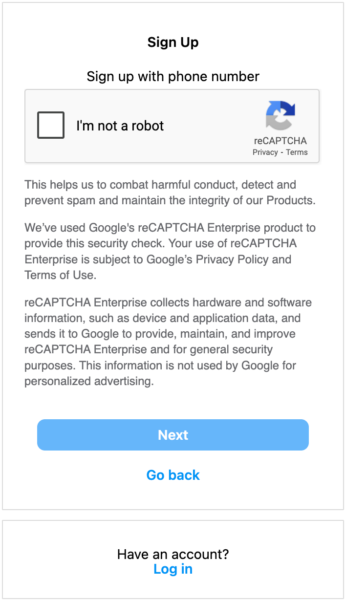
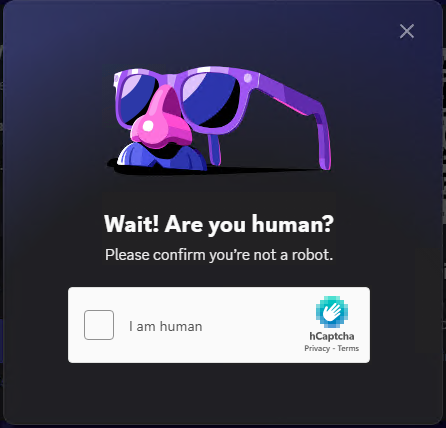
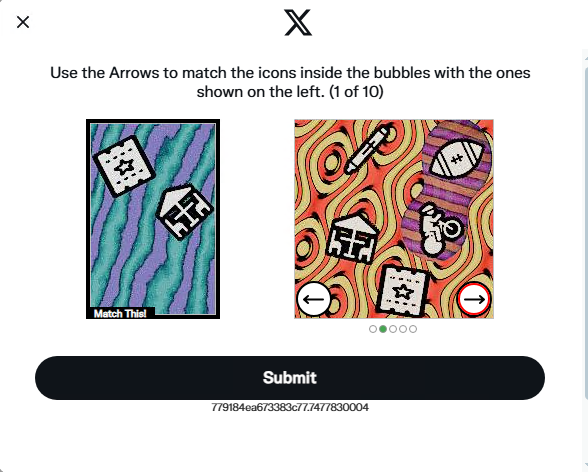
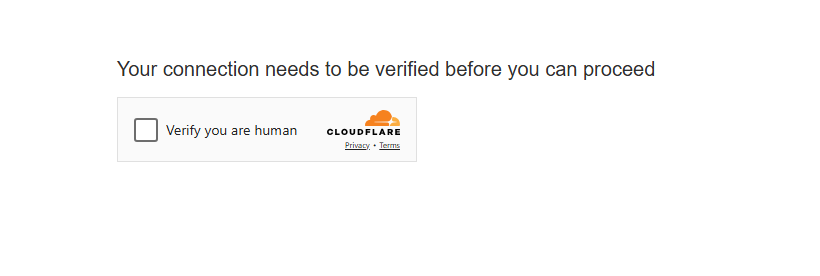
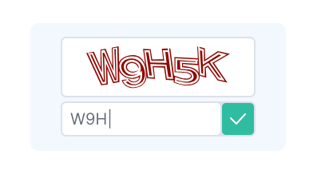
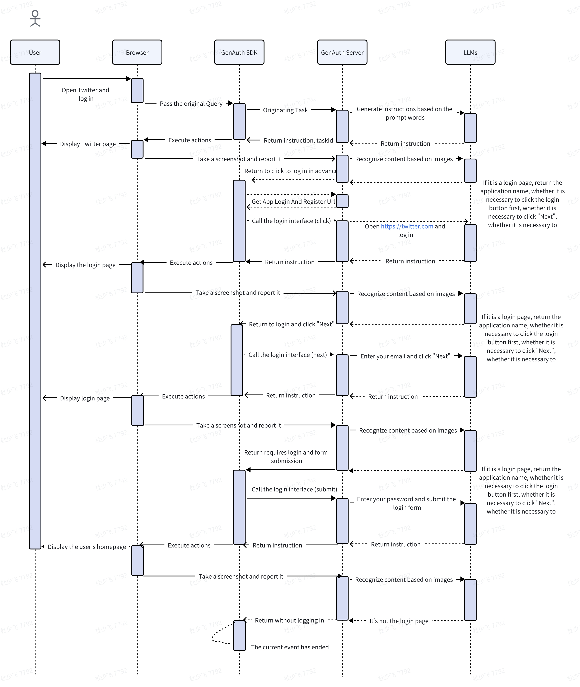
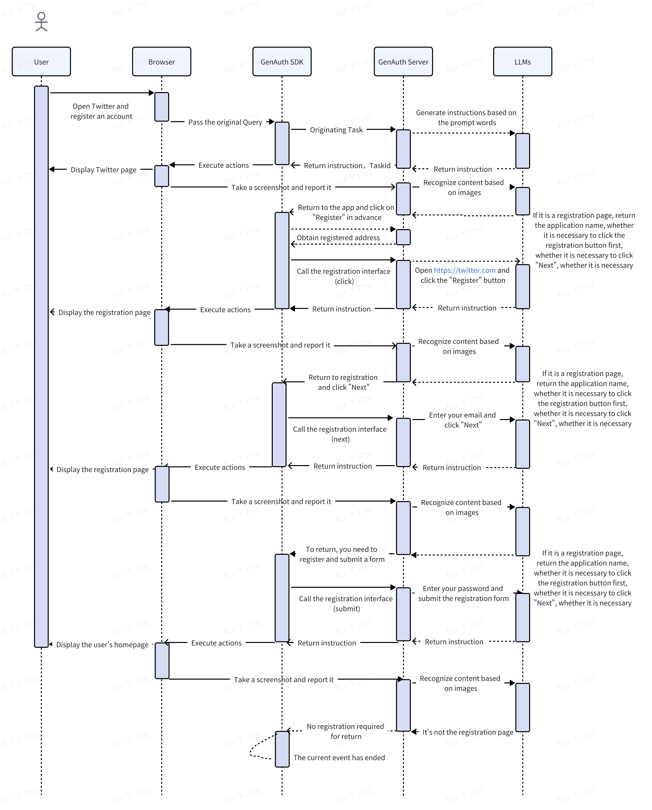

# AgentAuth Server API Documentation

This document details the API list for interaction between the AgentAuth SDK and the AgentAuth Server, including business events, browser events, and core RESTful interfaces.

## 1. Business Event List (Server to SDK)

These events are actively sent by the GenAuth Server to the SDK, and the SDK needs to subscribe to and handle these messages.

| Event Name      | Purpose                                      | Remarks                |
| :-------------- | :------------------------------------------- | :--------------------- |
| `message`       | Message event responded by the server         | Demonstrate the thought process used |
| `browser_event` | Browser event to be executed                 | Used for executing CDP instructions |


**Browser Event Output Example (JSON)**

```json
{
  "actions": [
    {"method": "navigate", "value": "https://www.instagram.com"},
    {"method": "wait", "selector": "#kw", "options": {"timeout": "5s"}},
    {"method": "insertText", "selector": "#kw", "value": "AI"},
    {"method": "click", "selector": "#su"}
  ]
}
```

## 2. Browser Event List (CDP Instructions, carried by `browser_event`)

These are browser automation instructions generated by the GenAuth Server. The SDK receives them via the `browser_event` event and executes them using `chromedp` or similar tools.

| Event Name   | Purpose                                   |
| :----------- | :---------------------------------------- |
| `navigate`   | Navigate to a web page address            |
| `click`      | Click a menu or button                    |
| `wait`       | Wait for an element to load, requires custom code handling |
| `insertText` | Input data into an element                |
| `scroll`     | Mouse scroll, up or down                  |

## 3. Thought Process Message Event (carried by `message`)

After the SDK calls the Server's business interface, the Server sends the entire thought process to the client via SSE.

*   **Request Parameters**: None
*   **Response Parameters**:
    ```json
    {
        "taskId": "b9c2d2b7-eae0-4d37-a86e-b8606a74ffb4",
        "action": "message",
        "otherData": "",
        "message": "Generating thought process"
    }
    ```
### 3.1 Start analyzing the current page

* **Request parameters**: None
* **Response parameters**:
    ```json
    {
        "taskId": "b9c2d2b7-eae0-4d37-a86e-b8606a74ffb4",
        "action": "message",
        "otherData": "",
        "message": "Starting to analyze the current page, URL: https://www.instagram.com/accounts/emailsignup/"
    }
    ```

### 3.2 End analysis of current page

* **Request parameters**: None
* **Response parameters**:
    ```json
    {
        "taskId": "b9c2d2b7-eae0-4d37-a86e-b8606a74ffb4",
        "action": "message",
        "otherData": "{\"current_page\":\"register\",\"application_name\":\"Instagram\",\"login_step\":\"none\",\"switch_page\":\"none\",\"login_type\":\"none\",\"register\":{\"register_type\":\"email\",\"register_step\":\"submit\"},\"human_machine\":\"none\",\"country\":\"US\"}",
        "message": "End analyzing the current page"
    }
    ```
### 3.3 Start the automated registration or login process

* **Request parameters**: None
* **Response parameters**:
    ```json
    {
        "taskId": "b9c2d2b7-eae0-4d37-a86e-b8606a74ffb4",
        "action": "message",
        "otherData": "{\"current_page\":\"register\",\"application_name\":\"Instagram\",\"login_step\":\"none\",\"switch_page\":\"none\",\"login_type\":\"none\",\"register\":{\"register_type\":\"email\",\"register_step\":\"submit\"},\"human_machine\":\"none\",\"country\":\"US\"}",
        "message": "Starting the automated registration process, which may take a few minutes to complete."
    }
    ```
### 3.4 Renting temporary email addresses or phone numbers

* **Request parameters**: None
* **Response parameters**:
    ```json
    {
        "taskId": "b9c2d2b7-eae0-4d37-a86e-b8606a74ffb4",
        "action": "message",
        "otherData": "",
        "message": "Your email is being rented, please be patient~"
    }
    ```
### 3.5 Complete the lease

* **Request parameters**: None
* **Response parameters**:
    ```json
    {
        "taskId": "b9c2d2b7-eae0-4d37-a86e-b8606a74ffb4",
        "action": "message",
        "otherData": "",
        "message": "Email rental has been completed. We will proceed with the remaining steps for you~"
    }
    ```
### 3.6 Fill in email or phone number

* **Request parameters**: None
* **Response parameters**:
    ```json
    {
        "taskId": "b9c2d2b7-eae0-4d37-a86e-b8606a74ffb4",
        "action": "message",
        "otherData": "",
        "message": "Email registration successful, auto-filling in progress: ejirtbuu157@outlook.com"
    }
    ```
### 3.7 Read verification code

* **Request parameters**: None
* **Response parameters**:
    ```json
    {
        "taskId": "b9c2d2b7-eae0-4d37-a86e-b8606a74ffb4",
        "action": "message",
        "otherData": "",
        "message": "Reading email verification code"
    }
    ```
### 3.8 Waiting for verification code to be read

* **Request parameters**: None
* **Response parameters**:
    ```json
    {
        "taskId": "b9c2d2b7-eae0-4d37-a86e-b8606a74ffb4",
        "action": "message",
        "otherData": "",
        "message": "This is the first attempt to retrieve the email verification code. The interval is 5 seconds, and the maximum retrieval time is 15 minutes. Email account: ejirtbuu157@outlook.com"
    }
    ```

### 3.9 Enter verification code

* **Request parameters**: None
* **Response parameters**:
    ```json
    {
        "taskId": "b9c2d2b7-eae0-4d37-a86e-b8606a74ffb4",
        "action": "message",
        "otherData": "",
        "message": "Executing the process of entering the verification code from the email"
    }
    ```
### 3.10 Human-Machine Verification Analysis

* **Request parameters**: None
* **Response parameters**:
    ```json
    {
        "taskId": "b9c2d2b7-eae0-4d37-a86e-b8606a74ffb4",
        "action": "message",
        "otherData": "",
        "message": "Analyzing the current human-machine verification type"
    }
    ```
### 3.11 Human-machine verification cracking

* **Request parameters**: None
* **Response parameters**:
    ```json
    {
        "taskId": "b9c2d2b7-eae0-4d37-a86e-b8606a74ffb4",
        "action": "message",
        "otherData": "",
        "message": "Currently cracking the recaptcha human-machine verification"
    }
    ```

## 3. Core API List

### 3.1. Connect SSE

Used for the SDK to connect to the Server and receive real-time events using the SSE protocol.

*   **Request URL**: `/server/v1/sse`
*   **Request Method**: `GET`
*   **Request Parameters**: None
*   **Response Parameters**:
    ```json
    {
        "apiCode": 1000,
        "message": "Connection successful",
        "data": {
            "action": "connected",
            "sessionId": "258cf6cb-0859-4743-81d4-716121efe886"
        }
    }
    ```
    | Parameter   | Type     | Remarks                                 |
    | :---------- | :------- |:----------------------------------------|
    | `apiCode`   | `int`    | `10000`: Success, `50000`: Internal business exception |
    | `message`   | `varchar`| Connection successful                   |
    | `data`      | `object` | Current `sessionId`                     |

---

### 3.2. Ping Packet

The server periodically sends Ping packet events to the SDK to maintain and check the connection status. The client subscribes to this event.

*   **Request Parameters**: `{"ping":"keep-alive"}`
*   **Response Parameters**: None

---

### 3.3. Connection Success Event

After the SDK successfully connects to the Server, the Server returns the current connection information. The client needs to subscribe to this event.

*   **Request Parameters**: None
*   **Response Parameters**:
    ```json
    {"apiCode":10000,"message":"Connection successful","data":{"action":"connected","sessionId":"162a4e39-6fce-4761-977b-a67e57a32ed3"}}
    ```
---

### 3.4. Convert Natural Language to Browser Instruction Message Event

After the SDK calls the Server's task initiation interface, the Server sends the process of converting natural language to browser instructions to the client via SSE.

*   **Request Parameters**: None
*   **Response Parameters**:
    ```json
    {
        "taskId": "b9c2d2b7-eae0-4d37-a86e-b8606a74ffb4",
        "action": "message",
        "otherData": "",
        "message": "Converting natural language to browser instructions"
    }
    ```

---

### 3.5. Browser Instruction Message Event

After the SDK calls the Server's task initiation interface, the Server sends the browser instruction process to the client via SSE.

*   **Request Parameters**: None
*   **Response Parameters**:
    ```json
    {
        "taskId": "b9c2d2b7-eae0-4d37-a86e-b8606a74ffb4",
        "action": "browser_event",
        "otherData": "{\"actions\":[{\"method\":\"navigate\",\"selector\":\"\",\"value\":\"https://www.instagram.com/accounts/signup/\",\"options\":null},{\"method\":\"wait\",\"selector\":\"input[name=\\\"username\\\"]\",\"value\":\"\",\"options\":{\"timeout\":\"134\"}},{\"method\":\"insertText\",\"selector\":\"input[name=\\\"username\\\"]\",\"value\":\"jackdu@outlook.com\",\"options\":null},{\"method\":\"wait\",\"selector\":\"input[name=\\\"password\\\"]\",\"value\":\"\",\"options\":{\"timeout\":\"167\"}},{\"method\":\"insertText\",\"selector\":\"input[name=\\\"password\\\"]\",\"value\":\"Passokkdm@!.\",\"options\":null},{\"method\":\"wait\",\"selector\":\"button[type=\\\"submit\\\"]\",\"value\":\"\",\"options\":{\"timeout\":\"112\"}},{\"method\":\"click\",\"selector\":\"button[type=\\\"submit\\\"]\",\"value\":\"\",\"options\":null}]} ",
        "message": "Browser instructions generated"
    }
    ```

---

### 3.6. Start Task Interface

Used to initiate an automation task.

*   **Request URL**: `/server/v1/task/start`
*   **Request Method**: `POST`
*   **Request Parameters**:

    | Parameter        | Type      | Remarks                  |
    | :-------------- | :-------- |:------------------------|
    | `sessionId`     | `varchar` | Connection ID            |
    | `tenantId`      | `varchar` | Tenant pool ID           |
    | `text`          | `varchar` | User's original Query data |
    | `genAuthUserId` | `varchar` | Current logged-in GenAuth user ID |
    | `type`          | `varchar` | `task`, initiate task    |

*   **Request Example**:
    ```json
    {"sessionId":"162a4e39-6fce-4761-977b-a67e57a32ed3","text":"I want to become an Instagram user. Please help me register an account on Instagram","type":"task","genAuthUserId":"xxxx"}
    ```
*   **Response Example**:
    ```json
    {
        "apiCode": 10000,
        "message": "Success",
        "data": {
            "taskId": "5b5eca40-d9db-42c5-8559-f0db606d8e53",
            "action": "message",
            "otherData": "",
            "message": "Conversation task initiated successfully"
        }
    }
    ```

---

### 3.7. Screenshot Reporting Interface (SDK to Server)

The SDK uploads the current screenshot to the server to determine whether login or registration is required. If needed, the server responds with the corresponding operation code, and the SDK needs to call the corresponding interface.

*   **Request URL**: `/server/v1/task/create-screenshot`
*   **Request Method**: `POST`
*   **Request Type**: `form-data`
*   **Request Parameters**:
* 
    | Parameter        | Type      | Remarks                         |
    | :-------------- | :-------- | :------------------------------ |
    | `sessionId`     | `varchar` | Connection ID                   |
    | `taskId`        | `varchar` | Task ID                         |
    | `screenshot`    | `file`    | Image file                      |
    | `url`           | `varchar` | Current browser address         |
    | `tenantId`      | `varchar` | Tenant pool ID                  |
    | `genAuthUserId` | `varchar` | IDaaS user ID                   |
*   **Response Content**:
    ```json
    {
        "apiCode": 10000,
        "message": "Success",
        "data": {
            "current_page": "login/register/human_machine/none",
            "application_name": "Xiaohongshu",
            "login_step": "click_code/click_next/click_code/submit/none",
            "switch_page": "none/click_switch_phone/click_switch_email",
            "login_type": "phone+code/email+p/u+p/email+code/phone+code/email/phone/none",
            "human_machine": "none/recaptcha/hcaptcha/funcaptcha",
            "app_id": "0o9s98de-f2f5-49a1-8a84-e15bab519cbc",
            "country":"china/other"
        }
    }
    ```

---

### 3.8. Client Get Application URL Interface (SDK to Server)

If the SDK finds that the current page requires login, it calls this interface to get the application login and registration URLs, which are used in the login, registration, and visual HTML retrieval interfaces.

*   **Request URL**: `/server/v1/client/urls`
*   **Request Method**: `POST`
*   **Request Parameters**:
* 
    | Parameter          | Type      | Remarks                         |
    | :---------------- | :-------- | :------------------------------ |
    | `applicationName` | `varchar` | Application name                |
    | `tenantId`        | `varchar` | Tenant pool ID                  |
*   **Response Content**:
    ```json
    {
        "apiCode": 10000,
        "message": "Success",
        "data": {
            "registration_Url": "https://www.instagram.com/r.php",
            "login_url": "https://www.instagram.com/login/",
            "success": true
        }
    }
    ```

---

### 3.9. Client Login Interface (SDK to Server)

If the SDK uploads a screenshot to the server and finds that login is required, it needs to call the login interface.

*   **Request URL**: `/server/v1/client/login`
*   **Request Method**: `POST`
*   **Request Parameters**:
* 
    | Parameter        | Type      | Remarks                             |
    | :-------------- | :-------- |:------------------------------------|
    | `sessionId`     | `varchar` | Connection ID                       |
    | `taskId`        | `varchar` | Task ID                             |
    | `applicationName` | `varchar` | Application name                    |
    | `appId`         | `varchar` | Application ID                      |
    | `loginUrl`      | `varchar` | Application address                  |
    | `html`          | `varchar` | Current page visible HTML or HTML with hidden values |
    | `genAuthUserId` | `varchar` | Current IDaaS user ID               |
    | `tenantId`      | `varchar` | Tenant pool ID                      |
    | `processEvent`  | `object`  | Current process event, see example below |
*   **`processEvent` Example**:
    ```json
    {
        "current_page": "login",
        "application_name": "Instagram",
        "login_step": "click_code",
        "switch_page": "none",
        "login_type": "phone+code",
        "human_machine": "none"
    }
    ```
*   **Response Content**:
    ```json
    {
        "apiCode": 10000,
        "message": "Success",
        "data": {
            "actions": [
                {
                    "method": "wait",
                    "selector": "#username",
                    "value": "",
                    "options": {
                        "timeout": "10s"
                    }
                },
                {
                    "method": "insertText",
                    "selector": "#username",
                    "value": "ejirtbuu157@outlook.com",
                    "options": null
                },
                {
                    "method": "wait",
                    "selector": "#password",
                    "value": "",
                    "options": {
                        "timeout": "10s"
                    }
                },
                {
                    "method": "insertText",
                    "selector": "#password",
                    "value": "123456",
                    "options": null
                },
                {
                    "method": "click",
                    "selector": "#loginButton",
                    "value": "",
                    "options": null
                }
            ]
        }
    }
    ```

---

### 3.10. Client Registration Interface (SDK to Server)

If the SDK uploads a screenshot to the server and finds that registration is required, it needs to call the registration interface.

*   **Request URL**: `/server/v1/client/register`
*   **Request Method**: `POST`
*   **Request Parameters**:
* 
    | Parameter        | Type      | Remarks                         |
    | :-------------- | :-------- | :------------------------------ |
    | `sessionId`     | `varchar` | Connection ID                   |
    | `taskId`        | `varchar` | Task ID                         |
    | `applicationName` | `varchar` | Application name                |
    | `registerUrl`   | `varchar` | Application registration address |
    | `html`          | `varchar` | Current page visible HTML, only pass the visible HTML, needs to be obtained by the client |
    | `genAuthUserId` | `varchar` | Current IDaaS user ID           |
    | `tenantId`      | `varchar` | Tenant pool ID                  |
* **`processEvent` 示例**:
  ```json
  {
      "register": {"register_type": "email","register_step": "click_next"}
  }
  ```  
* **Response Content**:
    ```json
    {
        "apiCode": 10000,
        "message": "Success",
        "data": {
            "actions": [
                {
                    "method": "wait",
                    "selector": "input[name='name']",
                    "value": "",
                    "options": {
                        "timeout": "1000"
                    }
                },
                {
                    "method": "insertText",
                    "selector": "input[name='name']",
                    "value": "jackdu",
                    "options": null
                },
                {
                    "method": "wait",
                    "selector": "input[name='phone_number']",
                    "value": "",
                    "options": {
                        "timeout": "1000"
                    }
                },
                {
                    "method": "insertText",
                    "selector": "input[name='phone_number']",
                    "value": "15001222222",
                    "options": null
                },
                {
                    "method": "click",
                    "selector": "button[type='button']",
                    "value": "",
                    "options": null
                },
                {
                    "method": "wait",
                    "selector": "select[id='SELECTOR_1']",
                    "value": "",
                    "options": {
                        "timeout": "1000"
                    }
                },
                {
                    "method": "select",
                    "selector": "select[id='SELECTOR_1']",
                    "value": "1",
                    "options": null
                },
                {
                    "method": "wait",
                    "selector": "select[id='SELECTOR_2']",
                    "value": "",
                    "options": {
                        "timeout": "1000"
                    }
                },
                {
                    "method": "select",
                    "selector": "select[id='SELECTOR_2']",
                    "value": "1",
                    "options": null
                },
                {
                    "method": "wait",
                    "selector": "select[id='SELECTOR_3']",
                    "value": "",
                    "options": {
                        "timeout": "1000"
                    }
                },
                {
                    "method": "select",
                    "selector": "select[id='SELECTOR_3']",
                    "value": "1990",
                    "options": null
                },
                {
                    "method": "wait",
                    "selector": "button[data-testid='ocfSignupNextLink']",
                    "value": "",
                    "options": {
                        "timeout": "1000"
                    }
                },
                {
                    "method": "click",
                    "selector": "button[data-testid='ocfSignupNextLink']",
                    "value": "",
                    "options": null
                }
            ]
        }
    }
    ```

---

### 3.11. Break CAPTCHA Interface (SDK to Server)

If the SDK finds that the screenshot upload response data indicates a CAPTCHA, it needs to call this interface.

*   **Request URL**: `/server/v1/client/machine`
*   **Request Method**: `POST`
*   **Request Parameters**:
* 
    | Parameter      | Type      | Remarks                                                         |
    | :------------- | :-------- | :-------------------------------------------------------------- |
    | `sessionId`    | `varchar` | Connection ID                                                   |
    | `taskId`       | `varchar` | Task ID                                                         |
    | `machineType`  | `varchar` | CAPTCHA type: `reCaptcha v2`/`hCaptcha`/`funCaptcha`/`cloudflare`/`textCaptcha`/`normal captcha`/`none` |
    | `machineData`  | `varchar` | CAPTCHA data, JSON string, format depends on `machineType`, see examples below |
    | `genAuthUserId`| `varchar` | Current IDaaS user ID                                           |
    | `tenantId`     | `varchar` | Tenant pool ID                                                  |
*   **`machineData` Examples**:
    *   **reCaptcha v2 CAPTCHA data**:
        ```json
        {
            "siteKey":"6LdktRgnAAAAAFQ6icovYI2-masYLFjEFyzQzpix",
            "url":"https://www.fbsbx.com/captcha/recaptcha/iframe/?__cci=ig_captcha_iframe&compact=false&locale=zh_CN&referer=https%253A%252F%252Fwww.instagram.com"
        }
        ```
    *   **hCaptcha CAPTCHA data**:
        ```json
        {
            "siteKey":"6LdktRgnAAAAAFQ6icovYI2-masYLFjEFyzQzpix",
            "url":"https://www.fbsbx.com/captcha/recaptcha/iframe/?__cci=ig_captcha_iframe&compact=false&locale=zh_CN&referer=https%253A%252F%252Fwww.instagram.com"
        }
        ```
    *   **funCaptcha CAPTCHA data**:
        ```json
        {
            "siteKey":"6LdktRgnAAAAAFQ6icovYI2-masYLFjEFyzQzpix",
            "url":"https://www.fbsbx.com/captcha/recaptcha/iframe/?__cci=ig_captcha_iframe&compact=false&locale=zh_CN&referer=https%253A%252F%252Fwww.instagram.com",
            "surl":"",
            "userAgent":"",
            "data":{"":""}
        }
        ```
    *   **normal captcha CAPTCHA data**:
        ```json
        {
            "file":"img.jpg",
            "base64":"",
            "phrase":"",
            "caseSensitive":"",
            "calc":"",
            "numberic":"",
            "minLen":"",
            "maxLen":"",
            "lang":"",
            "hintText":"",
            "hintImageBase64":"",
            "hintImageFile":""
        }
        ```
    *   **cloudflare CAPTCHA data**:
        ```json
        {
            "siteKey":"0x4AAAAAAAJel0iaAR3mgkjp",
            "url":"https://dash.cloudflare.com/login"
        }
        ```
*   **Response Content**:
    ```json
    {
        "apiCode": 10000,
        "message": "Success",
        "data": {
            "token": "03AFcWeA...",
            "id": "80061008118"
        }
    }
    ```
## 4. Human machine verification
    During the process of completing automated login and registration, we will automatically handle the interaction for human-machine verification, freeing up your hands. Currently, we support the following types of human-machine verification。
### 4.1 ReCaptcha
    If your target website is using Google's reCaptcha V2 human-machine verification code, we will automatically crack it for you。

### 4.2 HCaptcha
    If your target website uses HCaptcha human-machine verification code, we will automatically crack it for you。

### 4.2 FunCaptcha
    If the target website you are using employs a game-type human-machine verification code, we will automatically crack it for you。

### 4.2 Cloudflare
    If your target website uses Cloudflare CAPTCHA, we will automatically crack it for you。

### 4.2 Normal
    If the target website you are using employs the basic Normal type of human-machine verification code, we will automatically crack it for you。

### 4.2 Text
    If the target website you are using employs a Text-type human-machine verification code, we will automatically crack it for you。

## 5. Constant Data Description
### 5.1. Ping Packet Response Data Constants
    | Parameter   | Value         | Remarks                                     |
    | :---------- | :------------ | :------------------------------------------ |
    | `ping`      | `keep-alive`  | Session keep-alive and detection            |
### 5.2. Screenshot Reporting Interface Response Data Constants
    | Parameter           | Value                                             | Remarks                                     |
    | :-----------------  | :------------------------------------------------ | :------------------------------------------ |
    | `current_page`      | `login` `register` `human_machine` `none`           | Current page type, e.g., login, register, CAPTCHA page, etc. |
    | `application_name`  | `Instagram`                                          | Current application name, e.g., Instagram or Twitter or other |
    | `login_step`        | `click_login` `click_next` `click_code` `submit` `none` | Current login step, e.g., click login button, click next, click get code, submit login, etc. |
    | `switch_page`       | `click_switch_phone` `click_switch_email` `none`    | Whether to switch pages, e.g., switch to phone login, switch to email login, etc. |
    | `login_type`        | `u+p` `email+p` `email+code` `phone+code` `email` `phone` `none` | Login type, e.g., username and password login, email and password login, email and code login, phone and code login, email login, phone login, etc. |
    | `human_machine`     | `reCaptcha` `hCaptcha` `funCaptcha` `cloudflare` `textCaptcha` `normal captcha` `none` | Various CAPTCHA types |
    | `country`           | `china` `other`                                     | Country of the current application, China or other |
## 6. Flow chart
### 6.1 Standardized login identification process

### 6.2 Register standardized identification process
