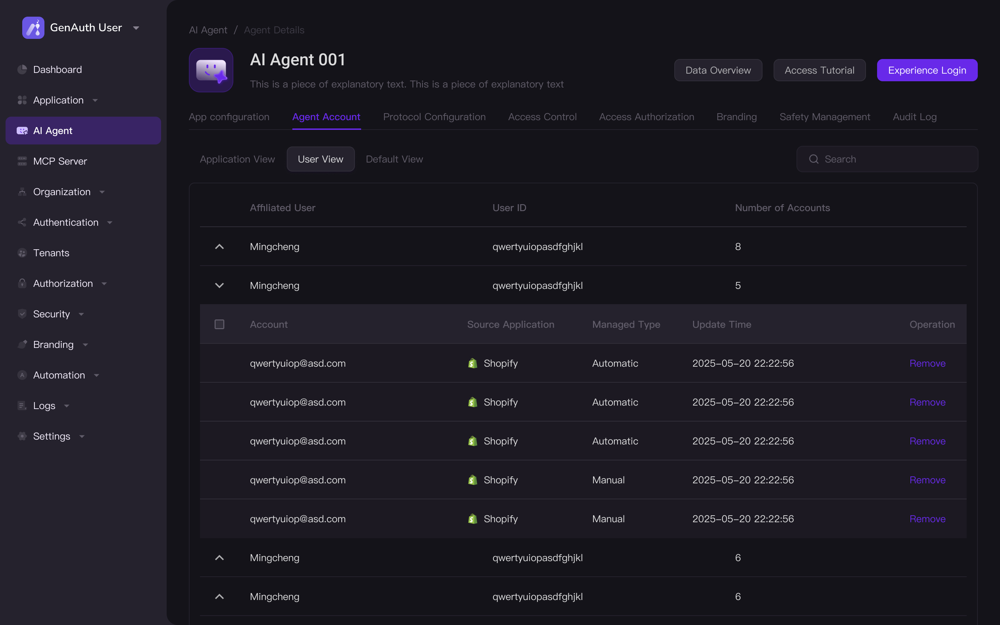

# 什么是 Agent 代理注册和认证？

GenAuth 推出的 Agent 代理认证第三方账号功能，旨在解决 AI 应用与用户交互过程中涉及第三方账号（如 Twitter、Instagram、Facebook 等服务平台）注册或登录的繁琐流程痛点。

当你的 AI 应用需要代表用户执行需要认证状态的操作时（例如：帮助用户自动发帖、管理数据、整合信息等），GenAuth 可以安全地代理用户完成目标平台的身份验证流程，并将获取的登录状态令牌直接返回给你的应用，使你的 AI 能够继续代表用户执行后续操作。

这一切在用户授权的前提下进行，无需用户离开对话界面。

# 什么场景适合使用 Agent 代理注册和认证？

* **智能搜索**

当你正在开发一款浏览器智能深度搜索产品时，在帮助用户使用深度搜索时，可能需要通过各大社交媒体上的信息和数据完成搜索、统计和汇总，很多平台需要登录账号方可获取内容。

要求用户手动登录十分影响用户体验和搜索效率，用同一账号难以应对实际的客户请求量并引发第三方的风控问题。使用 GenAuth 为用户自动申请虚拟邮箱，注册并登录第三方平台获取内容。

* **MCN 机构批量孵化达人账号**

当你需要开发一款辅助 MCN 机构日常工作的 AI 智能助手时，无法忽视的用户痛点就是每天重复且耗时的账号开通、管理工作，通常每月、每个运营人员就需要给 20+ 大人开通TikTok、Instagram 等多个平台账号。不但需要手动重复填写达人的资料、协调海外同事帮忙接收验证码等，还需要关注文化差异避免触犯平台规则。

接入 GenAuth 即可自动化上述用户痛点，并托管账号免除后续管理账号、发布内容时多次登进登出的繁琐步骤，使你的 AI 应用成为辅助 MCN 机构提效的得力助手。

* **营销号内容刷新热度和评论**

如果你正在开发一款服务于营销号的运营人员或自媒体账号的主播，可以给其发布内容刷热度的运营类应用，用户需要解决有效账号评论、点赞刷热度的场景。整个流程涉及到申请手机号或邮箱、注册并完成多次人机核验、发布有效评论等，接入 GenAuth 的能力可以为用户自动完成多账号的注册登录流程，并为其托管。

为你的用户解决的最耗费时间的重复劳动，将精力更多放在更高优先级的业务上。

* **购物平台比价**

当你的目标用户是热衷于购物的人，一定经常需要货比三家或海外淘等等，他们需要前往各大电商平台进行手动比价、汇总、检测波动等，以保证成本能够最小化。

你开发的 AI 智能助手可以协助他们门完成比价的工作，接入 GenAuth 的能力后，即可在后台自动完成日亚/美亚/Shopify 等各大电商账号的注册、搜索并整合该款游戏机在不同平台商家的价格，最终产出性价比最高的购买方案。

# Agent 代理注册和认证能解决什么问题？

1. 帮助你的 AI 应用提升用户体验：​。用户仅需正常发出任务请求，任何需要注册/登录第三方平台的才能进行的任务都可以被无感解决——由 GenAuth 在后台安全地自动化处理。告别反复输入密码、验证码、跳转登录页的糟糕体验，为用户打造流畅无感的使用旅程。

2. 简化复杂操作，为你的 AI 应用提高任务完成率，进而提升用户转化率​。简化甚至隐藏注册/登录第三方平台这一关键漏斗节点，可以让用户更专注于与 AI 的有价值对话内容，显著提高 AI 建议的采纳率和任务完成率。

3. 为你的团队降低开发复杂性：​

   * 免登录逻辑的开发：​ 开发者无需深入研究每个第三方平台的 OAuth、OIDC、登录表单模拟或图形验证码处理等复杂且易变的安全机制。

   * 统一接口：​ GenAuth 提供标准化的 API 接口，开发者只需关注“在哪个平台、需要什么权限”，GenAuth 负责处理具体协议的差异性。

   * 规避维护负担：​ 目标平台频繁更新登录流程或安全策略带来的兼容性问题，由 GenAuth 统一处理与更新，节省开发者大量维护成本。

4. 在开发过程中，为你拓展 AI 应用能力边界，​ 使你的 AI 应用能够真正代理用户执行涉及第三方账号的关键操作，解锁更多实用场景。

# 如何接入和使用 Agent 代理注册和认证能力？

## 1. 开发者：接入并配置 AI 应用

建议添加研发写的接入方法等内容

* 开发者应在 GenAuth 创建 Agent 应用，并完善必要信息；

## 2. 终端用户：对话中无感代理注册/认证第三方账号

* 在终端用户的 AI Chat 应用场景中，对话中涉及到第三方账号注册/登录的内容时，将自动调起 GenAuth 的能力进行对应操作；

* 执行过程中，提供任务进度的文字版（右侧）和沙盒环境页面版（输入框上方），均可选隐藏/展示：

* 场景举例——当任务需要一次性注册同一平台的多个账号时，效果如下图：

* 我们将提供非常详细的步骤描述，如需可展示在您的 AI 应用任务进度描述中。例如：

  * 申请虚拟邮箱进度

  * 填写注册信息详情和进度

  * 完成人机验证进度

  * 完成注册账号进度

  * 完成登录账号进度

  * ...

* 若在运行过程中出现错误，也可快速定位卡点；

## 3. 终端用户：在个人中心管理已托管的第三方账密

* 终端用户可以在【个人中心】模块查看并管理已托管的第三方账密：

  * 支持取消第三方账密的托管权限；

  * 支持手动添加新的账号托管，方便未来使用 AI 应用时快速执行相关操作；

## 4. 开发者：查看/管理 AI 应用的用户数据

* 开发者可以在控制台查看用户已托管的账号信息。我们提供了 3 种视图，满足不同的审查/使用需求：

1. 应用视图：

* 用户视图：

* 默认视图：

