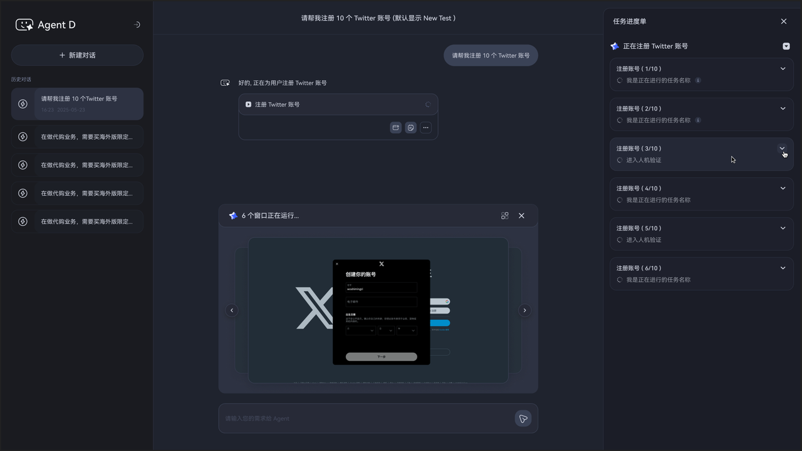
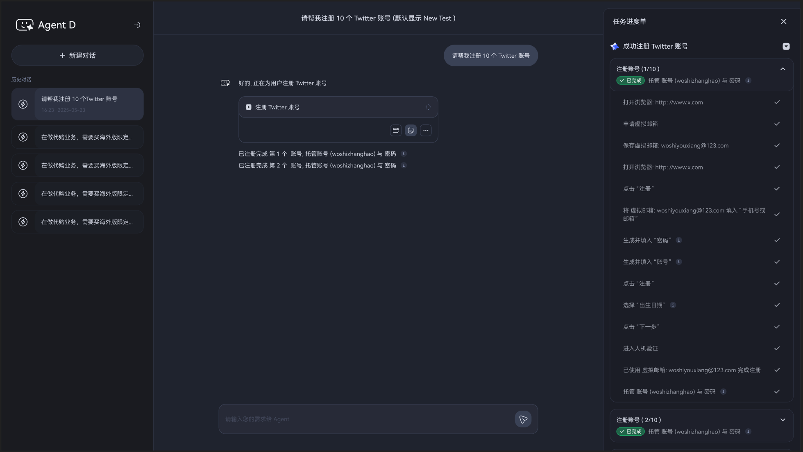
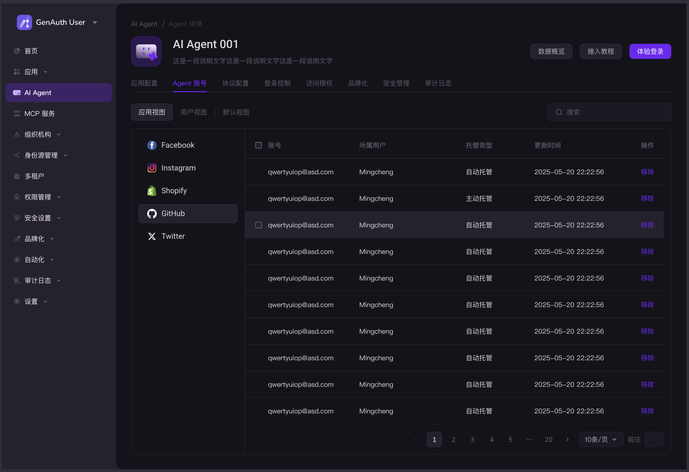
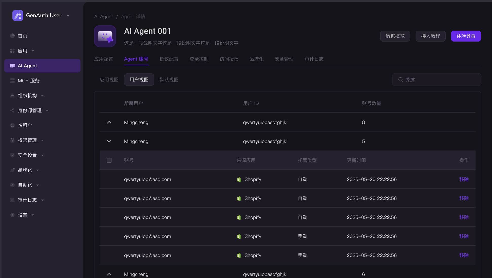
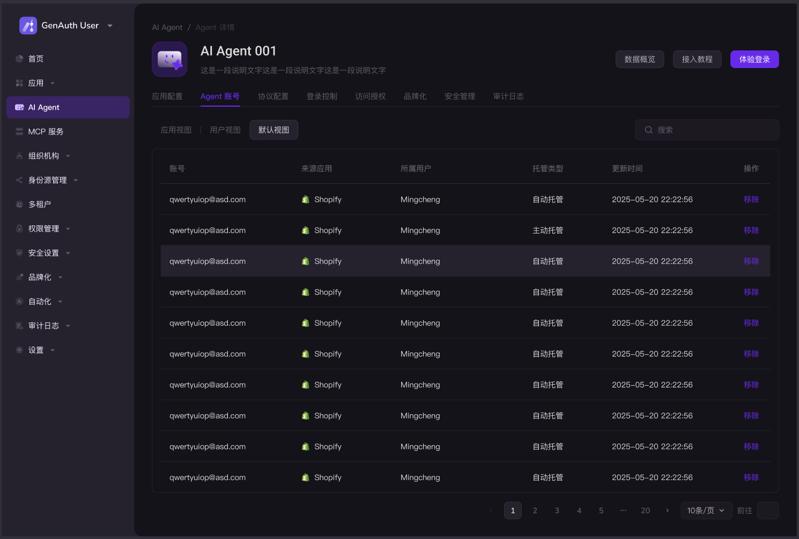

# What is Agent Proxy Registration and Authentication?

GenAuth’s Agent proxy authentication for third-party accounts is designed to address the pain points of cumbersome registration or login processes for third-party accounts (such as Twitter, Instagram, Facebook, etc.) during user interactions with AI applications.

When your AI application needs to perform authenticated actions on behalf of users (for example: automatically posting, managing data, aggregating information, etc.), GenAuth can securely proxy the user to complete the target platform’s authentication process and directly return the obtained login token to your application, enabling your AI to continue performing subsequent operations on behalf of the user.

All of this is done with the user’s authorization, without requiring the user to leave the chat interface.

# What Scenarios Are Suitable for Using Agent Proxy Registration and Authentication?

* **Intelligent Search**

When you are developing a browser-based intelligent deep search product, you may need to access information and data from various social media platforms to complete searches, statistics, and aggregation. Many platforms require account login to access content.

Requiring users to log in manually greatly affects user experience and search efficiency. Using the same account cannot meet actual customer request volumes and may trigger third-party risk controls. With GenAuth, you can automatically apply for a virtual email, register, and log in to third-party platforms to obtain content.

* **Batch Account Creation for MCN Agencies**

When developing an AI assistant for MCN agencies’ daily work, a major pain point is the repetitive and time-consuming process of account creation and management. Each month, each operator may need to create accounts for 20+ influencers on platforms like TikTok and Instagram. This usually involves repeatedly filling in influencer information, coordinating with overseas colleagues to receive verification codes, and being mindful of cultural differences to avoid violating platform rules.

By integrating GenAuth, you can automate these pain points and host accounts, eliminating the need for repeated logins when managing or posting content, making your AI application a powerful tool for MCN agencies.

* **Refreshing Popularity and Comments for Marketing Accounts**

If you are developing an application for marketing account operators or streamers to boost content popularity, users need to solve scenarios such as posting valid comments and likes with multiple accounts. The process involves applying for phone numbers or emails, registering, passing multiple CAPTCHAs, and posting valid comments. Integrating GenAuth can automate multi-account registration and login, and host them for the user.

This solves the most time-consuming repetitive tasks for your users, allowing them to focus on higher-priority business.

* **Price Comparison on Shopping Platforms**

For users who love shopping, price comparison across platforms is common. They need to manually compare, aggregate, and monitor price fluctuations on various e-commerce platforms to minimize costs.

Your AI assistant can help them complete price comparisons. With GenAuth, it can automatically register accounts on Amazon JP/US, Shopify, etc., search and aggregate prices for a product across different merchants, and ultimately provide the most cost-effective purchase plan.

# What Problems Can Agent Proxy Registration and Authentication Solve?

1. **Enhance User Experience for Your AI Application:**  
   Users only need to make normal task requests. Any task that requires registration/login to a third-party platform can be seamlessly handled by GenAuth in the background. Say goodbye to repeatedly entering passwords, verification codes, and jumping to login pages, and provide users with a smooth, seamless experience.

2. **Simplify Complex Operations and Improve Task Completion Rate:**  
   By simplifying or even hiding the registration/login step for third-party platforms, users can focus more on valuable conversations with the AI, significantly increasing the adoption rate of AI suggestions and task completion rate.

3. **Reduce Development Complexity for Your Team:**  
   * **No Need to Develop Login Logic:** Developers do not need to study each third-party platform’s OAuth, OIDC, login form simulation, or CAPTCHA handling.

   * **Unified Interface:** GenAuth provides standardized API interfaces. Developers only need to specify “which platform and what permissions are needed,” and GenAuth handles protocol differences.

   * **Avoid Maintenance Burden:** GenAuth handles compatibility issues caused by frequent updates to target platforms’ login processes or security policies, saving developers significant maintenance costs.

4. **Expand the Capabilities of Your AI Application:**  
   Allow your AI application to truly act on behalf of users for key operations involving third-party accounts, unlocking more practical scenarios.

# How to Integrate and Use Agent Proxy Registration and Authentication?

## 1. Developer: Integrate and Configure the AI Application

*It is recommended to add integration methods provided by R&D here.*

* Developers should create an Agent application in GenAuth and complete the necessary information.

## 2. End User: Seamless Proxy Registration/Authentication of Third-Party Accounts in Chat

* In the AI Chat application scenario, when the conversation involves third-party account registration/login, GenAuth’s capability will be automatically invoked.

* During execution, both a text-based progress (on the right) and a sandboxed page version (above the input box) are provided, both of which can be optionally hidden or displayed:

* Example scenario: When a task requires registering multiple accounts on the same platform at once, the effect is as shown below:

* We provide detailed step descriptions, which can be displayed in your AI application’s task progress description if needed. For example:

  * Progress of applying for a virtual email

  * Details and progress of filling in registration information

  * Progress of completing CAPTCHA

  * Progress of account registration

  * Progress of account login

  * ...

* If an error occurs during execution, the bottleneck can be quickly located.

## 3. End User: Manage Hosted Third-Party Accounts in Personal Center

* End users can view and manage hosted third-party accounts in the [Personal Center] module:

  * Support for revoking hosting permissions for third-party accounts

  * Support for manually adding new accounts for hosting, making it easier to quickly perform related operations in future AI application usage

## 4. Developer: View/Manage User Data of the AI Application

* Developers can view user-hosted account information in the console. We provide three views to meet different review/use needs:

1. **Application View:**

* **User View:**

* **Default View:**

