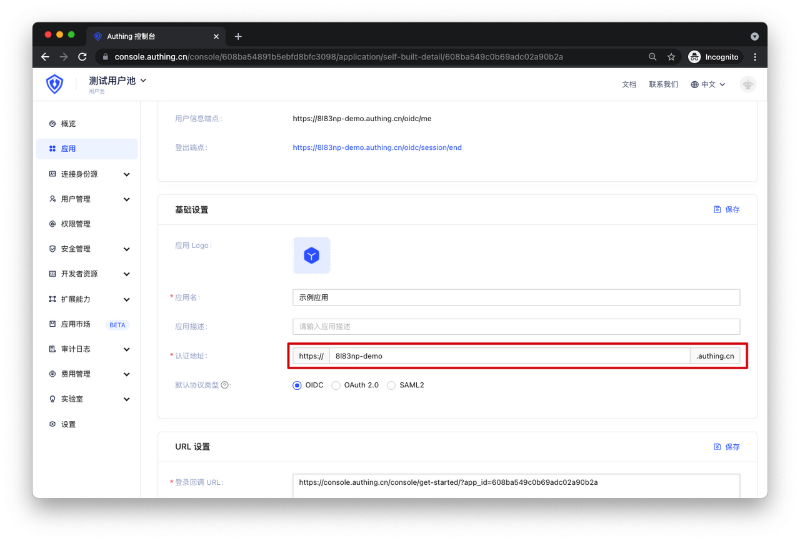

# Important Notes Before Joining APN

<LastUpdated/>

Before joining APN, in addition to having basic OIDC capabilities, you need to pay attention to the following points to ensure the security and rationality of authorization:

## Multi-tenant Business Model

If your application is used by many companies or teams simultaneously, sharing a set of service clusters and resources, but independently owning their own data and configurations, this is a typical **multi-tenant scenario**.

You need to ensure that your application already has a **multi-tenant business model** to guarantee data isolation between different tenants.

### Scenario

If Company X and Company Y purchase your application, and Company X creates users A, B, C in your SP (application server), if Company Y also creates the same three users A, B, C in GenAuth, your SP needs to be able to identify multi-tenant user authorization.

This is a multi-tenant model. The simplest implementation is to ensure uniqueness by combining user + request domain (or tenant ID), like AX, BX, CX, AY, BY, CY.

### Best Practices

- If your application requires corporate email as login account, then you already have a multi-tenant business model.
- If different companies or teams using your application have independent login domains, then you already have a multi-tenant business model.
- Additionally, you can currently implement multi-tenancy through GenAuth's application domain + username.

GenAuth's application domain can be found in the following location:

## Single-tenant Business Model

If your application is used by many companies or teams simultaneously, but they each independently own dedicated service clusters and resources, and independently own their data and configurations, this is a **single-tenant business model**.

Under the single-tenant business model, your tenant data is physically isolated, eliminating the risk of data permission confusion. However, you may need to pay attention to scenarios where a single tenant uses multiple IDPs.

### Scenario

If Company X purchased your application and previously created users A, B, C, D, and recently purchased a new (IDaaS) IDP partner to implement SSO, creating the same users A, B, C in the (IDaaS) IDP system, Company X hopes that users A, B, C can access their resources by logging in from either side, while user D can only access their resources by logging in through your IDP.

### Best Practices

You need to implement identity data association between users A, B, C from the (IDaaS) IDP requests and users A, B, C on your application server through association information.
