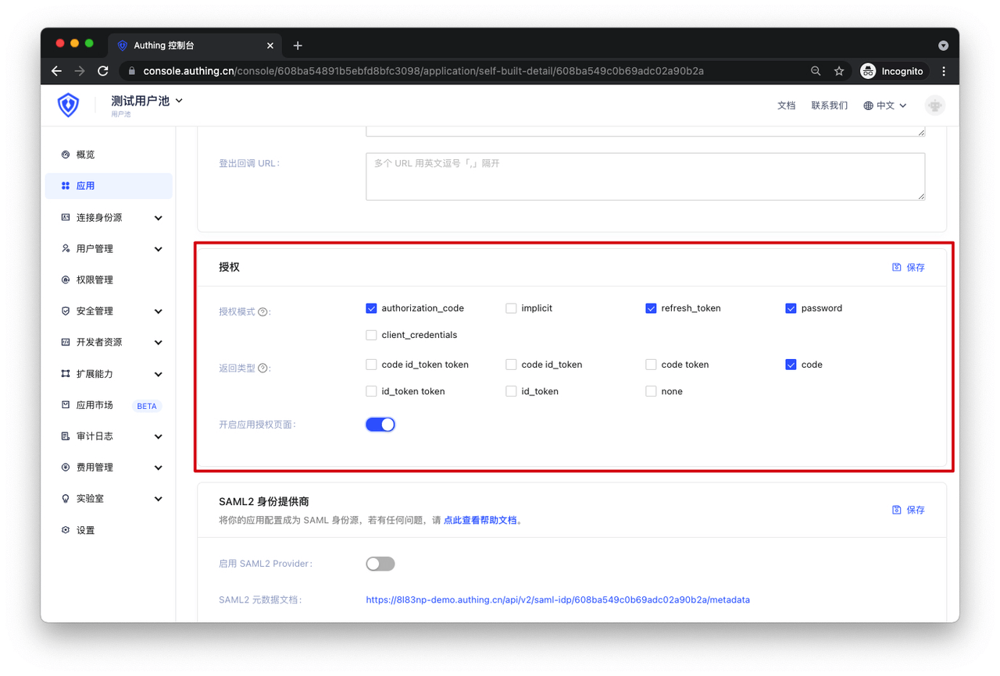

# Type 2 Authorization Code + PKCE Mode Testing

<LastUpdated/>

**Suggestion**

> If your application is a **SPA frontend application or mobile app**, it is recommended to use **Authorization Code + PKCE mode** to complete user authentication and authorization. Authorization Code + PKCE mode is **suitable for scenarios where keys cannot be securely stored** (such as frontend browsers).

Set up the authentication method for your application in GenAuth:

Now you can start testing.

## 1. Configure your OIDC Identity Provider

Before making your application support the OIDC protocol, you need to configure the following information in your frontend application:
