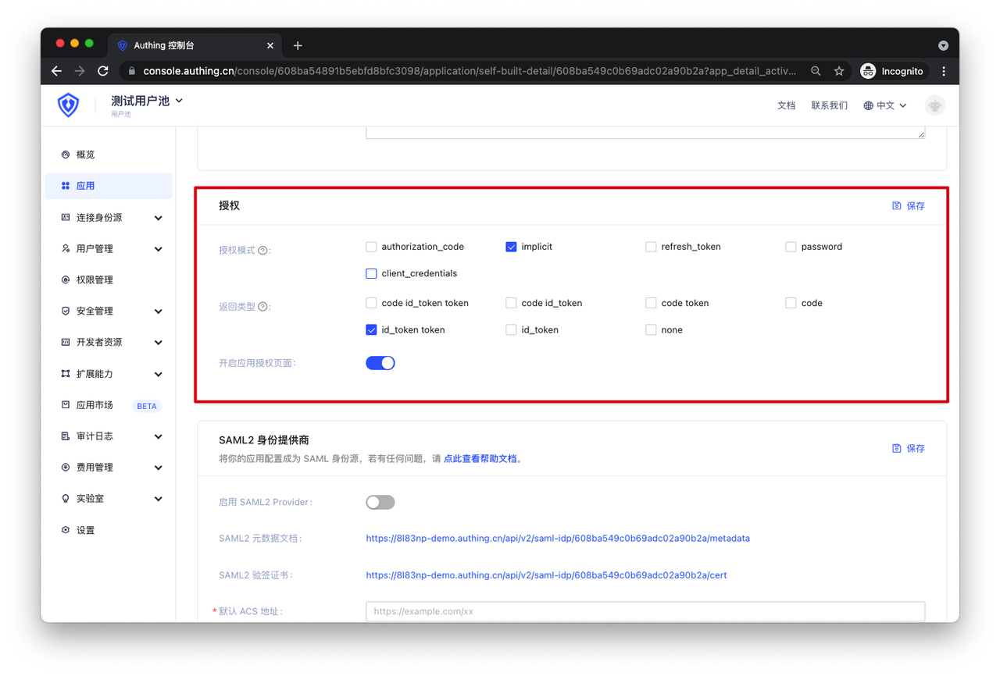

# Type 3 Implicit Mode Testing

<LastUpdated/>

**Suggestion:**

> If your application is a **SPA frontend application** without backend services, it is recommended to use **Implicit Mode** to complete user authentication and authorization. Implicit Mode is **suitable for scenarios where keys cannot be securely stored** (such as frontend browsers). In **Implicit Mode**, applications do not need to exchange code for tokens or request the `/token` endpoint, as AccessToken and IdToken are returned directly from the **authentication endpoint**.

> **_Note: Under OIDC Implicit Mode, for security reasons, your frontend application must use HTTPS protocol_**

Set up the authentication method for your application in GenAuth:

Now you can start testing.

## 1. Configure your OIDC Identity Provider

Before making your application support the OIDC protocol, you need to configure the following information in your frontend application:
