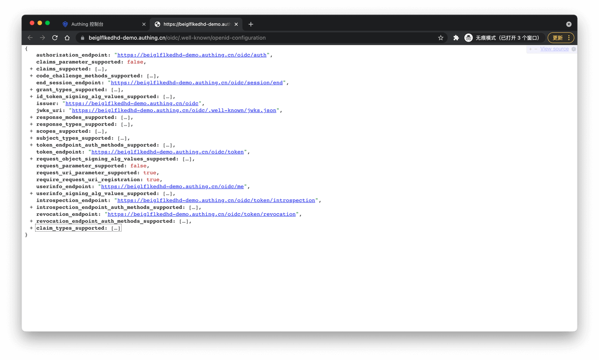

# Type 4 Password Mode Testing

<LastUpdated/>

**Suggestion:**

> Password mode requires your application to carry username and password to request OIDC identity provider, and your application should not store this information, which requires your application to be fully trusted by users.

Set up the authentication method for your application in GenAuth:

Now you can start testing.

## 1. Get GenAuth OIDC IdP Configuration

By accessing the above address, you will get the following configuration information:

## 2. Initiate OIDC Password Mode Authentication

Use `HTTP POST` to request the OIDC token endpoint on your application server. The token endpoint can be obtained as follows:

Required parameters are as follows:

| Parameter     | Description                                                                                                         | Required |
| ------------- | ------------------------------------------------------------------------------------------------------------------- | -------- |
| client_id     | OIDC application ID, i.e. GenAuth application ID                                                                    | Yes      |
| client_secret | OIDC application secret, i.e. GenAuth application secret                                                            | Yes      |
| username      | Username of the user who needs to log in                                                                            | Yes      |
| password      | Password of the user who needs to log in                                                                            | Yes      |
| grant_type    | Authorization mode, must be the string "password" in password mode                                                  | Yes      |
| scope         | Authorization scope, default is openid profile, optional values are in scopes_supported from OIDC IdP configuration | No       |

By carrying the above parameters in `application/x-www-form-urlencoded` or `application/json` format to request the token endpoint, you will get the following information which includes `access_token`:

##

3. Get User Information Using AccessToken

After your application obtains the `access_token`, you can initiate an `HTTP GET` request to the user information endpoint to get user information. The user information endpoint can be obtained as follows:

The request needs to carry the `access_token` parameter. After a successful request, you will get the following information:

Congratulations! Your application now has OIDC capabilities.
