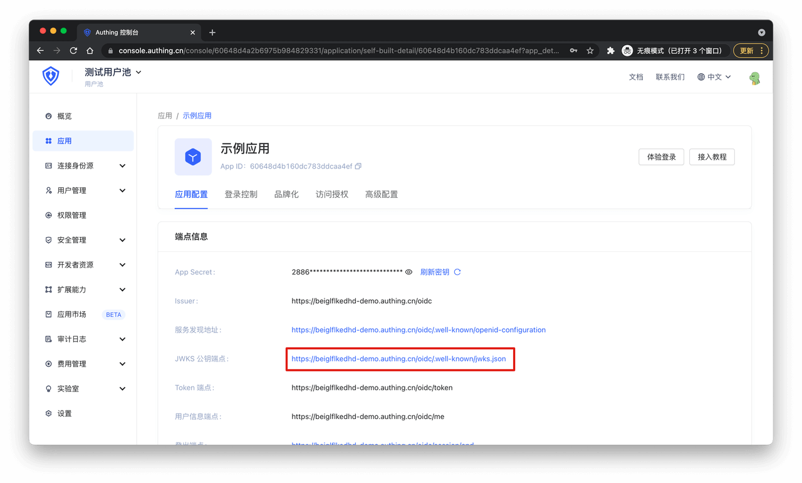

# Type 5 Client Credentials Mode Testing

<LastUpdated/>

**Suggestion:**

> Client Credentials mode is used for server-to-server authorization (M2M authorization) without user involvement.

Set up the authentication method for your application in GenAuth.

Now you can start testing.

## 1. Get GenAuth OIDC IdP Configuration

By accessing the above address, you will get the following configuration information:

## 2. Get Programming Access Account

Client Credentials mode requires an agreed access token to obtain `access_token`. In GenAuth, this is a programming access account.
Find the Application Access Authorization tab:

Scroll down to find "Programming Access" and click the "Add" button.

Enter any remarks and click "Save".

Now you can use `AccessKey` and `SecretKey` to get `access_key`.

## 3. Authorize Programming Access Account

In the GenAuth console, find "Permission Management" -> "Your Created Application", click "Add Resource".

Enter the following information:

- Resource name, the resource you want to test, in this example it's `book`.

- Resource description, notes about the resource.

- Operation type, operations on the resource. In this example, a `read` operation was added, indicating reading books.

- Operation description, description of the operation.

Click "Save", then click "Authorize", "Add Authorization":

Fill in the following information:

- Select "Programming Access Account" as the authorized principal type.

- Select the previously created programming access account as the authorized principal.

- In authorization rules, select the previously created "book" as resource type, enter "\*" as resource identifier to allow all book resources, select "Specific Operations" for operation, and choose the previously created "book:read" from the dropdown.

Click "Confirm".

## 4. Initiate OIDC Client Credentials Mode Authentication

Use `HTTP POST` to request the OIDC token endpoint on your application server. The token endpoint can be obtained as follows:

Required parameters are as follows:

| Parameter     | Description                                                                                                                                                   | Required |
| ------------- | ------------------------------------------------------------------------------------------------------------------------------------------------------------- | -------- |
| client_id     | OIDC application ID, i.e. AccessKey of the programming access account                                                                                         | Yes      |
| client_secret | Access token, i.e. SecretKey of the programming access account                                                                                                | Yes      |
| grant_type    | Authorization mode, must be the string "client_credentials" in Client Credentials mode                                                                        | Yes      |
| scope         | Authorization scope, format is resourceName:resourceScope:action, e.g. book:\*:read for read permission on all books, multiple scopes are separated by spaces | Yes      |

By carrying the above parameters in `application/x-www-form-urlencoded` or `application/json` format to request the token endpoint, you will get the following information which includes `access_token`:

In this example, the requested `scope` is `book:*:read book:*:edit`. Since this account was only granted `book:*:read` permission, the `rejected_scope` includes `book:*:edit`.

Congratulations! Your application now has OIDC capabilities.
