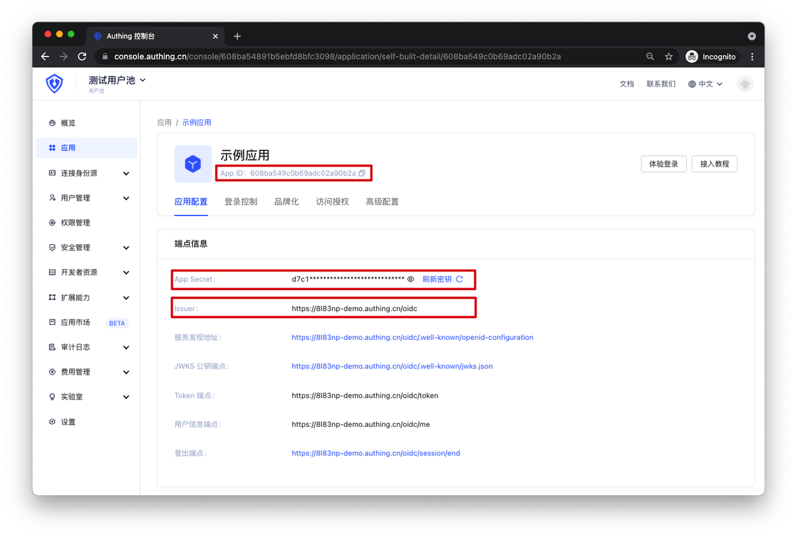
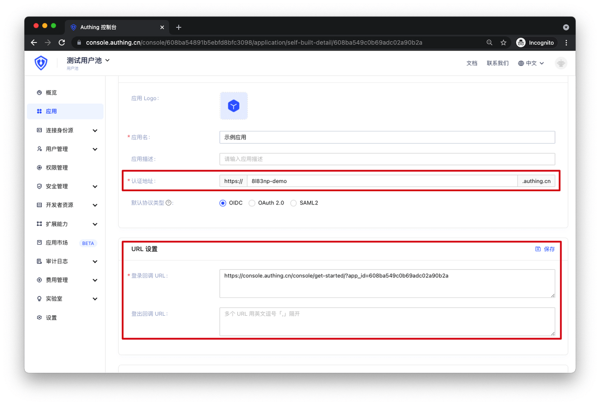

# Step 2: Click on the newly created application to get OIDC parameters

<LastUpdated/>

In the application details, you can obtain the following parameters for the application:

- App ID
- App Secret
- Issuer

- Authentication URL: This is the appHost parameter
- Login/Logout callback URL: Need to configure the application address for successful user login and logout on GenAuth

scope (Authorization Scope): Authorize access to user's detailed information.

User information corresponding to scope parameters:

| scope name      | Corresponding Information                                                                                                                            |
| --------------- | ---------------------------------------------------------------------------------------------------------------------------------------------------- |
| username        | username                                                                                                                                             |
| address         | address                                                                                                                                              |
| email           | email，email_verified                                                                                                                                |
| phone           | phone_number, phone_number_verified                                                                                                                  |
| profile         | birthdate，family_name，gender，given_name，locale，middle_name，name，nickname，picture，preferred_username，profile，updated_at，website，zoneinfo |
| offline_access  | If this parameter exists, the token interface will return the refresh_token field                                                                    |
| roles           | Corresponds to role information, user's role list                                                                                                    |
| unionid         | User's unionid field                                                                                                                                 |
| openid          | User's openid field                                                                                                                                  |
| external_id     | User ID in the original system                                                                                                                       |
| extended_fields | User's extended field information, content is an object where key is the extended field name and value is the extended field value                   |
