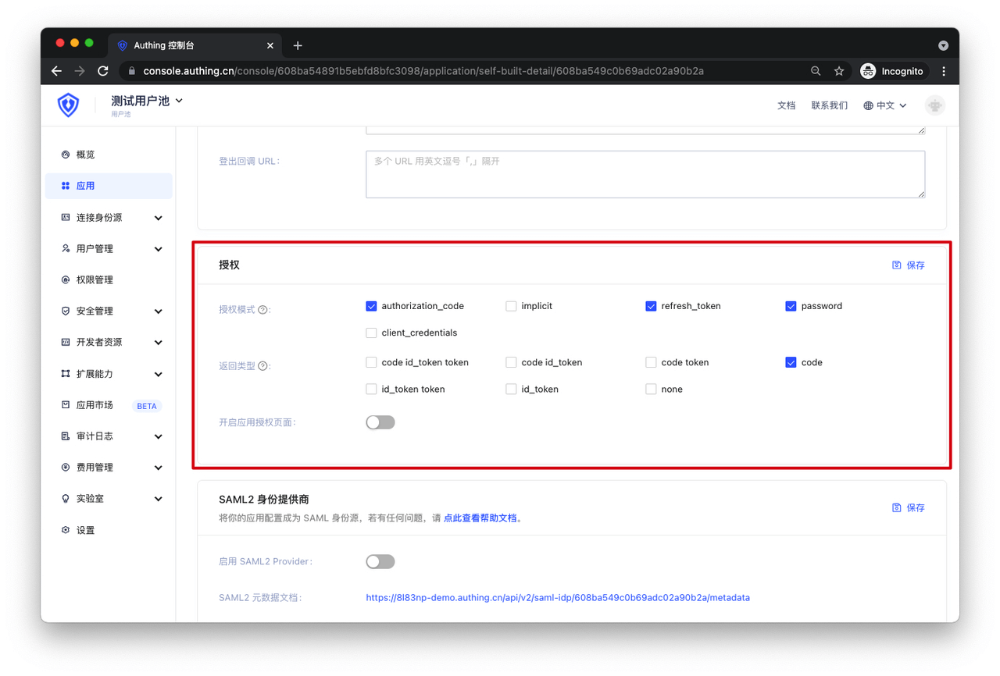

# Step 4: Test Your Application Through GenAuth's IDP

<LastUpdated/>

Below we will provide five different authorization mode test examples to help you quickly verify if your OIDC integration is successful.

You only need to test the authorization mode you have integrated. If you don't know which mode to choose, please use the most common **Authorization Code Mode** for testing. If you want to use other modes for testing, please refer to [More OIDC Test Methods](/apn/more-oidc-tests/).

## Type 1 Authorization Code Mode Test (Recommended)

**Suggestion:**

> If your application project has a **backend service** that can securely store keys, it is recommended to use the **Authorization Code Mode**.

Set up the authentication method for your application in GenAuth:

Now you can start testing.

### 1. Configure Your OIDC Identity Provider

Before making your application support the OIDC protocol, you need to configure the following information in your backend application:
