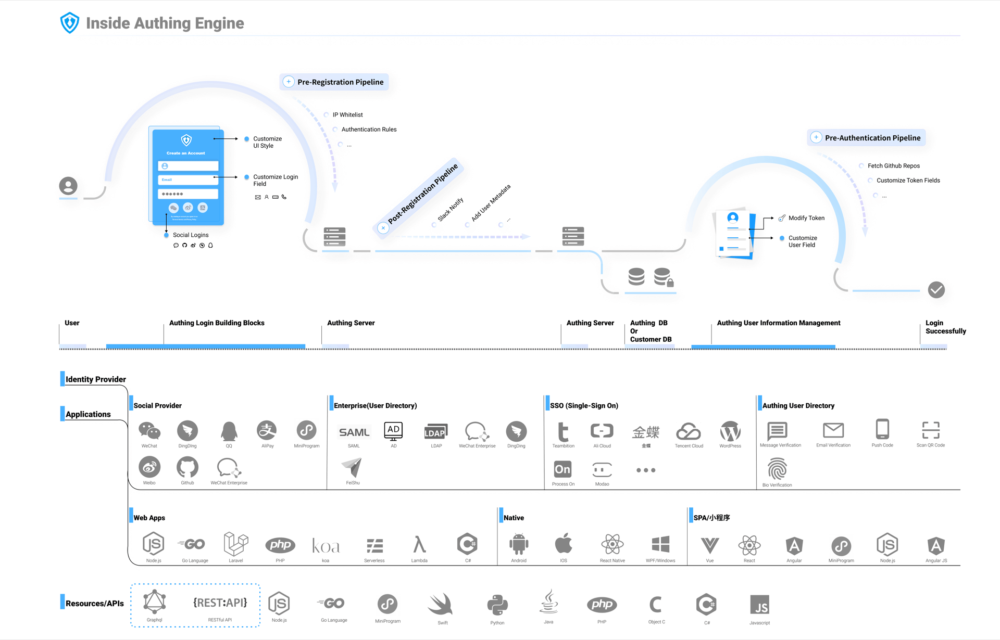

# What is GenAuth

<LastUpdated/>

{{$localeConfig.brandName}} provides professional identity authentication and authorization services for enterprises and developers on the cloud.

You can connect applications on any platform to {{$localeConfig.brandName}} (whether newly developed applications or old applications), and you can also customize the login method of the application (such as: email/password, SMS/verification code, social login, etc.).

You can choose our SDK or call related APIs to connect to your application based on the technology you use. When a user initiates an authorization request, {{$localeConfig.brandName}} will help you authenticate their identity and return the necessary user information to your application.

## Inside GenAuth Engine

## Why use GenAuth

Here are some of the use cases for {{$localeConfig.brandName}} that we have compiled:

- You want to develop a cool app, and you want to add user authentication and authorization. You want your users to be able to log in using WeChat or GitHub, and you also want to track the user's registration source and activity data so that you can do subsequent user growth.

- You have made an API, and you want to use the OAuth 2.0 protocol to ensure the security of the API.

- You have made many applications, and you want the user data of these applications to be interoperable through single sign-on (SSO).

- You have made a JavaScript front-end application and a mobile application, and you want both client applications to be able to securely access your API.

- You need to make a web application that supports SAML login.
- You think passwords are very vulnerable, so you want users to log in with a one-time mobile phone verification code or email verification code.
- If your user's password is leaked on other websites, you want to be notified so that you can notify your users to reset their passwords.
- If a user fails to log in continuously, you want to ban their IP to prevent DDOS attacks or brute force password cracking.
- You are in a large enterprise that wants to federate its existing corporate directory to allow employees to log in to various internal and third-party applications with their existing corporate credentials.
- You don't want (or you don't know how) to implement your own user management solution, nor do you want to develop repetitive UIs for password reset, creation, configuration, blocking, and deletion of users. You just want to focus on your own business R&D and product design. At this time, you can choose {{$localeConfig.brandName}} as the authentication middleware.
- You want to enforce multi-factor authentication when users want to access sensitive data.
- You are looking for an identity solution that can help you be compatible with the growing compliance requirements such as SOC2, GDPR, OpenID Connect, etc.
- You want to use data analytics to track users on your website or app, and you want to use this data to expand customer acquisition channels, measure user retention, and gradually improve the registration process.

## What industry standards does GenAuth follow?

Once upon a time, when computers were independent systems, or when the Internet did not explode, all identity authentication and user data existed on a single computer. Now times have changed, and you can use the same login information on multiple applications and websites (such as the ubiquitous "Login with WeChat"), which is achieved by following the same identity authentication standards.
These standards are a set of open specifications and protocols that can help developers and companies design good identity authentication and authorization systems, and specify how to properly manage identity, transfer data, and authorization.

**Industry standard protocols used by {{$localeConfig.brandName}} include:**

- **OAuth 2.0:** An authorization standard that allows users on one site to grant limited access to their resources to other sites without obtaining their credentials (usually account passwords). For example, this standard is used when you click "Login with WeChat" on your phone, and the system will ask you whether you agree to share your avatar, nickname and other data with the application.
- **Open ID Connect:** This is a superset of OAuth 2.0. It provides more user information and access permissions and standards on top of OAuth 2.0. For example, it defines the user's avatar as picture.
- **JSON Web Tokens:** An open standard mainly used for secure transmission of information. Its format is very compact and independent. After parsing, it is a JSON format.
- **Security Assertion Markup Language (SAML):** An XML-based open data format. SAML allows enterprise applications to connect seamlessly with internal and external programs.
- **LDAP:** You can understand the Lightweight Directory Access Protocol (LDAP) as a tree-like database used to store user and organization information. It is often used for single sign-on (SSO) and enterprise employee information management.
- **CAS**: Central Authentication Service (CAS) is a single sign-on protocol. Its purpose is to allow a user to access multiple applications by providing credentials (such as username and password) only once to the authentication server. This not only saves users from having to authenticate again when logging into web applications, but also prevents these applications from obtaining sensitive information such as passwords.
