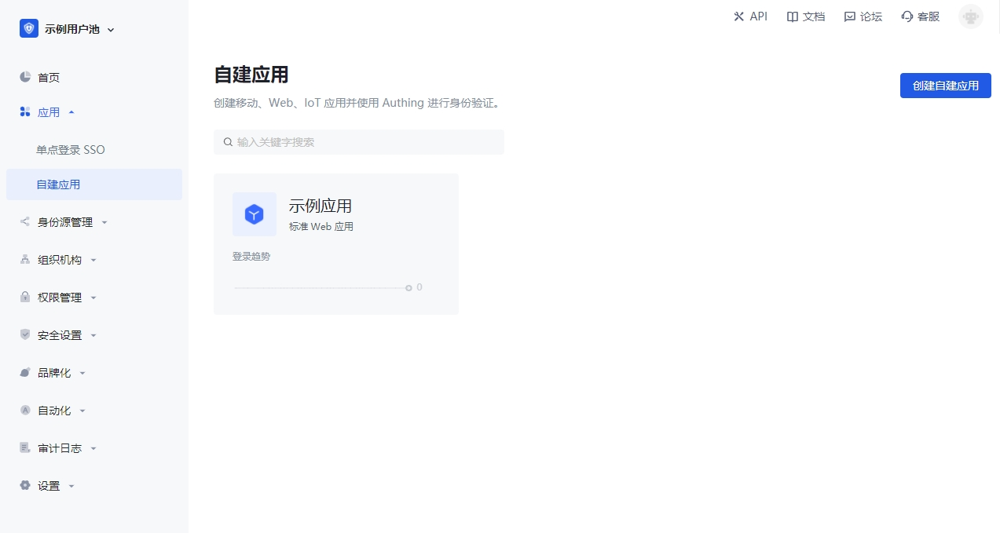
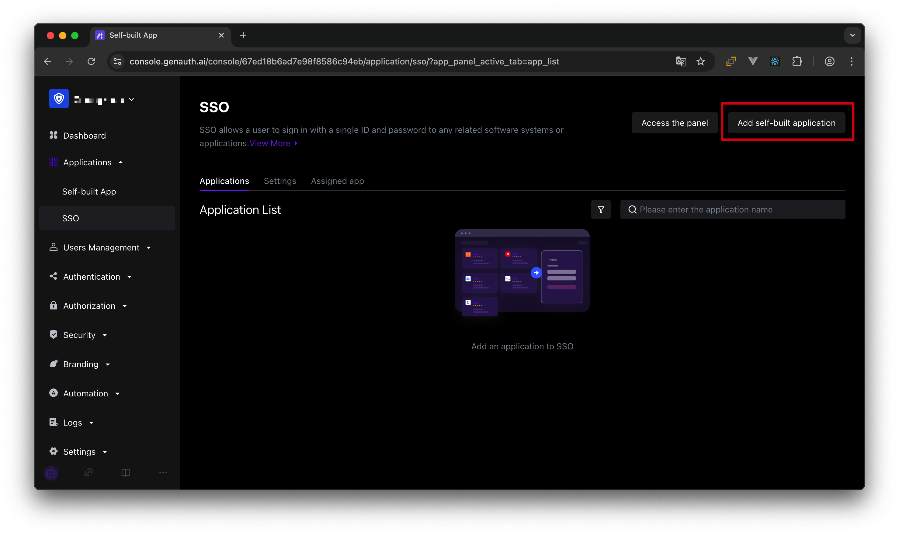
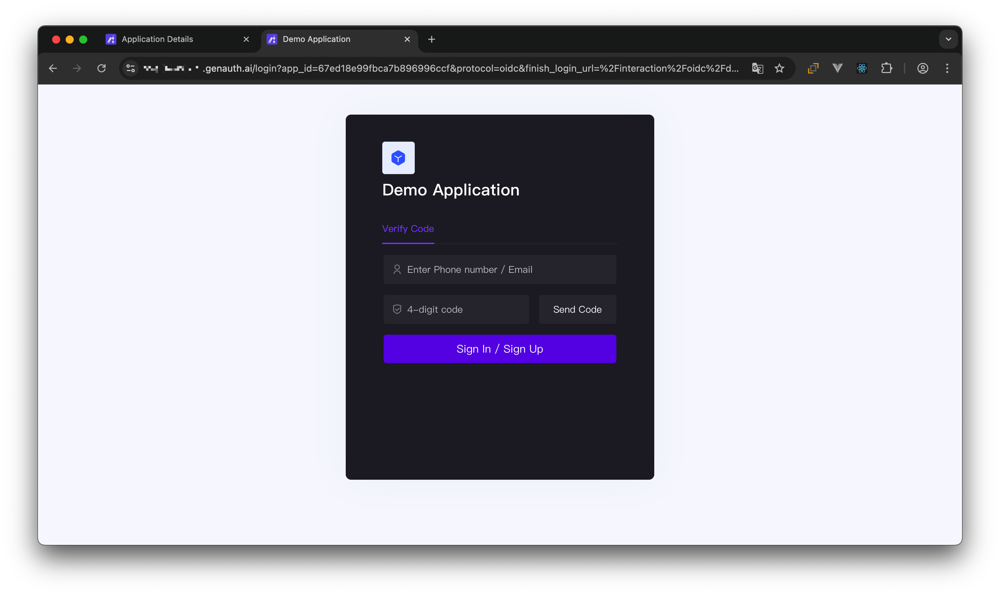
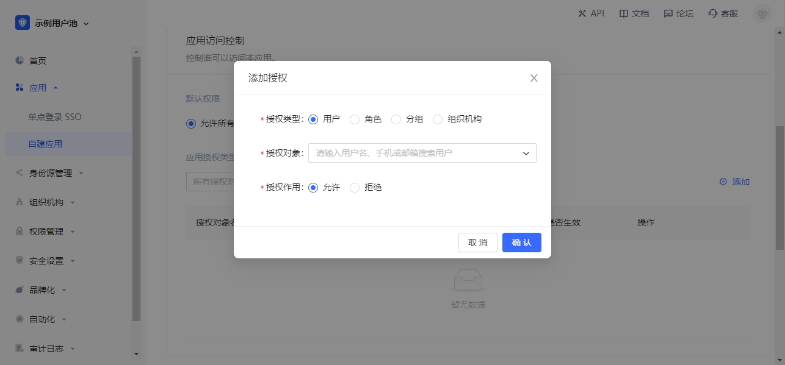

# What is an application?

<LastUpdated/>

::: hint-info
As we have introduced before, [user pool](./user-pool.md) is the smallest unit of tenant isolation in {{$localeConfig.brandName}}, which stores all user data in your user system; and the application corresponds to the business application you created in reality.
:::

A user pool may have multiple applications. For example, all students of a school are in a user pool, and the school will develop multiple applications such as course selection application, email application, teacher-student service center, etc. at the same time, and these applications will use the same user system.

## Where can I see all my applications?

You can view all your applications on the **Applications->Self-built Applications** page of the [console](https://console.genauth.ai):

## Applications share a user directory

The first thing you need to remember is that all applications in a user pool share a user directory. This design fundamentally solves the problem of user-system fragmentation that is common in old systems.

## Implement single sign-on between applications

You need to first click **Add self-built application** or **Add integrated application** on the **Application->Single sign-on SSO** management page, as shown in the figure below:

After adding the application, after logging in to application A, the user will automatically log in when accessing application B. For more details, please refer to the [Implementing Single Sign-On (SSO)](/guides/app-new/sso/) guide and the [Single Sign-On SDK](https://docs.genauth.ai/v3/reference/sdk/web/).

## Access the online login form

Each application in {{$localeConfig.brandName}} has an online login registration page for end users. You can visit "`https://<YOUR_APP_DOMAIN>.genauth.ai/`" or "`https://<YOUR_APP_DOMAIN>.genauth.ai/login`":

## Integrate the component version of the application login box into your application system

The {{$localeConfig.brandName}} embedded login component is a lightweight, modern, and highly scalable front-end login component provided by {{$localeConfig.brandName}}. It supports native JavaScript and the three major front-end frameworks of React, Vue, and Angular. This embedded login component is basically consistent with the login page hosted by {{$localeConfig.brandName}}, and has strong customization capabilities. This component has built-in functions such as password reset, MFA, social login, and scan code login, all of which are highly configurable.

For details, see [Use the embedded login component to complete authentication](/guides/basics/authenticate-first-user/use-embeded-login-component/).

## Access the online version of the personal center

In {{$localeConfig.brandName}}, each application has an online personal center page for end users to use. You can visit `https://<YOUR_APP_DOMAIN>.genauth.ai/u` to access:

## Control whether users can access a specific application

By default, all users in your user pool can log in to your application. You can also control who can access this application in the **Application Access Control Module** of **Application Details Page->Access Authorization**.

> You can grant users, roles, groups, and organizations access to the app.

## Other features

Each app in {{$localeConfig.brandName}} has the following capabilities:

- [Become an OIDC identity source](/guides/federation/oidc.md).
- [Become an OAuth identity source](/guides/federation/oauth.md).
- [Become a SAML identity source](/guides/federation/saml.md).
- Customize the login style by configuring login registration methods, [Configuring social login](/guides/connections), customizing CSS, etc.
- Enable registration protocol.
- Complete the registration information. For details, please refer to [Extend the authentication process - Complete custom field data during registration](/guides/authentication/extensibility/user-defined-field.md).
- Enable multi-factor authentication.
- Manage and authorize API resources. For details, please refer to [User-consented resource authorization](/guides/authorization/user-consent-authz.md).
- Application access control, control which users can access your application.
- Sub-accounts, add sub-account login capabilities.
- Login state management, you can [view the current online users of the application](/guides/user/login-state.md).
