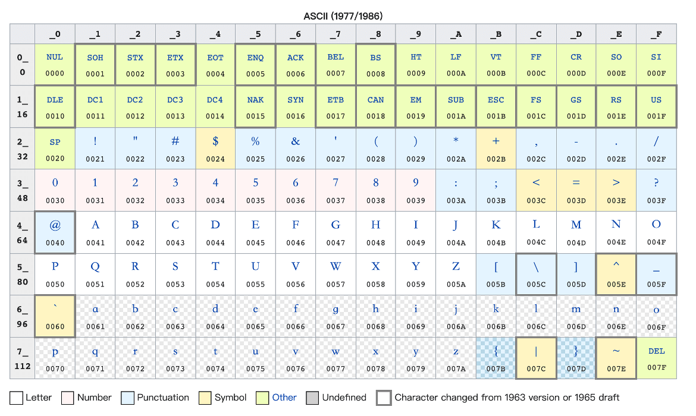
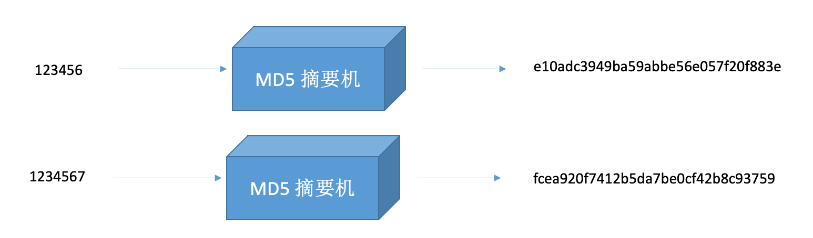
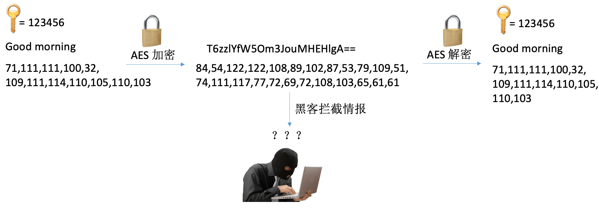
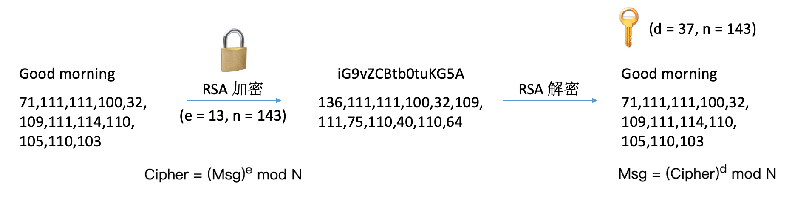
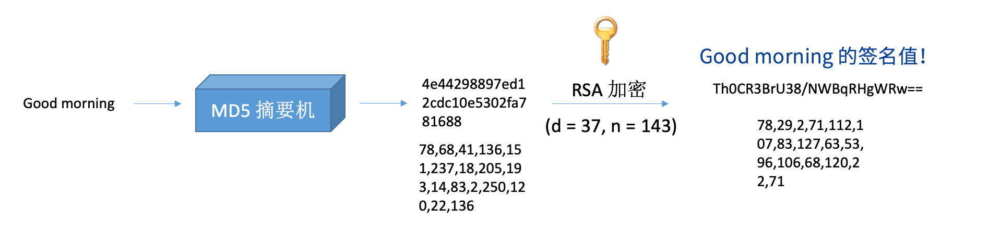
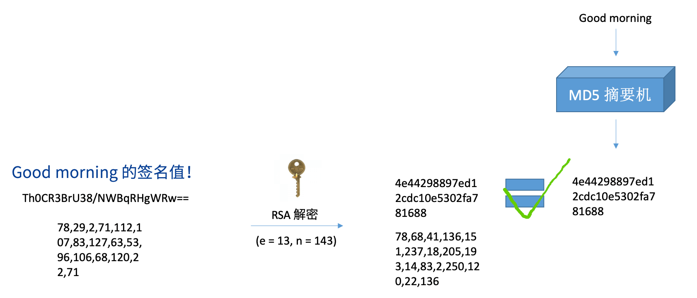

# Basic Concepts of Cryptography

<LastUpdated/>

This article describes several common concepts in cryptography: encryption, decryption, signature, signature verification, summary, encoding, public key, and private key.

## Encoding

Encode information, **without information loss**, and anyone can decode the information through encoding. For example, ASCII code, base64 encoding.

For example, the following is an ASCII encoding table:

## Summary

Calculate the summary value of the information, **with information loss**, such as md5 summary, sha1 summary.

## Encryption

Encrypt information so that it cannot be known by the listener, **without information loss**. For example: AES, DES, RSA.

## Public key

The public key is two numbers, e (e = 65537, e > 1 and coprime with ø(n), ø(n) is the Euler function), n (n = p \* q, p, q are prime numbers), used for signature verification or encryption. Generally speaking, we do not say that we use the public key to decrypt, but we say that we use **public key to verify**. For example, RSA public key.

## Private key

The private key is two numbers, d (e is the inverse element of ø(n), ø(n) is the Euler function), n (n = p \* q, p, q are prime numbers), used for signing or decrypting. Generally speaking, we do not say that we use the private key to encrypt, but we say that we use **private key to sign**.

## Relationship between public key and private key

There is no difference in mathematics, they are both a pair of numbers, depending on which set of numbers is made public. The content encrypted by the public key must be decrypted with the private key; the content encrypted by the private key must be decrypted with the public key. The private key must be protected by yourself and must not be leaked; the public key can be made public on the Internet and anyone can use it to encrypt information. Of course, only the private key can decrypt the encrypted content.

## Signature

Calculate the summary value of the information, sign the summary value with the private key, and generate a signature value. The signature algorithm includes RS256, etc.

## Verify Signature

Use the public key to verify the signed information. After getting a piece of information and its signature value, you need to calculate the information summary value first, decrypt the signature value with the public key, and compare it with the calculated information summary value.

