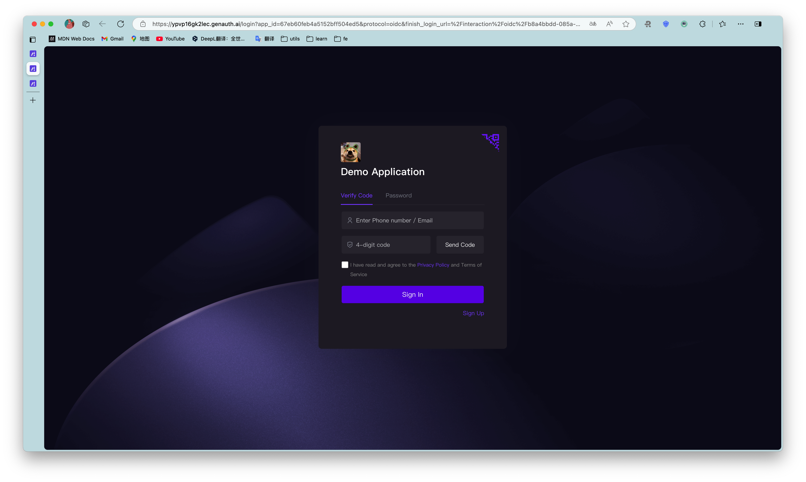

# Hosted Login Page vs Embeddable Login Component

<LastUpdated/>

There are multiple authentication integration methods available in the {{$localeConfig.brandName}} system, the most recommended and commonly used of which are the "hosted mode" and the "component embedded" mode. Both modes provided by GenAuth are easy to implement, and you can read the onboarding process of the [hosted login page](/guides/basics/authenticate-first-user/use-hosted-login-page.md) and the [embedded login component](/guides/basics/authenticate-first-user/use-embeded-login-component/) respectively. The difference between the two lies in the usage scenario, customization flexibility, and maintenance management cost.

## Hosted Login Page

GenAuth hosted mode is considered the simplest and most secure integration method. This is because the login process is maintained by {{$localeConfig.brandName}} and kept secure by {{$localeConfig.brandName}}. For most integrations, it is recommended to use the {{$localeConfig.brandName}} hosted login flow. Your business system redirects the user to {{$localeConfig.brandName}}, where the user authenticates and then redirects back to the application callback connection configured in the console. This design is considered a security best practice. In terms of custom configuration, the hosted mode provides a moderate degree of customization of the login registration form, which can be customized through console configuration and CSS.

For details on access, please see [Use hosted login page to complete authentication](/guides/basics/authenticate-first-user/use-hosted-login-page.md).

## Embeddable login component

The customer-hosted login component (Guard) is considered to be the best balance between flexibility and integration. If the integration requires a deeper level of customization or some scenarios where the hosted mode cannot be used in front-end and back-end separation, it is recommended to use the component embedding mode. The customer embedded component embeds the page by providing an open source Guard connection. The embedded login component is built and updated by GenAuth, uses industry best practice security design, and can be integrated into your developed project with only a few lines of JavaScript code. It can be loaded directly from CDN or NPM, or built from source code. The {{$localeConfig.brandName}} login component provides multiple integration modes for Javascript native, React, Vue, and Angular, allowing seamless integration and high customization flexibility in any of your projects.

For more information, see [Use the embeddable login component to complete authentication](/guides/basics/authenticate-first-user/use-embeded-login-component/).

## Most should use {{$localeConfig.brandName}} for hosting

- Easy to maintain, no maintenance, no updates.
- Hosted and protected by {{$localeConfig.brandName}}.
- No XSS (cross-site scripting) attacks and other potential risks.
- Easy to integrate.
- Customizable through console configuration and CSS.
- Complex logic changes that require access to source code are limited.
- Redirect users out of the application, then redirect to {{$localeConfig.brandName}}, and then redirect again.

## What about component embedding?

- May require moderate maintenance. If you use a CDN, maintenance efforts will be more limited because GenAuth will keep it up to date. NPM packages a specific version of the login component, which means that it may need to be updated regularly in your project.
- If implemented using recommended best practices, it is still considered very secure.
- Source code customization control is powerful, while greatly simplifying the development process and improving security compared to building from scratch.
- If you are integrating and developing in full accordance with our documentation or related tutorials, there is no security risk. However, it should be noted that if your integration implementation scheme deviates greatly from our recommended approach, such as not keeping security credentials effectively, there may be potential security risks.
- May be vulnerable to XSS (cross-site scripting) attacks.
- Compared with the login process hosted by {{$localeConfig.brandName}}, the integration and maintenance workload is higher.
- Keep users in the application and reduce redirects to and from {{$localeConfig.brandName}}.
