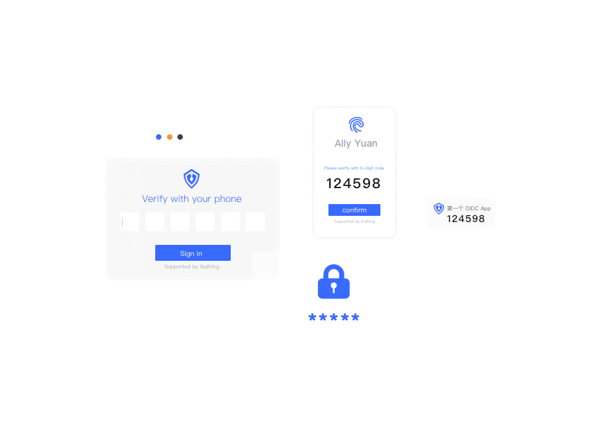
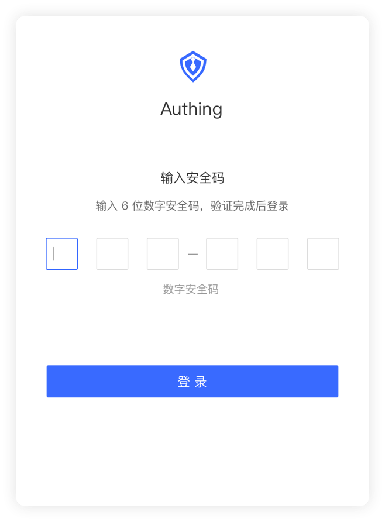
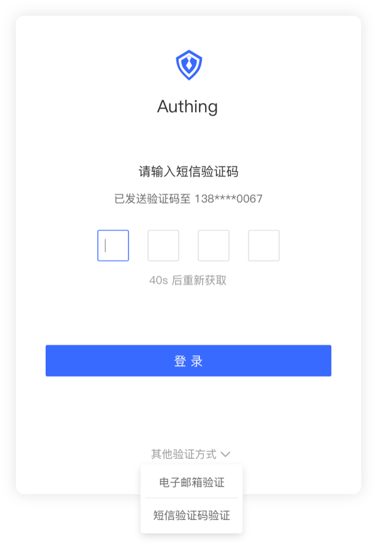
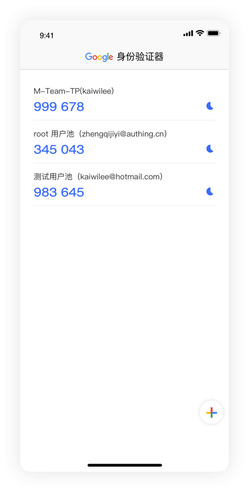
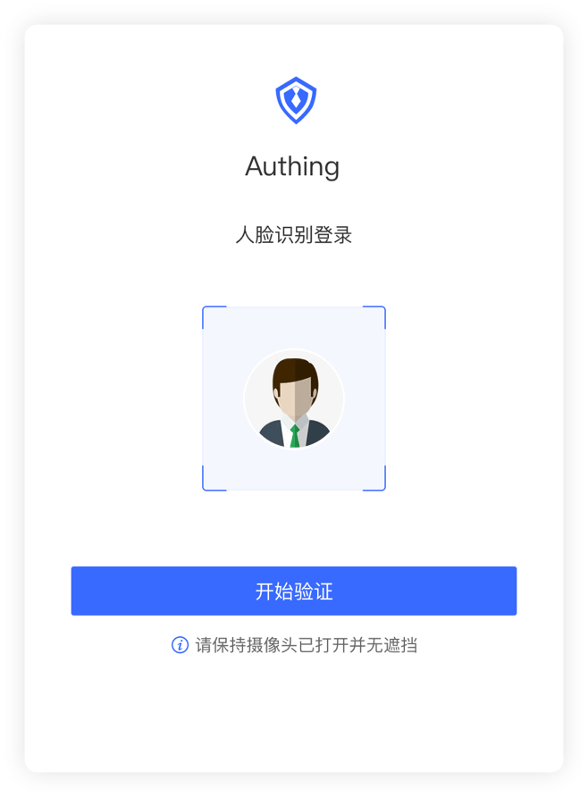
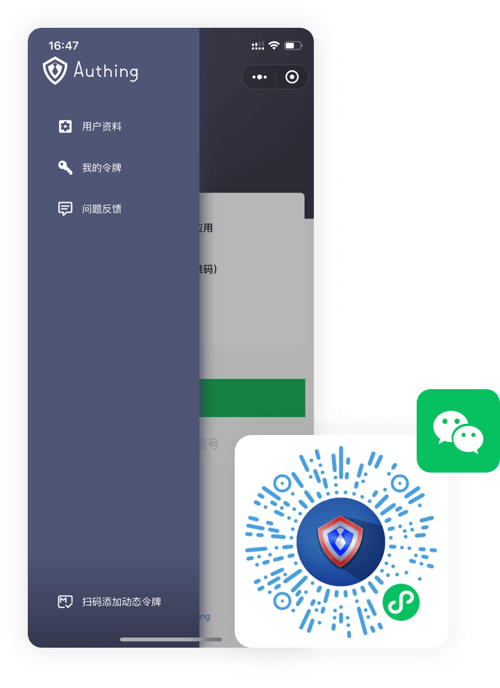

---
tags:
  - Lightweight Directory Access Protocol
---

# What is Multi-Factor Authentication

<LastUpdated/>

Multi-Factor Authentication (MFA) is a very simple security practice that can add an extra layer of protection beyond the username and password. After enabling multi-factor authentication, users need to provide a second authentication in addition to the username and password (first authentication) when performing operations. Multi-factor authentication combined will provide higher security protection for your account and resources.

For enterprises, the cost of data breaches is becoming more and more serious. On the one hand, enterprises will be punished by regulators, such as British Airways, which was fined 204 million euros by the UK Information Commissioner's Office (ICO) for data breaches. On the other hand, once a data breach occurs, the enterprise will lose the trust of customers and users, affecting the company's long-term development.

Therefore, the use of MFA has become a basic means for enterprises to prevent data breaches. MFA requires users to use at least two factors to verify their identity before they can access the application, which is rapidly becoming popular in enterprises.

Late last year, LastPass conducted a survey of 47,000 businesses and found that 57% of businesses worldwide are currently using MFA, up 12% from the previous year. Statistics also prove the effectiveness of MFA. Earlier this year, Microsoft reported that 99.9% of the breached accounts it tracked did not use multi-factor authentication.

## GenAuth Multi-Factor Authentication Core Functions

- GenAuth ensures business security through multiple authentication methods.

- [Custom authentication process](/guides/pipeline/), one-click start, simple operation.

- Support device environment data reporting, multi-dimensional analysis of security levels.

- Support configuration policies to achieve environmental risk adaptation.

- Also applicable to [in-application permission control scenarios](/guides/access-control/).

- Default integration with [Universal Login Component (Guard)](/reference/guard/).

- [Manage user data, query behavior logs](/guides/audit/).
- Provide [SDK and open interface](/reference/) to help developers quickly call related capabilities and build customized user management pages.

## Multi-factor authentication method

GenAuth provides multiple authentication methods to improve enterprise identity security.

### Mobile token

Through highly secure dynamic OTP password verification, help protect account security and avoid malicious attacks.

### SMS/email verification code

- Simple operation.

- Convenient and fast.

- Improve login security.

### Compatible with third-party authenticators

Compatible with third-party authenticators, including but not limited to:

- Google Authenticator
- Microsoft Authenticator

### Face recognition

As a key factor of human characteristics, face is widely used in the field of security authentication.

<!-- ### Mini Program Authentication

Integrate the GenAuth mobile token authenticator into the WeChat mini program, eliminating the process of installing the APP and quickly using the mobile authenticator.

 -->

## Advantages of GenAuth multi-factor authentication

### Developer-friendly

Provide an out-of-the-box end SDK to facilitate end developers to quickly implement MFA.

- Support multiple ends: [Web](/reference/guard/), [iOS](/reference/sdk-for-swift.md), [Android](/reference/sdk-for-android.md).
- Built-in multiple MFA components, such as OTP, verification code, face recognition, etc.
- Only one method needs to be called to invoke the MFA authentication component, get the authentication result, and complete the authentication process.

### Customized data reporting

Customized data reporting, participating in process initiation decision-making, covering more complex and refined scenarios.

- Supports reporting data when the [GenAuth SDK](/reference/) is initialized.
- Supports scheduled data reporting.
- Supports active data reporting when the application is running.

### Policy-based

MFA trigger conditions are based on custom policies, and the policy system is simple, efficient, complete, and flexible:

- Simple: If you don't want to configure complex policies, you can use the default security policy or preset hit conditions.

- Efficient: The policy hit is judged in milliseconds, and MFA is immediately invoked; based on a friendly user interface.
- Complete: The policy is described based on function expressions, and developers can obtain enough information (including but not limited to user information, devices, networks, locations, behaviors, custom reported data, etc.) to write policy hit logic.
- Flexible: Hit judgment can be made based on multiple methods at the same time.

### Simple configuration

Based on a friendly user interface, quickly configure MFA for specific applications:

- One-click to turn on/off MFA.

- One-click to enable the default security policy, without understanding the policy configuration, can also greatly improve the security of the application.

- Preset more than a dozen important and commonly used policy hit conditions, which take effect immediately after selection, and can be used by non-engineers.

## Adaptive Multi-factor Authentication

Compared to traditional MFA, adaptive MFA can choose to apply different authentication methods according to the current security situation, ensuring security while also taking into account user experience. Adaptive MFA provides a more flexible and intelligent verification strategy.

When the user goes through the authentication process, "adaptive" MFA generates multiple key elements for the currently logged-in user:

- User attributes: such as user name, password, user identity and other user attributes and information.

- Location awareness: Location awareness is divided into virtual location (IP address) and physical location (country, region, etc.).

- Request source: Determine the source of the current user's request, such as hardware device information, the system the user is currently in, etc.

- Biometrics: Identify the user's biometric information, such as face recognition.

- Behavior analysis: A series of user behaviors such as whether it comes from a common login location, whether the wrong password has been entered multiple times, and the user's previous operation records.
