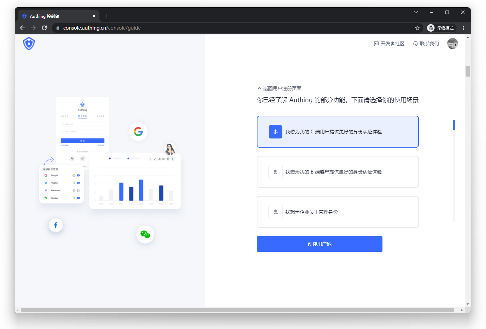

# What is a user pool

<LastUpdated/>

When you start to build an exciting application, the first thing is often to build a user system. Building a user system always involves complex authentication processes and security issues. Using {{$localeConfig.brandName}} can relieve you of these troubles.

The first step in using {{$localeConfig.brandName}} is to create a user pool. The user pool is the smallest unit of isolation for your user system. You can divide users in different scenarios into different user pools. Each user pool has its own users and applications. The permissions, applications, and organizations between different user pools are completely isolated.

<!-- (It is recommended to add a user pool and multi-application architecture diagram here) -->

You can create users in the user pool of {{$localeConfig.brandName}}, import users through directory integration, or import users through application integration. Applications under a user pool are connections to public applications (such as Office365) or private applications (such as your own applications). Through such connections, your users can quickly and efficiently complete authentication and authorization between different applications with one identity.

## URL address of user pool

When creating a user pool for {{$localeConfig.brandName}}, a URL is assigned to each user pool (that is, the address in the browser address bar after entering the user pool). A typical organization URL is the tenant name (subdomain) and then the domain name (such as `you-tenant-domain.genauth.ai`). You can customize the URL of the {{$localeConfig.brandName}} user pool by replacing the {{$localeConfig.brandName}} domain name with your own domain name. [For details, please see this document](/guides/deployment/custom-domain.md).

## Administrator console

The administrator console (or management console) is where you use to manage the {{$localeConfig.brandName}} user pool. As an administrator, you need to log in to the Admin Console through the domain [https://console.genauth.ai](https://console.genauth.ai). In the Admin Console, you can create new user pools or switch between different user pools.

Entering a user pool in the Admin Console allows you to manage user data and application connection information within the user pool.

## Cross-user pools

User pools are hard boundaries for users or application resources, so user and application data cannot be shared between user pools. You can use [federation authentication](/guides/federation/) to allow users to log in across user pools, but users still exist in each organization separately.

## Multiple user pools

In most cases, your company or project has only one user pool. A single user pool provides a standard resource management entry for the entire user base, an integration point for applications, and has low complexity.
However, in more complex situations, you may need multiple user pools. For example, your company is a large organization with more than 10,000 employees and many upstream and downstream suppliers. You need to coordinate employees and suppliers in an ERP application to complete a business process. At this time, you can create two user pools, one for internal employees and another for external suppliers. By connecting to external identity sources, suppliers are allowed to access internal ERP applications, achieving segmented management and collaborative work between internal and external organizations.
Multiple user pools allow complete isolation of internal and external users, and applications and changes of internal or external organizations do not affect each other. However, multiple user pools increase complexity in terms of the number of environments to be managed. We recommend reducing the number of user pools as much as possible to reduce system complexity.

## What is a user pool scenario

In {{$localeConfig.brandName}}, we divide user pools into different usage scenarios to better serve you. Each scenario has an independent service plan, which is divided into "B2C", "B2B" and "B2E". Before creating a user pool, you must select the scenario. The corresponding options are: B2C - I want to provide a better identity authentication experience for my C-end users; B2B - I want to provide a better identity authentication experience for my B-end customers; B2E - I want to manage employee identities for the enterprise.

## Fees

In {{$localeConfig.brandName}}, different user pool scenarios have different charges. Except for B2E, each scenario is divided into "Free Edition", "Basic Edition", "Premium Edition" and "Enterprise Edition".

For a detailed comparison of the functions and services of "Free Edition", "Basic Edition", "Premium Edition" and "Enterprise Edition" in different scenarios, please see the [Official Website "Pricing" Page](https://www.genauth.ai/pricing) for details.

## Next

After understanding the concept of user pool, you can learn about the concept of [application](./application.md).
