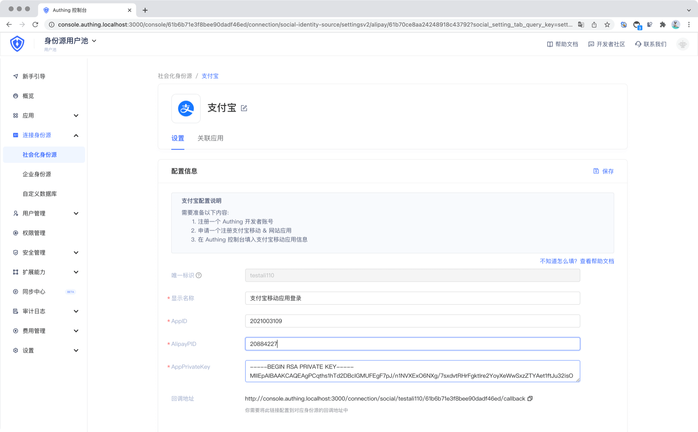
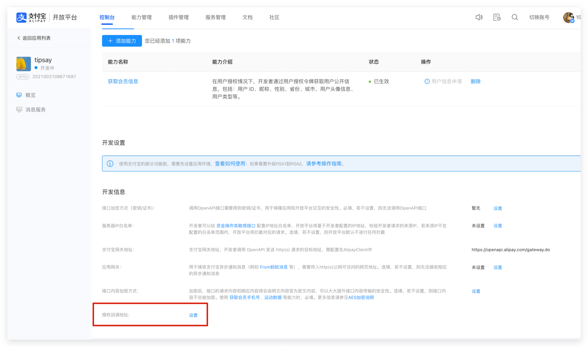

<IntegrationDetailCard :title="`Fill in the Alipay application configuration in ${$localeConfig.brandName}`">

You need to add the configuration of the application you created in the previous step in {{$localeConfig.brandName}}:

1. In the [{{$localeConfig.brandName}} console](https://console.genauth.ai), enter the "Social Identity Source" configuration page and click "Create Social Identity Source" to start selecting and creating.
   
2. Among all the social identity source icons, find and enter **Alipay (Web)** Social Login.
3. In the configuration form, fill in the following configurations according to the instructions:

- AppID: Alipay application ID;

- AlipayPID: Alipay main account ID, usually a number starting with 2088;

- AppPrivateKey: application private key;

4. Configure the generated callback address on the authorized callback address set in the Alipay web application development.

5. After the configuration is completed, click the "Create" button to complete the creation.

</IntegrationDetailCard>
