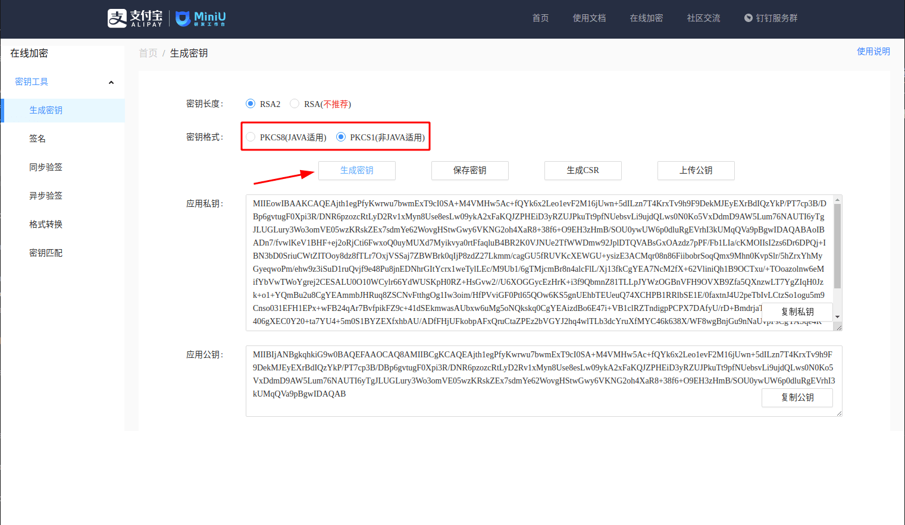
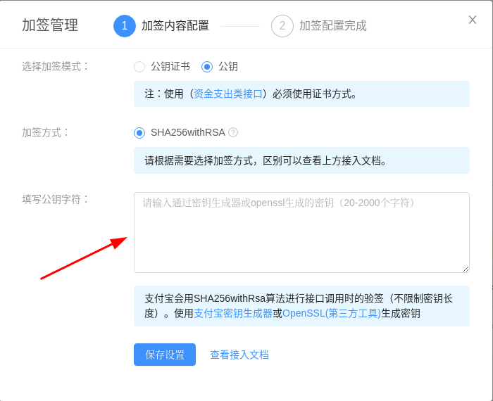

<IntegrationDetailCard title="Create a mobile app on Alipay Open Platform">

1. Go to [Alipay Open Platform](https://open.alipay.com/) to register an Alipay open account;

2. Go to [Developer Center Console](https://open.alipay.com/platform/developerIndex.htm) and follow the instructions to create a **mobile app**.

> Please make sure that your app has the **Get Member Information** capability, otherwise you will not be able to log in using Alipay.

3. After creating the app, you need to obtain the following app information:

- AppID (Application ID): You can get it in [Admin Center - My Application List](https://openhome.alipay.com/platform/appManage.htm#/apps).
- AlipayPID (Alipay main account ID, usually a number starting with 2088): You can get it on the [Account Center - Main Account Management](https://openhome.alipay.com/dev/workspace/account-center/main-account-manage) page.
- AppPrivateKey (application private key): You can generate a pair of application public and private keys in the [Alipay Online Key Generator](https://miniu.alipay.com/keytool/create):

> The key format must be PKCS1.

After generation, fill the "application public key" into the "interface signing method" configuration of your Alipay application. Save the "application private key" for the next step.

</IntegrationDetailCard>
