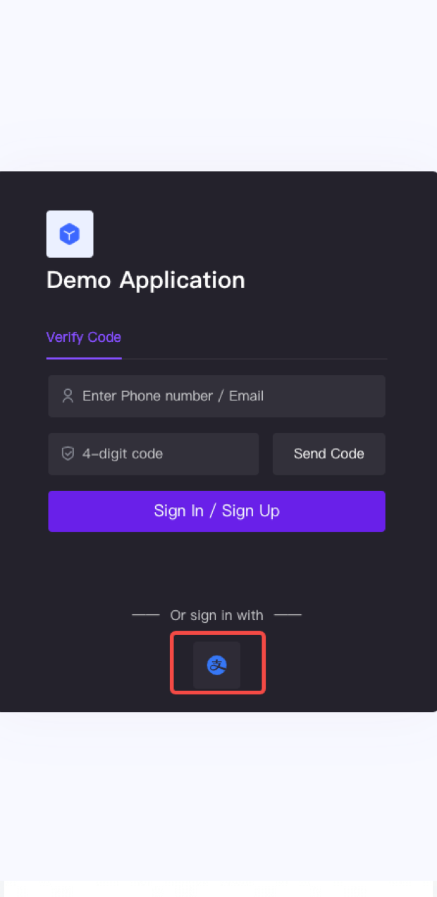

<IntegrationDetailCard title="Start Development Access">

#### Mobile Integration

With the SDK we provide, developers only need one line of code to integrate the one-click login function. Please refer to:

- [Android Integration Guide](https://github.com/Authing/guard-android/blob/master/doc/social/alipay.md)

- [iOS Integration Guide](https://github.com/Authing/guard-ios/blob/main/doc/social/alipay.md)

The effect after successful integration is as follows:

</IntegrationDetailCard>
