<IntegrationDetailCard title="Get Team ID">

Before configuring Sign in with Apple in the {{$localeConfig.brandName}} console, you need to register your iOS app in the [Apple Developer Portal](https://developer.apple.com/account/#). Once you have done this, you can fill in the {{$localeConfig.brandName}} Dashboard configuration form with the ID and Secret you obtained from Apple.

</IntegrationDetailCard>

<IntegrationDetailCard title="Create an App ID">

Go to the [Membership page](https://developer.apple.com/account/#) of the [Apple Developer Portal](https://developer.apple.com/account/#/membership) and record the **Team ID**:

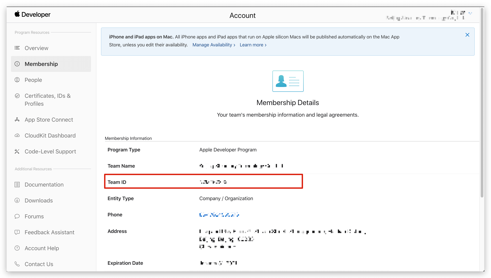

1. In the Apple Developer Portal, **Certificates, IDs, & Profiles** > **Identifiers** page, click the ➕ icon to create an app:

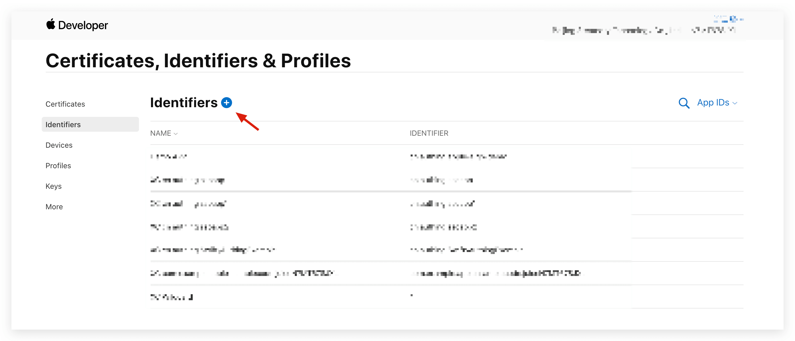

2. Select **App IDs** and click the **Continue** button to continue:

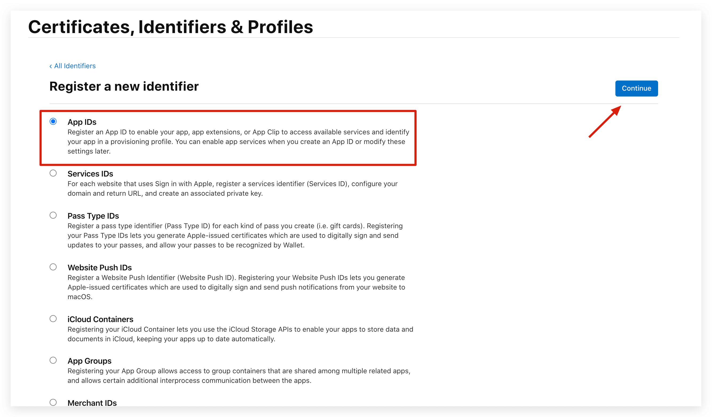

3. Select the application type of the format and click the **Continue** button to continue:

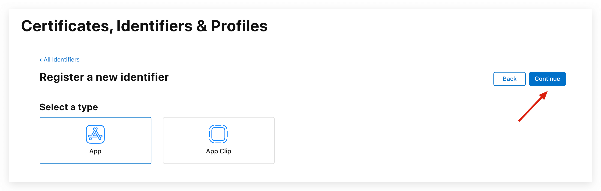

4. Fill in the application description and **Bundle ID**, please record this **Bundle ID**:

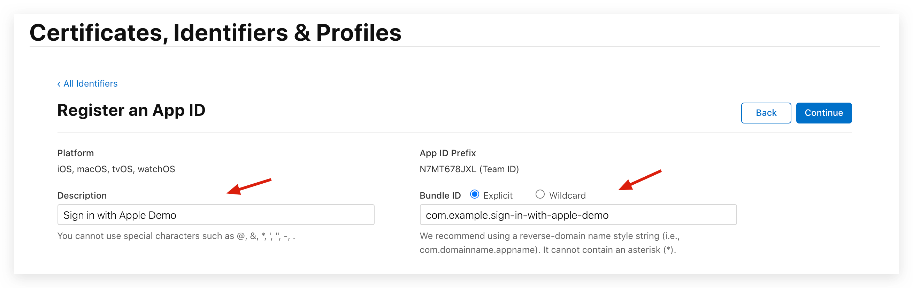

5. Slide the browser to the bottom to find Sign in with Apple and check it

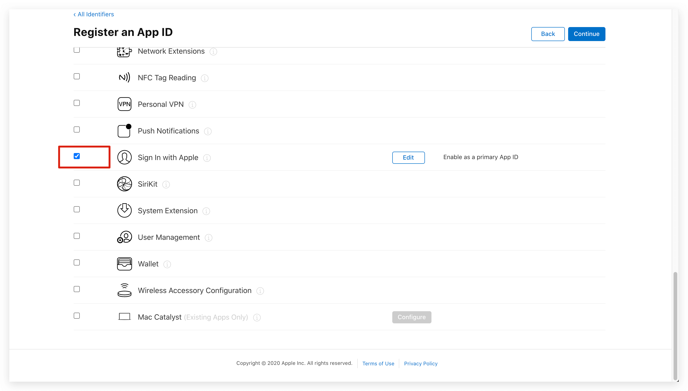

6. Finally, click the **Continue** button to create the app.

</IntegrationDetailCard>

<IntegrationDetailCard title="Create a Service ID">

1. Go back to **Certificates, IDs, & Profiles**, click the ➕ icon, select **Services IDs**, and then click the **Continue** button to continue:

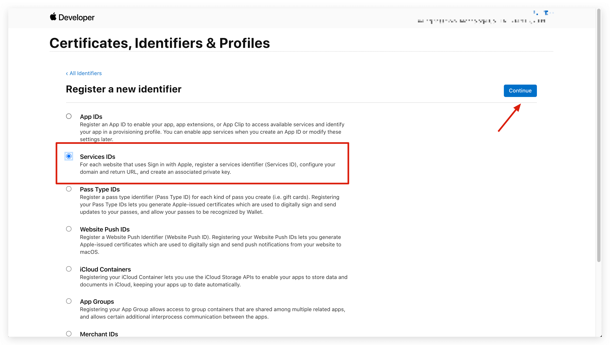

2. Fill in the description and Identifier, then click the **Continue** button to create the Service:

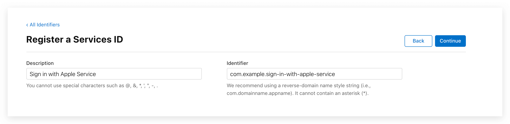

3. Find the Service you just created, select **Sign In with Apple**, and click **Configure**:

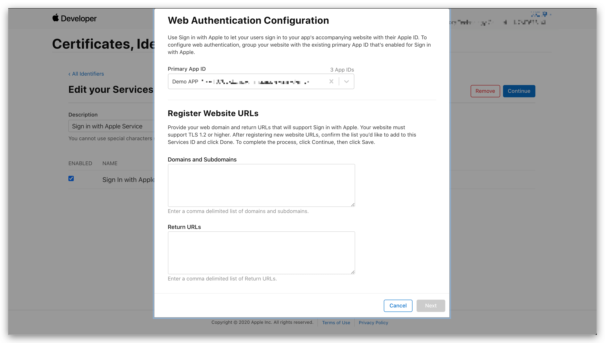

4. Fill in **Domains and Subdomains** and **Return URLs**:

- **Domains and Subdomains** Please fill in **core.genauth.ai**
- **Return URLs** Please fill in `https://core.genauth.ai/connection/social/apple/<YOUR_USERPOOL_ID>/callback`, please replace `<YOUR_USERPOOL_ID>` with your user pool ID.

5. Click **Save**, **Continue**, and finally **Register**.

6. Please record the **Service ID**.

</IntegrationDetailCard>

<IntegrationDetailCard title="Configure Signing Key">

1. Return to the **Certificates, IDs, & Profiles** page, switch to the **Keys** tab, and click the ➕ icon:

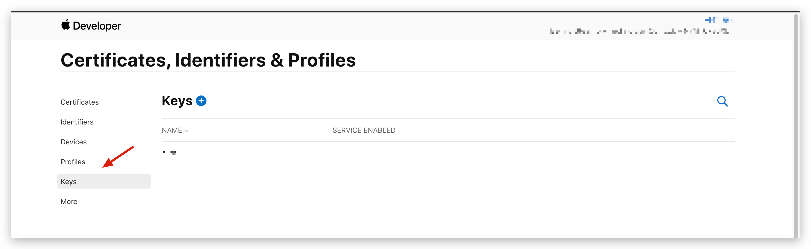

2. Enter a name and check **Sign in with Apple**, click **Configure**, and make sure the **Primary App ID** selected is the one you just created:

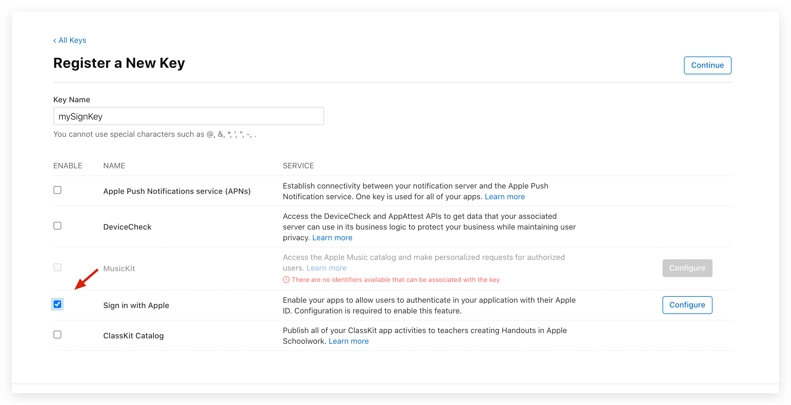

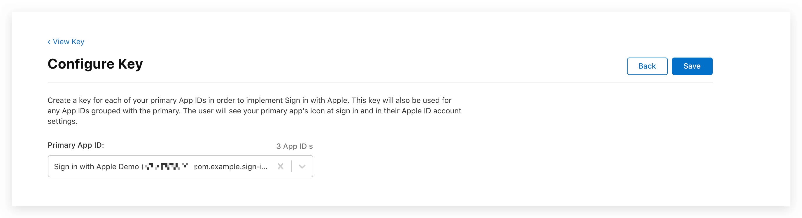

3. Click **Save**, **Continue**, and finally **Register**.

4. After creation, record the **Key ID** and click **Download** Download the key:

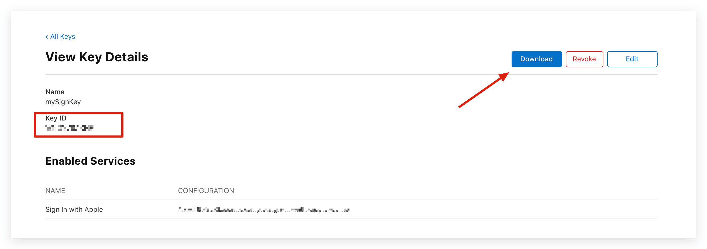

</IntegrationDetailCard>
