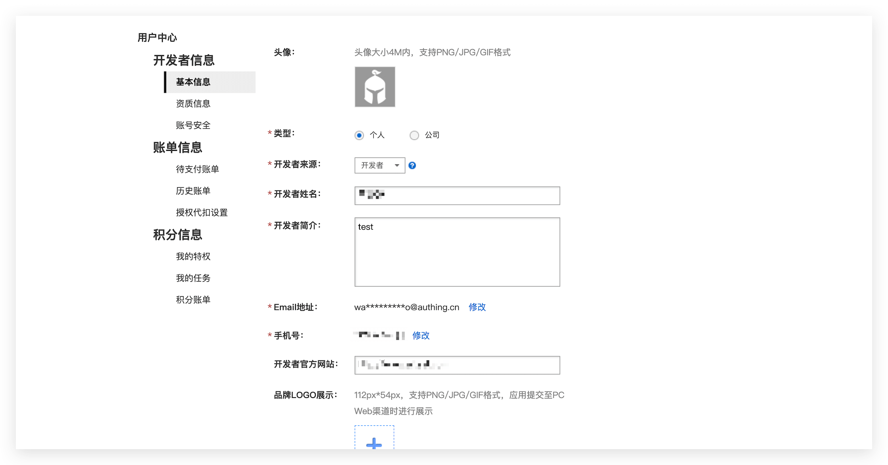
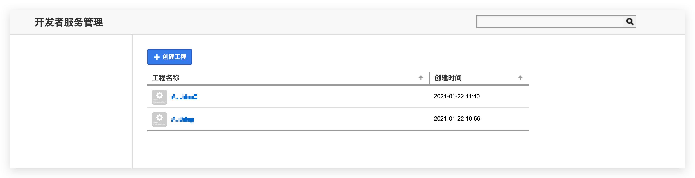
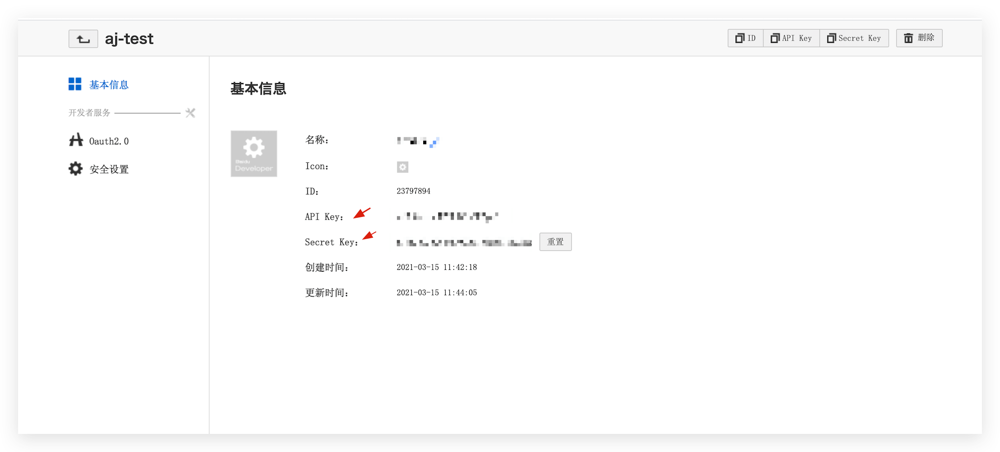
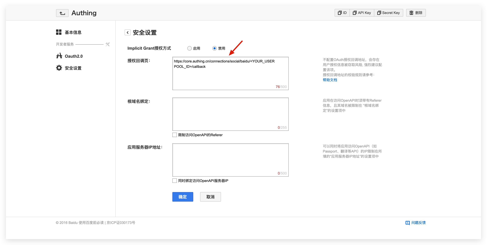

<IntegrationDetailCard title="Create a website application on Baidu Open Platform">

## Create a Baidu OAuth application

Register a **Baidu developer account**, log in and go to the [Baidu Developer Service Management Console](http://developer.baidu.com/console#app/project), fill in the developer information, and create a project (application):

After the creation is complete, you need to record the application's **API Key (i.e. Client ID)** and **Secret Key (i.e. Client Secret)**, which will be used later.

On the security settings page, set the authorization callback page address to:

| Field                      |                                     Value                                     |
| -------------------------- | :---------------------------------------------------------------------------: |
| Authorization callback URL | `https://core.genauth.ai/connection/social/baidu/<YOUR_USERPOOL_ID>/callback` |

> Replace <YOUR_USERPOOL_ID> with your user pool ID.

</IntegrationDetailCard>
