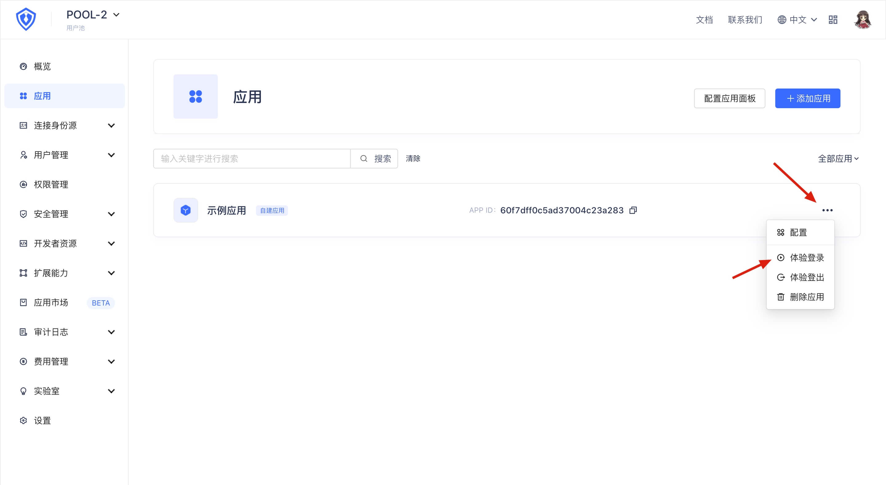
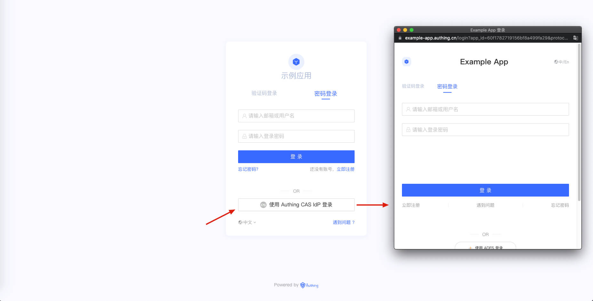

<IntegrationDetailCard :title="`Login with CAS IdP ${$localeConfig.brandName}`">

Open the **{{$localeConfig.brandName}} console** and go to **"User Pool B"**. Find the application you just created in the "Application" panel and click "Experience Login" in the expand menu on the right.

On the login page, click the "Login with `Connection Name`" button, where `Connection Name` is the connection display name previously configured in {{$localeConfig.brandName}}, and the login box of the identity source user pool will pop up.

In the pop-up login box, enter the user's username and password in **"User Pool A"**, and you can use the identity information in **"User Pool A"** to log in to **"User Pool B"**.

</IntegrationDetailCard>
