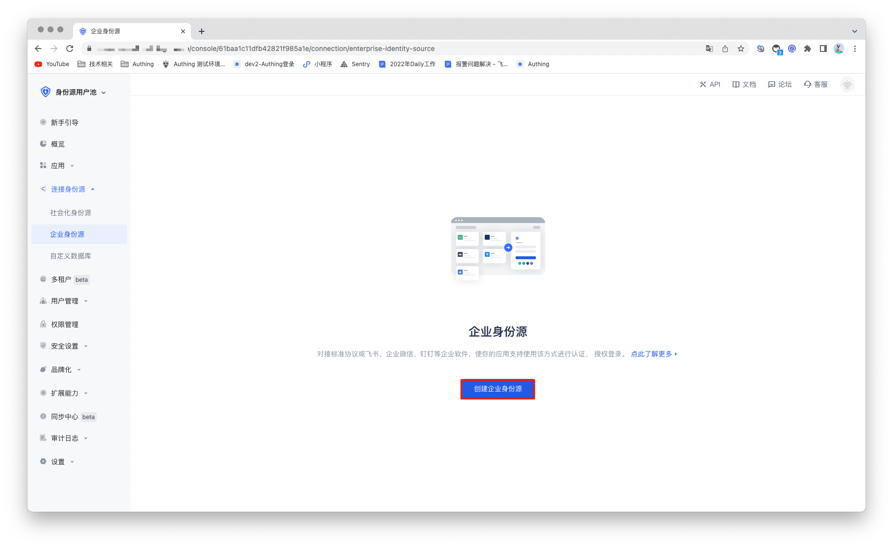
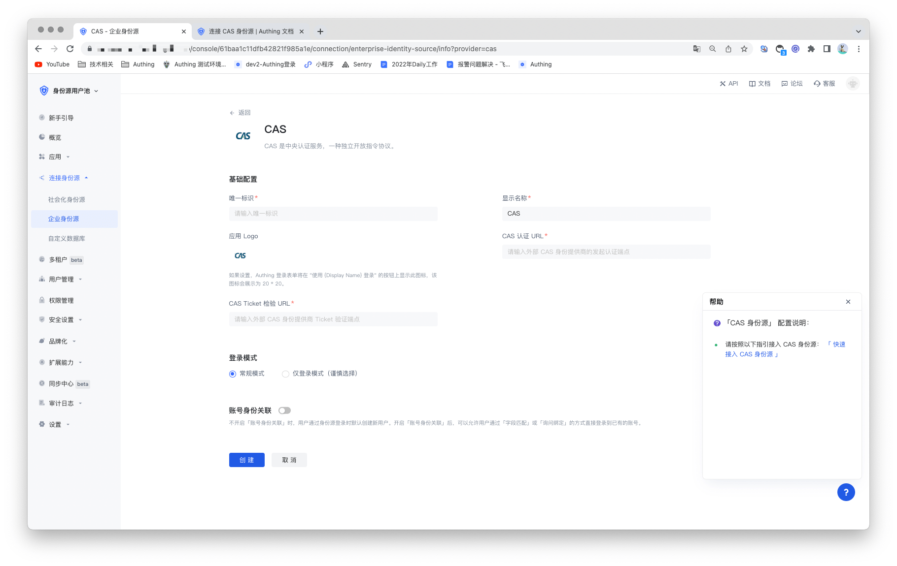

## CAS identity source

<LastUpdated/>

## Scenario introduction

- **Overview**: CAS (Central Authentication Service) is a single sign-on/single sign-out protocol for the Web. It allows users to access multiple applications while providing credentials (such as user ID and password) only once to the central CAS server application. GenAuth supports the authentication capabilities of the CAS protocol, and users only need to provide the services and configurations required for CAS protocol authentication. After configuring the CAS identity source, you can use it to complete the single sign-on and sign-out functions.
- **Application scenario**: PC website
- **End user preview image**:

## Notes

- A service with CAS protocol capabilities is required;
- This example will take the CAS IdP that comes with GenAuth as an example. The user pool connected to the CAS identity source and the user pool that serves as the CAS identity source cannot be the same.
- If you have not opened a GenAuth console account, please go to [GenAuth Console](https://www.genauth.ai/) to register a developer account first;

## Step 1: Create a CAS identity source

You need to configure your own CAS identity source (i.e. identity provider IDP) and obtain relevant information. This example will take the CAS IdP that comes with GenAuth as an example. If you already have a CAS identity source, you can go directly to step 2 for configuration.

1.1 Open **GenAuth console** and enter the user pool that you want to use as an identity source, which is called **"User Pool A"** here. Click the "Application" option in the left menu, find the application for which you want to enable CAS IdP capabilities in the right panel, and click to enter the application configuration page.

1.2 Find "Other Configuration" in the "Application Configuration" tab, turn on the "Enable CAS IdP" switch, and click the "Save" button. Record the contents of "Login endpoint" and "Service ticket verification endpoint (CAS 2.0)", which will be used in the subsequent configuration.

## Step 2: Configure CAS identity source in GenAuth console

2.1 Open **GenAuth console** and enter the user pool that you want to connect to the CAS identity source, which is called **"User Pool B"**. Select "Connect Identity Source" > "Enterprise Identity Source" in the left menu, and select "Create Enterprise Identity Source" in the right panel.

2.2 Find "CAS" in the right panel and click it.

2.3 Fill in the configuration content required by the CAS protocol according to the configuration requirements of CAS.

| Number | Field/Function               | Description                                                                                                                                                                                                                                                                                         |
| ------ | ---------------------------- | --------------------------------------------------------------------------------------------------------------------------------------------------------------------------------------------------------------------------------------------------------------------------------------------------- |
| 2.3.1  | Unique ID                    | a. The unique ID consists of lowercase letters, numbers, and -, and is less than 32 bits long. b. This is the unique ID for this connection and cannot be modified after it is set.                                                                                                                 |
| 2.3.2  | Display Name                 | This name will be displayed on the button on the login interface of the end user.                                                                                                                                                                                                                   |
| 2.3.3  | Application Logo             | The identity source logo displayed on the login interface button.                                                                                                                                                                                                                                   |
| 2.3.4  | CAS Authentication URL       | The URL used to initiate authentication requests to the CAS IdP. Fill in the "Login Endpoint" recorded previously.                                                                                                                                                                                  |
| 2.3.5  | CAS Ticket Verification URL  | The URL used to obtain identity information from the CAS IdP. Fill in the "service ticket verification endpoint (CAS 2.0)" recorded previously.                                                                                                                                                     |
| 2.3.7  | Login mode                   | After turning on "Login only mode", you can only log in to existing accounts, and you cannot create new accounts. Please choose carefully.                                                                                                                                                          |
| 2.3.8  | Account identity association | When "Account identity association" is not turned on, a new user is created by default when a user logs in through an identity source. After turning on "Account identity association", users can be allowed to log in directly to an existing account through "field matching" or "query binding". |

After the configuration is completed, click the "Save" button to complete the creation.

## Step 3: Development access

- **Recommended development access method**: Use hosted login page

- **Pros and cons description**: Simple operation and maintenance, which is handled by GenAuth. Each user pool has an independent second-level domain name; if you need to embed it in your application, you need to use the pop-up mode to log in, that is: after clicking the login button, a window will pop up with the login page hosted by GenAuth, or redirect the browser to the login page hosted by GenAuth.

- **Detailed access method**:

  3.1 Create an application in the GenAuth console. For details, see: [How to create an application in GenAuth](/guides/app-new/create-app/create-app.md).

  3.2 On the created CAS identity source connection details page, open and associate an application created in the GenAuth console.

3.3 Experience CAS enterprise login on the login page

