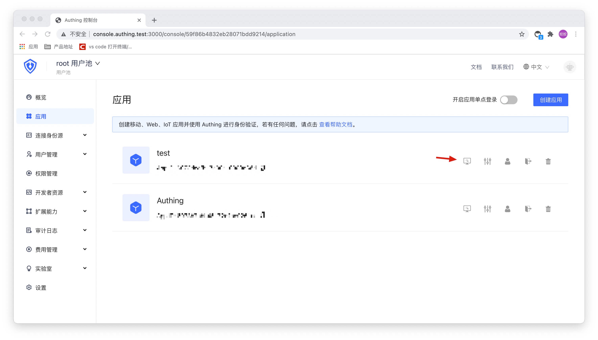

<IntegrationDetailCard title="Test Connection">

Go to **Console** > **Application** > **Application List**, select an application at random, and click "Experience".

On the login page, click "Log in with Custom Social Login".

In the pop-up login box, complete the authentication in the external social login identity source.

Login successful.

After successful login, jump to the callback address with the code authorization code.

</IntegrationDetailCard>
