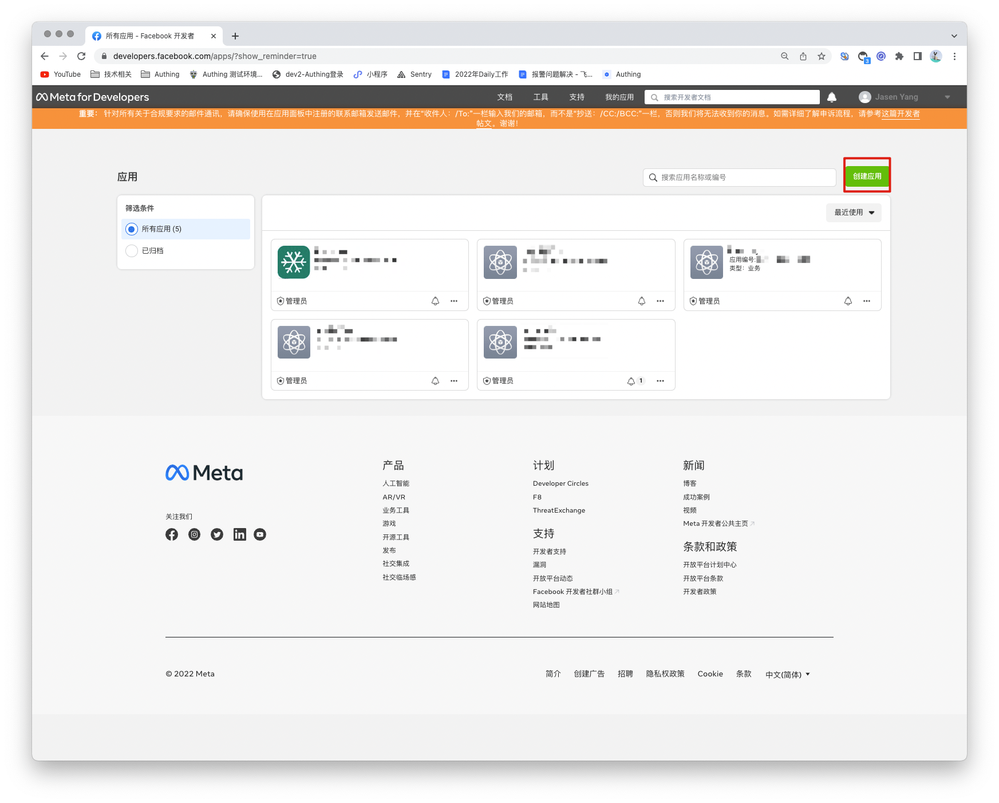
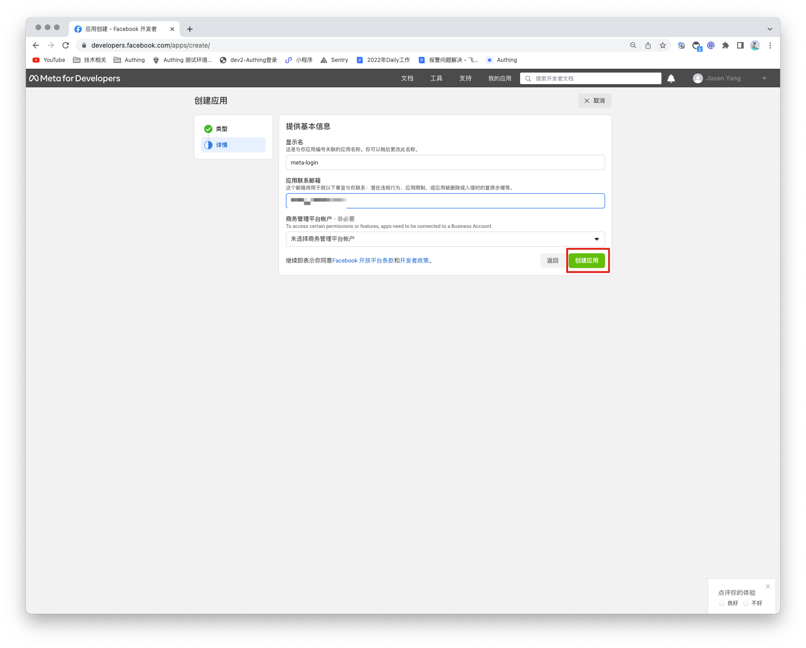
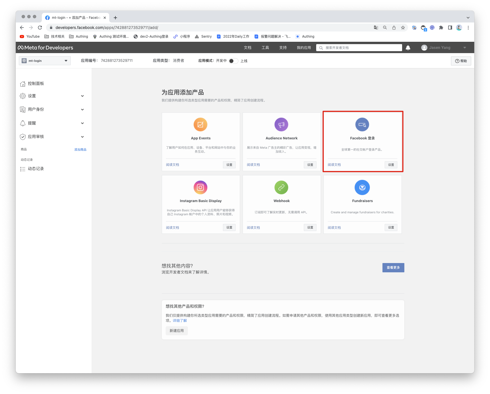
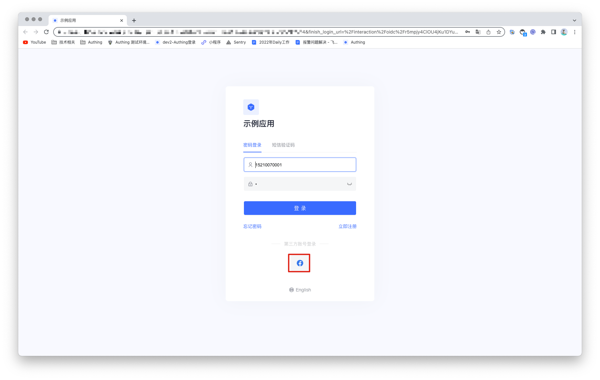

# Facebook Social Login

<LastUpdated/>

## Scenario Introduction

- **Overview**: Facebook social login is a user's secure login to a third-party application or website using Facebook as the identity source. Configure and enable Facebook social login in GenAuth to quickly obtain Facebook's basic open information and help users achieve password-free login.
- **Application scenario**: PC website
- **Terminal user preview image**:

## Notes

- If you have not opened a Facebook Open Platform account, please go to [Facebook Open Platform](https://developers.facebook.com/) to register a developer account.
- If you have not opened a GenAuth console account, please go to [GenAuth Console](https://www.genauth.ai/) to register a developer account.

## Step 1: Create a Facebook App

Go to [developers.facebook.com](https://developers.facebook.com/), click **My Apps**, then create a new app and select **Consumer** or **No App Type**, fill in the app name.

In the dashboard, find the **Facebook Login** product and click Set Up to add it to your app. Then find the App ID and App Secret in Settings > Basic in the left menu and write them down.

## Step 2: Configure Facebook in the GenAuth Console

2.1 In the GenAuth Console, on the Social Identity Sources page, click the Create Social Identity Source button to go to the Select Social Identity Source page.

2.2 Please go to the "Social Identity Source" - "Select Social Identity Source" page in the GenAuth console, click the "Facebook" identity source button to enter the "Facebook Login Mode" page.

2.3 Please go to the "Social Identity Source" - "Facebook" page in the GenAuth console to configure the relevant field information.

| Number | Field/Function               | Description                                                                                                                                                                                                                                                                                         |
| ------ | ---------------------------- | --------------------------------------------------------------------------------------------------------------------------------------------------------------------------------------------------------------------------------------------------------------------------------------------------- |
| 2.3.1  | Unique ID                    | a. The unique ID consists of lowercase letters, numbers, and -, and its length is less than 32 bits. b. This is the unique ID of this connection and cannot be modified after setting.                                                                                                              |
| 2.3.2  | Display Name                 | This name will be displayed on the button of the end user's login interface.                                                                                                                                                                                                                        |
| 2.3.3  | Application ID               | Application ID, which needs to be obtained on Facebook Open Platform.                                                                                                                                                                                                                               |
| 2.3.4  | Application Key              | Application ID, which needs to be obtained on Facebook Open Platform.                                                                                                                                                                                                                               |
| 2.3.5  | Scopes                       | Scopes, data permissions need to be applied for on Facebook Open Platform                                                                                                                                                                                                                           |
| 2.3.6  | Callback Address             | Facebook valid OAuth redirect URI. This URL needs to be configured on Facebook Open Platform.                                                                                                                                                                                                       |
| 2.3.7  | Login Mode                   | After turning on "Login Only Mode", you can only log in to existing accounts and cannot create new accounts. Please choose carefully.                                                                                                                                                               |
| 2.3.8  | Account Identity Association | When "Account Identity Association" is not turned on, a new user is created by default when a user logs in through an identity source. After turning on "Account Identity Association", users can be allowed to log in directly to an existing account through "Field Matching" or "Query Binding". |

After the configuration is complete, click the "Create" or "Save" button to complete the creation.

After creating the Facebook identity source on the GenAuth console, you need to configure the callback address to the **OAuth client authorization settings** in the Facebook application on Facebook's open platform.

## Step 3: Development access

- **Recommended development access method**: Use a hosted login page

- **Pros and cons description**: Simple operation and maintenance, GenAuth is responsible for operation and maintenance. Each user pool has an independent secondary domain name; if you need to embed it in your application, you need to use the pop-up mode to log in, that is: after clicking the login button, a window will pop up with the content of the login page hosted by GenAuth, or redirect the browser to the login page hosted by GenAuth.

- **Detailed access method**:

  3.1 Create an application in the GenAuth console. For details, see: [How to create an application in GenAuth](/guides/app-new/create-app/create-app.md)

  3.2 On the created Facebook identity source connection details page, open and associate an application created in the GenAuth console.

3.3 Experience Facebook third-party login on the login page

