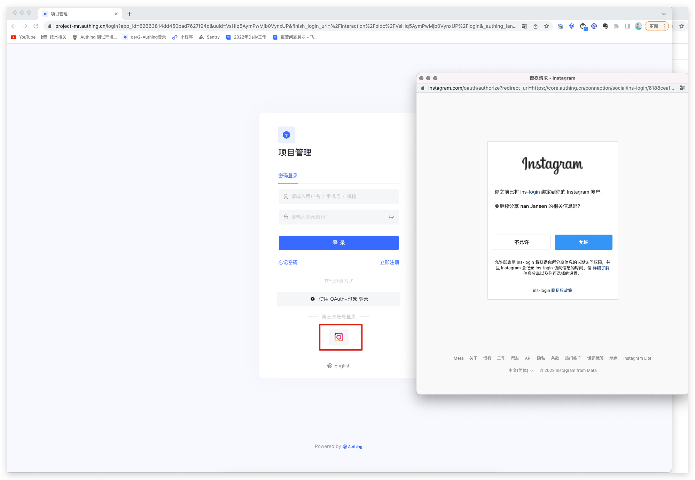
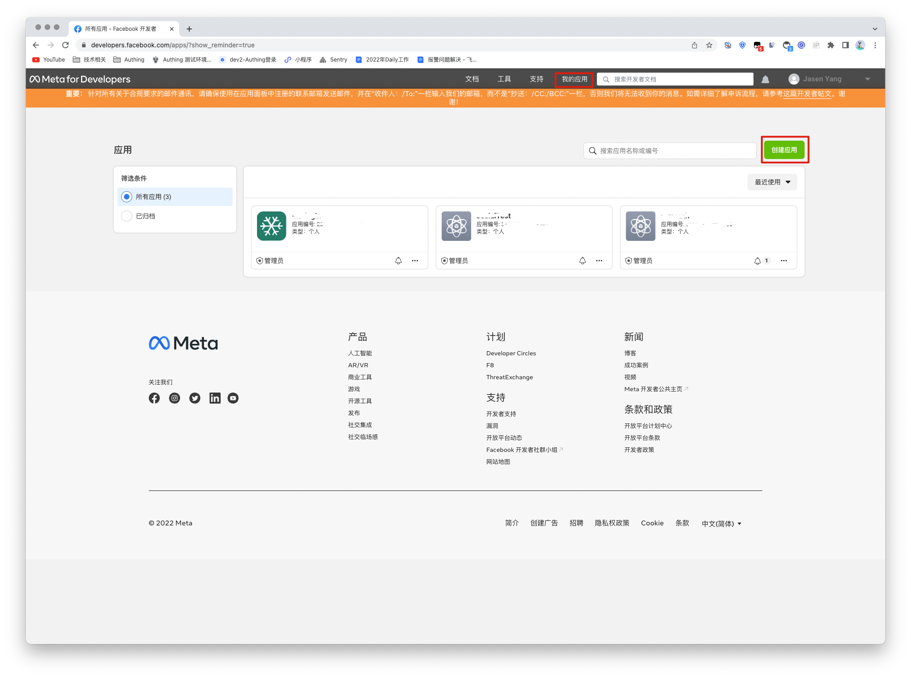
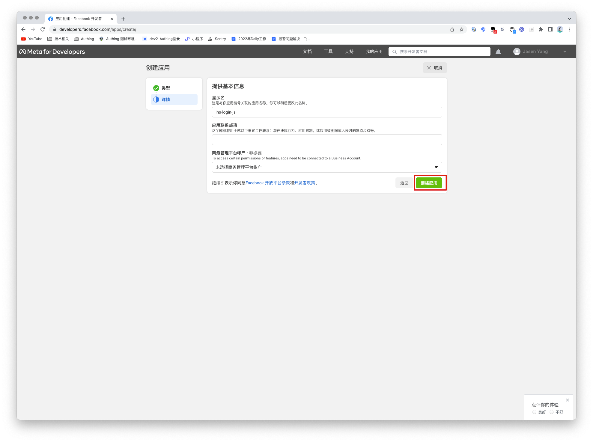
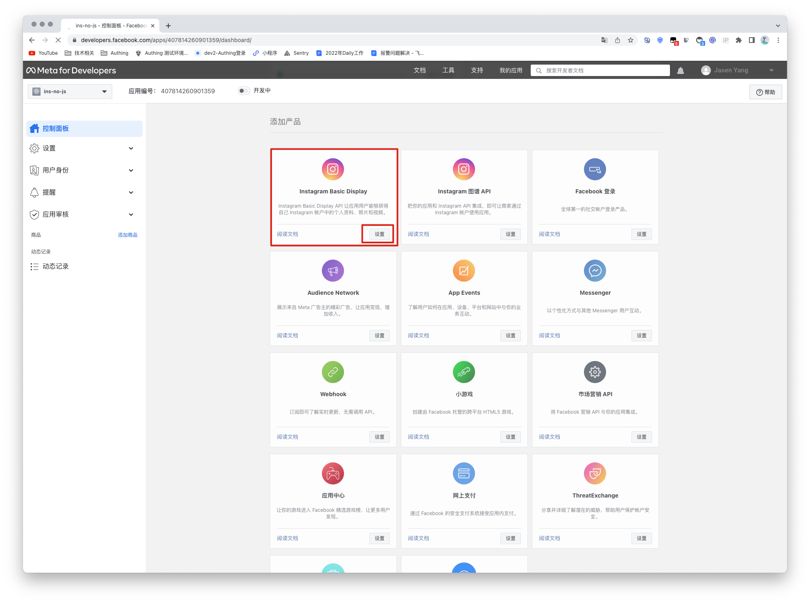
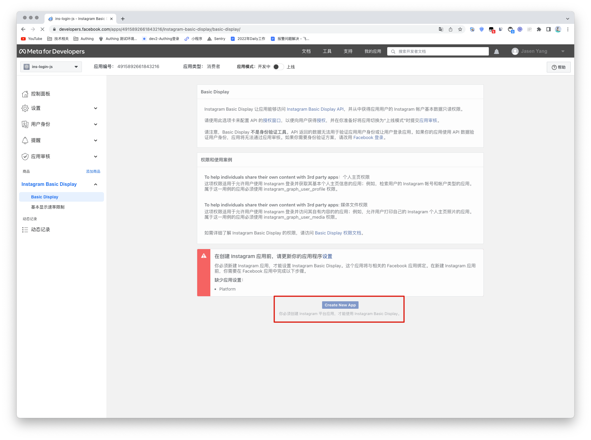
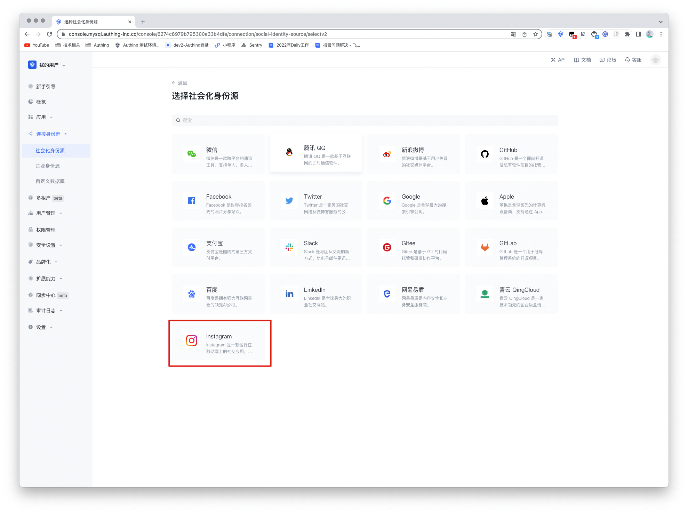
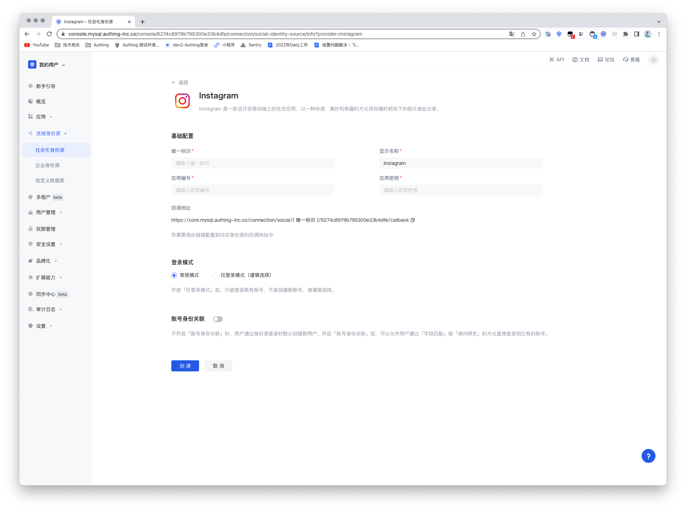
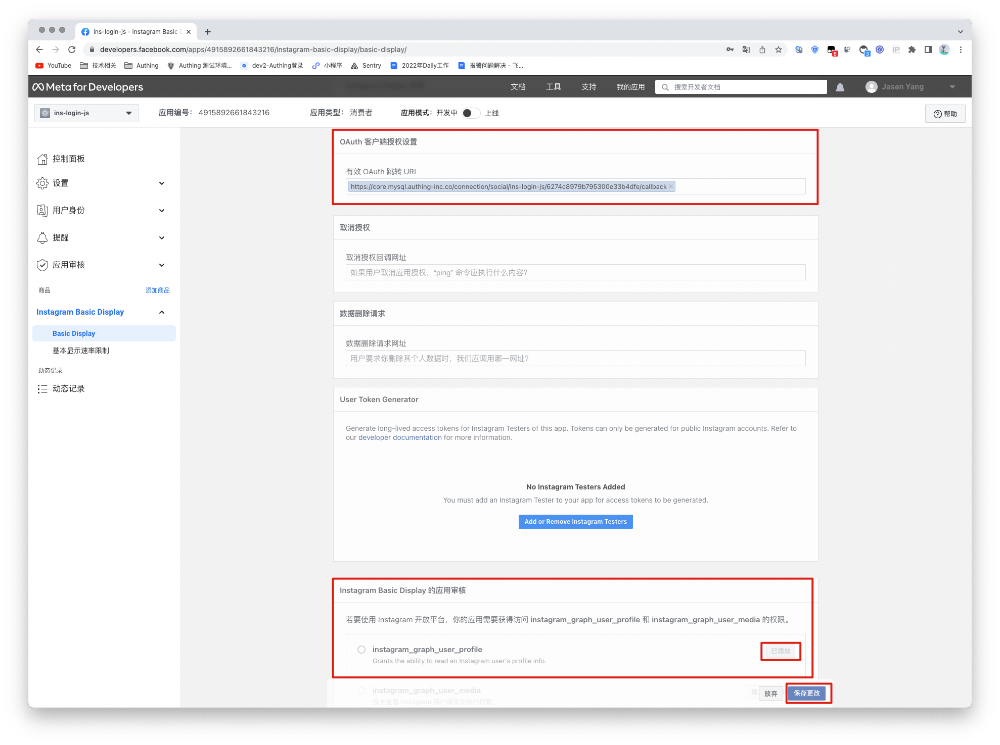
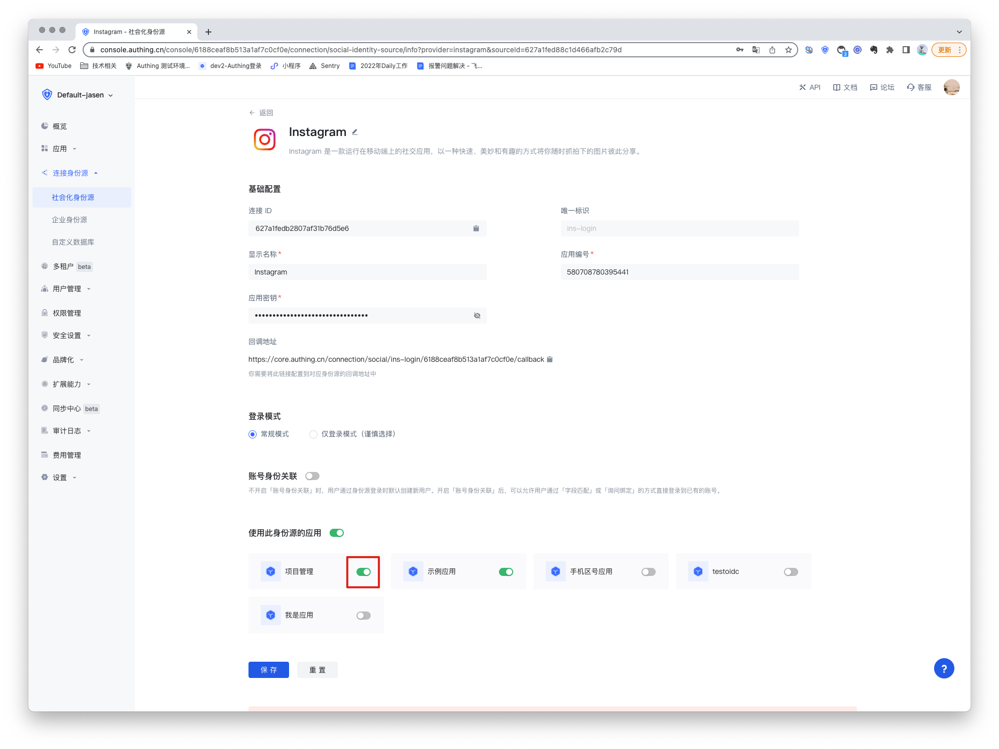
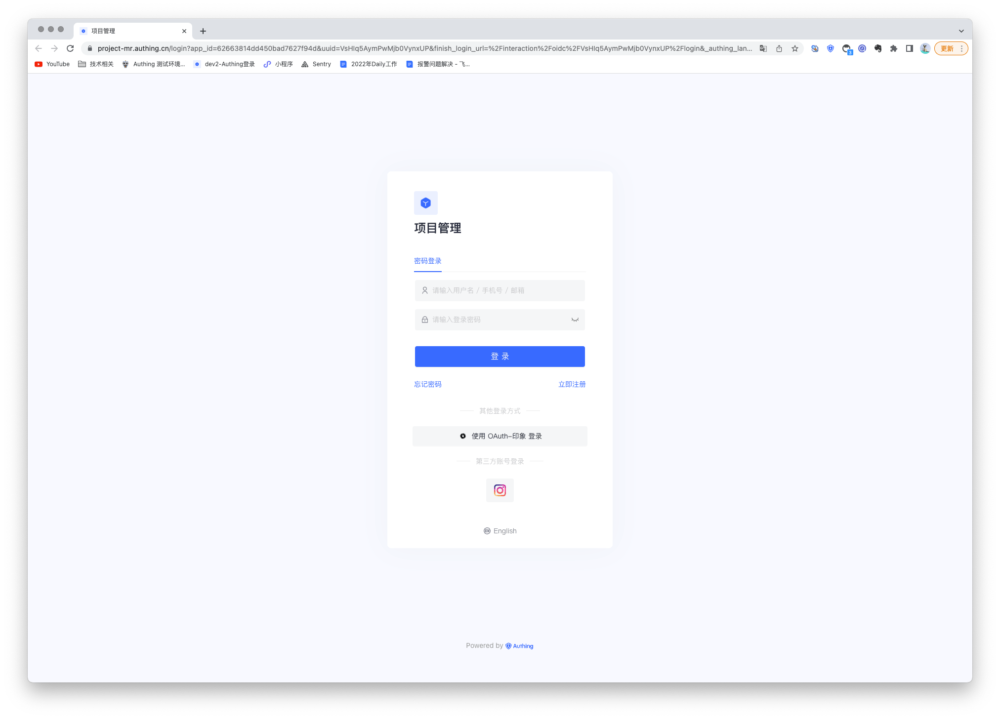

# Instagram Social Login

<LastUpdated/>

## Scenario Introduction

- **Overview**: Instagram social login allows users to log in to third-party applications or websites securely using Instagram as their identity source. Configure and enable Instagram social login in GenAuth to quickly obtain basic public information on Instagram and help users log in without a password.
- **Application scenario**: PC website
- **End-user preview image**:

## Notes

- If you do not have an Instagram Open Platform account, please go to [Instagram Open Platform](https://developers.facebook.com/) to register a developer account. Since Instagram belongs to Facebook, the Instagram open platform mentioned here is Facebook's open platform;
- Open an [Instagram account](https://www.instagram.com/) with multimedia materials;
- If you do not have a GenAuth console account, please go to the [GenAuth Console](https://www.genauth.ai/) to register a developer account;

## Step 1: Create a Facebook application

Go to [developers.facebook.com](https://developers.facebook.com/), click **My Apps**, then create a new application and select **Consumer** or **No application type**, and fill in the application name.

In the dashboard, find the **Instagram Basic Display** product, then click Settings to add it to your application.

Scroll to the bottom of the page and click **Create a new application**.

## Step 2: Configure Instagram in the GenAuth console

2.1 On the "Social Identity Source" page of the GenAuth console, click the "Create Social Identity Source" button to go to the "Select Social Identity Source" page.

2.2 On the "Social Identity Source" - "Select Social Identity Source" page of the GenAuth console, click the "Instagram" identity source button to go to the "Instagram Login Mode" page.

2.3 On the "Social Identity Source" - "Instagram" page of the GenAuth console, configure the relevant field information.

| Number | Field/Function               | Description                                                                                                                                                                                                                                                                                     |
| ------ | ---------------------------- | ----------------------------------------------------------------------------------------------------------------------------------------------------------------------------------------------------------------------------------------------------------------------------------------------- |
| 2.3.1  | Unique ID                    | a. The unique ID consists of lowercase letters, numbers, and -, and its length is less than 32 bits. b. This is the unique ID of this connection and cannot be modified after setting.                                                                                                          |
| 2.3.2  | Display Name                 | This name will be displayed on the button of the end user's login interface.                                                                                                                                                                                                                    |
| 2.3.3  | Application ID               | Application ID, which needs to be obtained on the Instagram Open Platform.                                                                                                                                                                                                                      |
| 2.3.4  | Application Key              | Application ID, which needs to be obtained on the Instagram Open Platform                                                                                                                                                                                                                       |
| 2.3.5  | Callback URL                 | Instagram valid OAuth jump URI. This URL needs to be configured on the Instagram Open Platform.                                                                                                                                                                                                 |
| 2.3.6  | Login Mode                   | After enabling "Login Only Mode", you can only log in to existing accounts, and cannot create new accounts. Please choose carefully.                                                                                                                                                            |
| 2.3.7  | Account Identity Association | When "Account Identity Association" is not enabled, a new user is created by default when a user logs in through an identity source. After enabling "Account Identity Association", users can be allowed to log in directly to an existing account through "Field Matching" or "Query Binding". |

After the configuration is complete, click the "Create" or "Save" button to complete the creation.

After creating the Instagram identity source on the GenAuth console, you need to configure the callback address to the **OAuth Client Authorization Settings** in the Instagram application on Instagram's open platform.

In the last step, Instagram needs to obtain permission to access **instagram_graph_user_profile**, so this permission needs to be added. Then click and save the changes to successfully create the instagram application.

## Step 3: Development access

- **Recommended development access method**: Use a hosted login page

- **Pros and cons description**: Simple operation and maintenance, GenAuth is responsible for operation and maintenance. Each user pool has an independent secondary domain name; if you need to embed it in your application, you need to log in using the pop-up mode, that is: after clicking the login button, a window will pop up with the login page hosted by GenAuth, or redirect the browser to the login page hosted by GenAuth.

- **Detailed access method**:

  3.1 Create an application in the GenAuth console. For details, see: [How to create an application in GenAuth](/guides/app-new/create-app/create-app.md)

  3.2 On the created Instagram identity source connection details page, open and associate an application created in the GenAuth console

3.3 Experience Instagram third-party login on the login page

