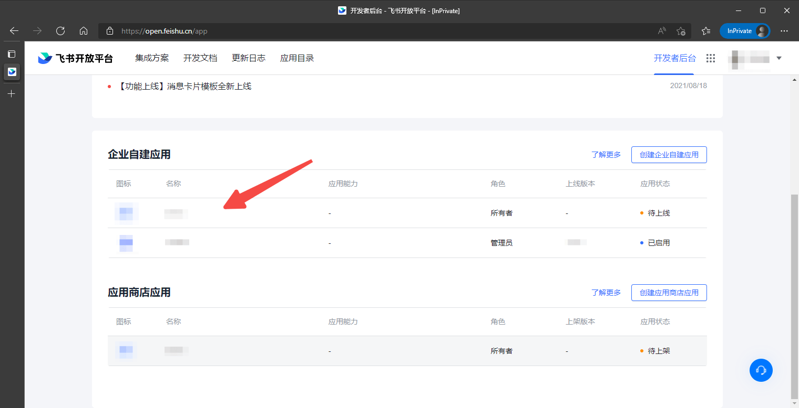
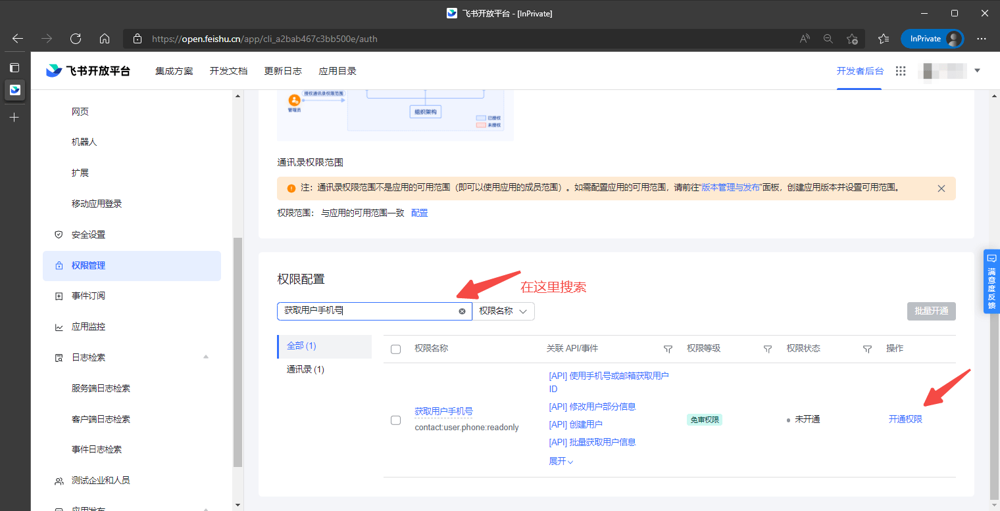
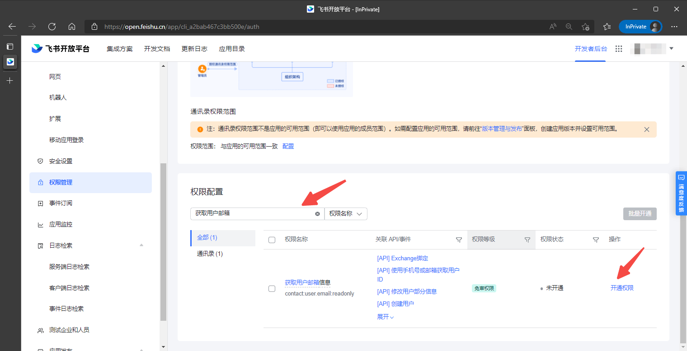

<IntegrationDetailCard title="Enable Feishu mobile app login function">

1. In [Feishu developer backend](https://open.feishu.cn/app), click the application for which you need to enable the mobile login function and enter the application details page:

2. Select **Mobile app login** in the **Application function** option of Feishu application details and click the button to enable the function;

3. After enabling, fill in the Feishu login configuration below and save after filling in;

</IntegrationDetailCard>

<IntegrationDetailCard title="Enable email/mobile number account identity association function">

1. On the **Permission Management** page of the Feishu application details, search for "Get user mobile number" and click to enable permissions

2. On the **Permission Management** page of the Feishu application details, search for "Get user email information" and click to enable permissions

3. After setting permissions, you need to release the latest version.

</IntegrationDetailCard>
