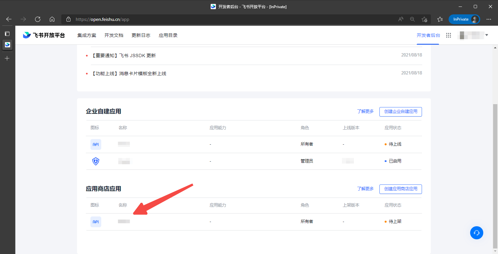
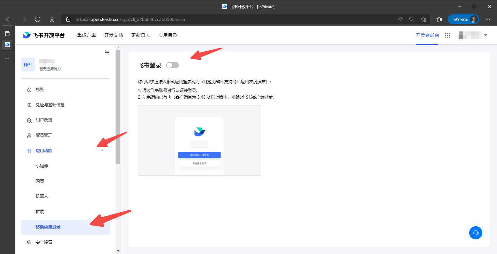
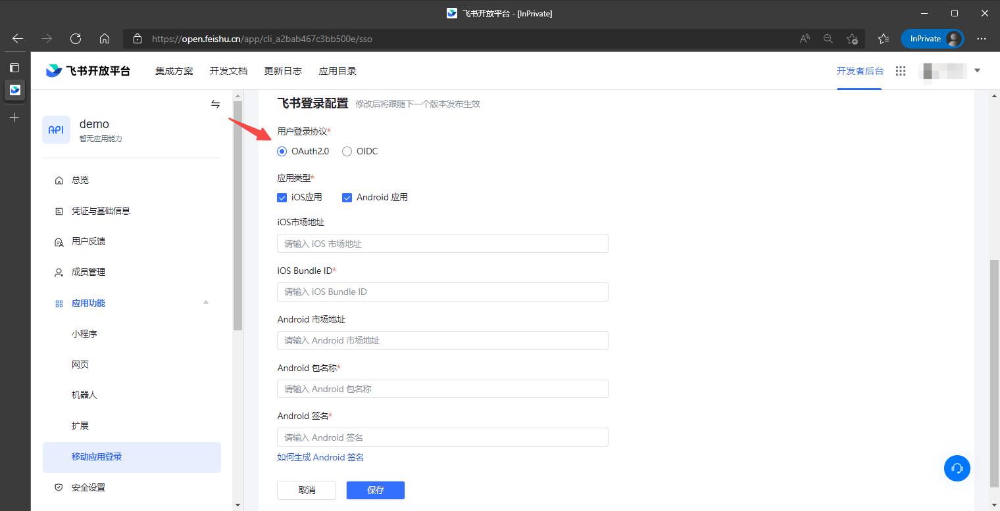

<IntegrationDetailCard title="Enable the mobile app login function for Feishu App Store apps">

1. In the [Feishu Developer Backstage](https://open.feishu.cn/app), click on the app for which you need to enable the mobile app login function and enter the app details page:

2. Select **Mobile App Login** in the **Application Function** option of Feishu App Details and click the button to enable the function;

2. After enabling, fill in the Feishu login configuration below and save after filling in;

</IntegrationDetailCard>
