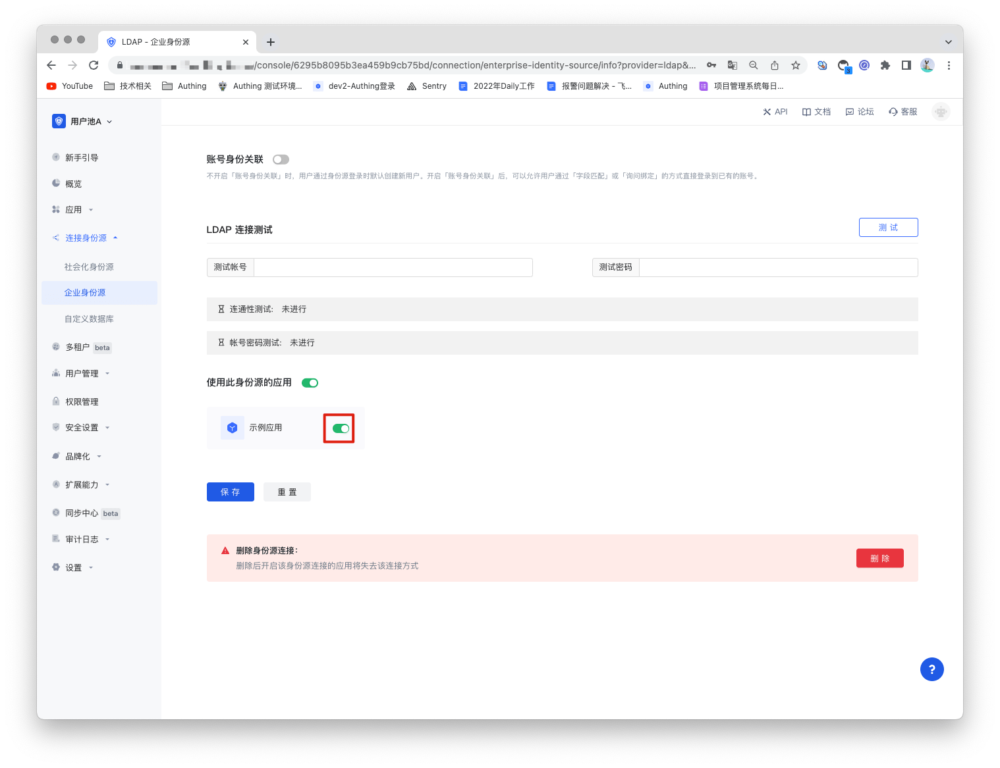

# Ldap identity source

<LastUpdated/>

## Scenario introduction

- **Overview**: LDAP (Lightweight Directory Access Protocol) is a software protocol that enables anyone to find data about organizations, individuals, and other resources (such as files and devices) on the public Internet or corporate intranet. LDAP is a "lightweight" version of the Directory Access Protocol (DAP), which is part of X.500 (the standard for directory services in the network).

- **Application scenario**: PC website
- **End user preview image**:

## Notes

- An LDAP service is required;
- If you do not have a GenAuth console account, please go to [GenAuth Console](https://www.genauth.ai/) to register a developer account;

## Step 1: Create an LDAP identity source

GenAuth supports viewing, modifying, adding, and deleting user information using the LDAP protocol. So if you don't have your own LDAP, you can [use GenAuth's LDAP user directory](https://docs.genauth.ai/guides/users/ldap-user-directory.html).

## Step 2: Configure LDAP identity source in GenAuth console

2.1 Open **GenAuth console** and enter the user pool you want to connect to the LDAP identity source, which is called **"User Pool B"** here. Select "Connect Identity Source" > "Enterprise Identity Source" in the left menu, and select "Create Enterprise Identity Source" in the right panel.

2.2 Find "LDAP" in the right panel and click it.

2.3 Fill in the configuration content required by the LDAP protocol according to the LDAP configuration requirements.

| Number | Field/Function               | Description                                                                                                                                                                                                                                                                                                               |
| ------ | ---------------------------- | ------------------------------------------------------------------------------------------------------------------------------------------------------------------------------------------------------------------------------------------------------------------------------------------------------------------------- |
| 2.3.1  | Unique ID                    | a. The unique ID consists of lowercase letters, numbers, and -, and its length is less than 32 bits. b. This is the unique ID of this connection and cannot be modified after setting.                                                                                                                                    |
| 2.3.2  | Display Name                 | This name will be displayed on the button of the terminal user's login interface.                                                                                                                                                                                                                                         |
| 2.3.3  | LDAP Link                    | The address of the LDAP server.                                                                                                                                                                                                                                                                                           |
| 2.3.4  | Bind DN                      | The user name used to connect to LDAP. This user name will be used to test the connection results and search for users or user groups.                                                                                                                                                                                    |
| 2.3.5  | Bind DN Password             | The password used to connect to LDAP. The password will be encrypted and stored in the database.                                                                                                                                                                                                                          |
| 2.3.6  | Users DN                     | Defines which directory to start searching from, such as: dc=fabrikam,dc=local                                                                                                                                                                                                                                            |
| 2.3.7  | Query Condition              | This condition combines bindDN and the corresponding secret to search for users, which is used to retrieve the user's dn information and perform ldap authentication in combination with the user's password. Custom filter expressions are supported, and the basic form is: &(objectClass=organizationalPerson)(cn=%s). |
| 2.3.8  | Login Mode                   | After turning on "Login Only Mode", you can only log in to existing accounts, and cannot create new accounts. Please choose carefully.                                                                                                                                                                                    |
| 2.3.9  | Account Identity Association | When "Account Identity Association" is not turned on, a new user is created by default when a user logs in through an identity source. After turning on "Account Identity Association", users can be allowed to log in directly to an existing account through "Field Matching" or "Query Binding".                       |

After the configuration is completed, click the "Save" button to complete the creation.

GenAuth also provides a test for LDAP connection, testing the connectivity of the LDAP service and whether the account and password are correct, helping you check whether the parameters are filled in correctly.

## Step 3: Development access

- **Recommended development access method**: Use a hosted login page

- **Advantages and disadvantages description**: Simple operation and maintenance, GenAuth is responsible for operation and maintenance. Each user pool has an independent secondary domain name; if you need to embed it into your application, you need to log in using the pop-up mode, that is: after clicking the login button, a window will pop up with the login page hosted by GenAuth, or redirect the browser to the login page hosted by GenAuth.

- **Detailed access method**:

  3.1 Create an application in the GenAuth console. For details, see: [How to create an application in GenAuth](/guides/app-new/create-app/create-app.md).

  3.2 On the created LDAP identity source connection details page, open and associate an application created in the GenAuth console.

3.3 Experience LDAP enterprise login on the login page.

