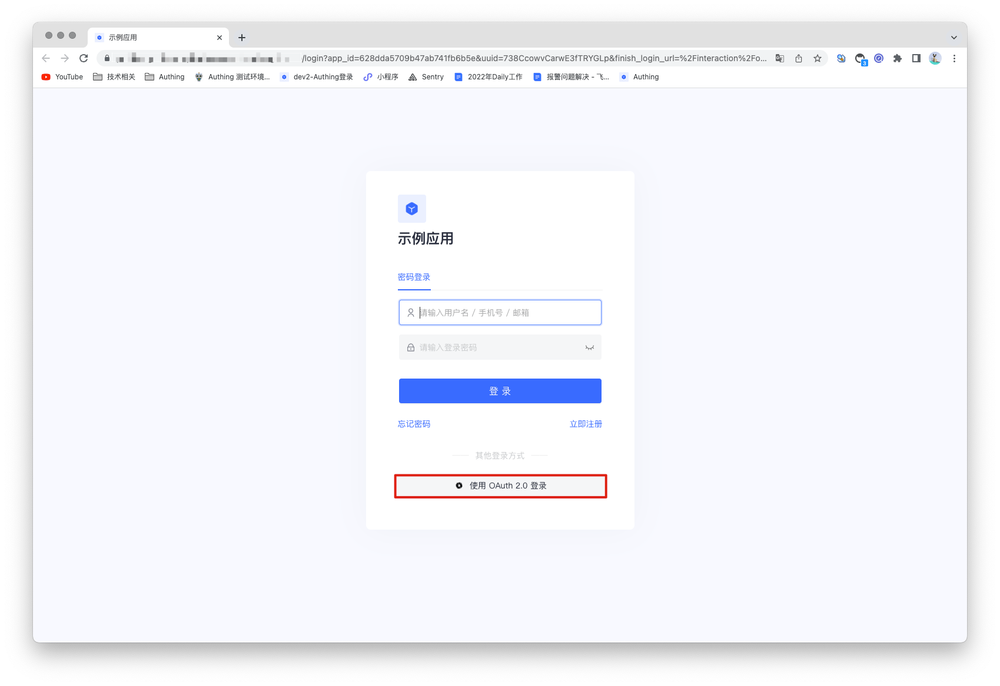
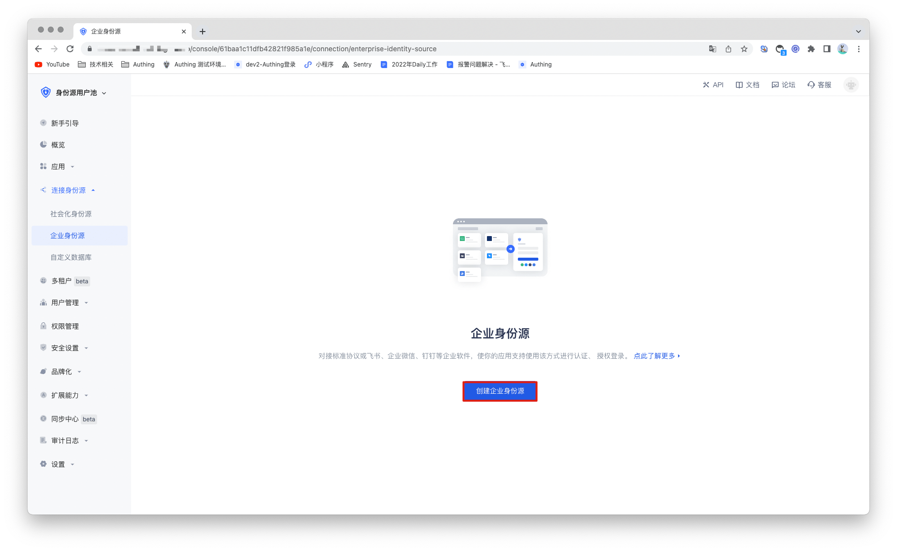
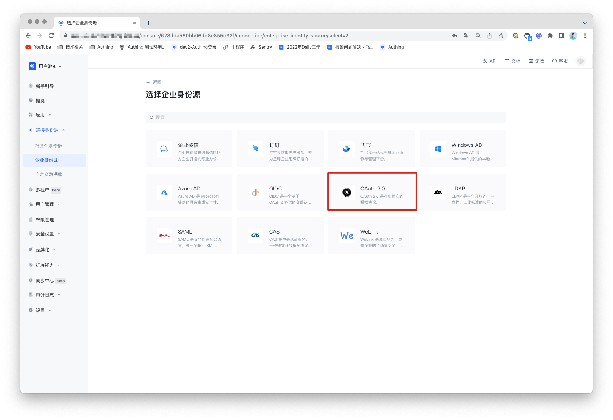
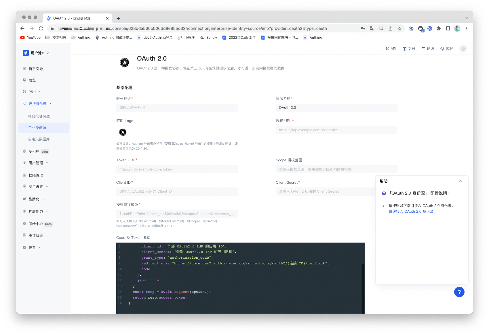
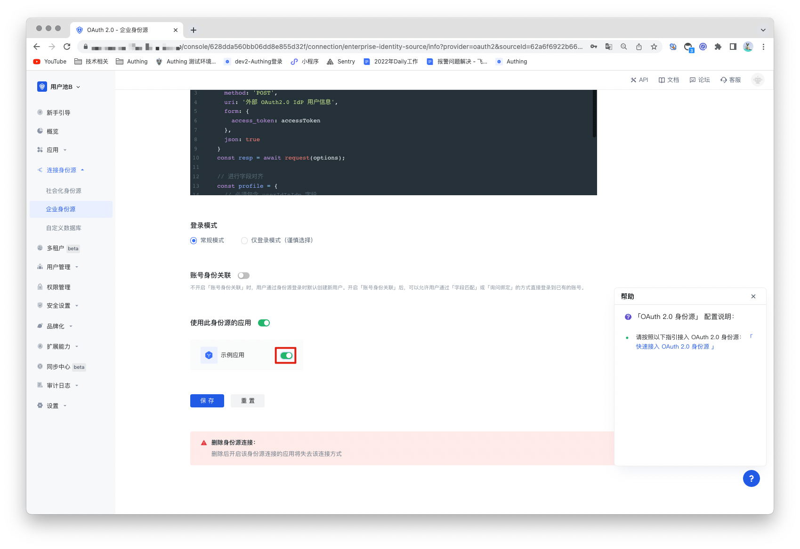

# OAuth2.0 Identity Source

<LastUpdated/>

## Scenario Introduction

- **Overview**: OAuth2.0 is a standard authorization protocol. When a user logs in to a third-party application, the OAuth2.0 protocol can be used to securely authorize the data to the caller, and after verification, the third-party application can be logged in without a password. It allows users to access multiple applications while only providing credentials (such as user ID and password) once to the central CAS server application. GenAuth supports the authentication capabilities of the OAuth2.0 protocol, and users only need to provide OAuth2.0 authentication services. After configuring the OAuth2.0 identity source, it can be used to complete single sign-on and sign-out functions.
- **Application scenario**: PC website
- **End user preview image**:

## Notes

- A service that supports OAuth2.0 protocol capabilities is required;

- If you have not opened a GenAuth console account, please go to [GenAuth Console](https://www.genauth.ai/) to register a developer account;

## Step 1: Create an OAuth2.0 identity source

Many existing websites provide third-party logins that follow the OAuth2.0 standard protocol. Many websites may have inconsistent processing details and can also be extended based on the OAuth2.0 protocol, but the overall authorization and authentication process is the same. Therefore, a third-party login application that supports OAuth2.0 authentication can be used as an identity source.

If there is no available identity source, GenAuth can also be used as an OAuth2.0 identity source, and other systems can access GenAuth as an identity provider through the OAuth2.0 protocol. For details, please refer to: [Become an OAuth2.0 identity source](https://docs.genauth.ai/guides/federation/oauth.html).

## Step 2: Configure the OAuth2.0 identity source in the GenAuth console

2.1 Open the **GenAuth console** and enter the user pool to which you want to connect the OAuth2.0 identity source, which is called **"User Pool B"** here. Select "Connect Identity Source" > "Enterprise Identity Source" in the left menu, and select "Create Enterprise Identity Source" in the right panel.

2.2 Find "OAuth2.0" in the right panel and click it.

2.3 According to the configuration requirements of OAuth2.0, fill in the configuration content required by the OAuth2.0 protocol.

| Number | Field/Function                   | Description                                                                                                                                                                                                                                                                                       |
| ------ | -------------------------------- | ------------------------------------------------------------------------------------------------------------------------------------------------------------------------------------------------------------------------------------------------------------------------------------------------- |
| 2.3.1  | Unique ID                        | a. The unique ID consists of lowercase letters, numbers, and -, and is less than 32 bits long. b. This is the unique ID for this connection and cannot be modified after it is set.                                                                                                               |
| 2.3.2  | Display Name                     | This name will be displayed on the button on the login interface of the end user.                                                                                                                                                                                                                 |
| 2.3.3  | Application Logo                 | The identity source logo displayed on the login interface button.                                                                                                                                                                                                                                 |
| 2.3.4  | Authorization URL                | The URL used to initiate authentication requests to the CAS IdP. Fill in the "Login Endpoint" recorded previously.                                                                                                                                                                                |
| 2.3.5  | Token URL                        | The URL used to obtain identity information from the CAS IdP. Fill in the "service ticket verification endpoint (CAS 2.0)" recorded previously.                                                                                                                                                   |
| 2.3.6  | Scope Authorization scope        | The authorization scope carried in the authorization request.                                                                                                                                                                                                                                     |
| 2.3.7  | Client ID                        | The Client ID of your OpenID Connect provider.                                                                                                                                                                                                                                                    |
| 2.3.8  | Client Secret                    | The Client Secret of your OpenID Connect provider.                                                                                                                                                                                                                                                |
| 2.3.9  | Authorization link template      | Concatenate the authorization URL to request the automatic generation of the authorization request link.                                                                                                                                                                                          |
| 2.3.10 | Code to Token script             | The script for exchanging the code for the token required in the authorization process.                                                                                                                                                                                                           |
| 2.3.11 | Token to User Information script | The script for exchanging the token for the user information required in the authorization process.                                                                                                                                                                                               |
| 2.3.12 | Login mode                       | After turning on "Login only mode", you can only log in to existing accounts, and cannot create new accounts. Please choose carefully.                                                                                                                                                            |
| 2.3.13 | Account Identity Association     | When "Account Identity Association" is not enabled, a new user is created by default when a user logs in through an identity source. After "Account Identity Association" is enabled, users can be allowed to log in directly to an existing account through "Field Matching" or "Query Binding". |

After the configuration is completed, click the "Save" button to complete the creation.

## Step 3: Development Access

- **Recommended Development Access Method**: Use Hosted Login Page

- **Pros and Cons Description**: Simple operation and maintenance, which is handled by GenAuth. Each user pool has an independent secondary domain name; if you need to embed it into your application, you need to log in using the pop-up mode, that is: after clicking the login button, a window will pop up with the content of the login page hosted by GenAuth, or redirect the browser to the login page hosted by GenAuth.

- **Detailed access method**:

  3.1 Create an application in the GenAuth console. For details, see: [How to create an application in GenAuth](/guides/app-new/create-app/create-app.md).

  3.2 On the created OAuth2.0 identity source connection details page, open and associate an application created in the GenAuth console.

3.3 Experience OAuth2.0 enterprise login on the login page

