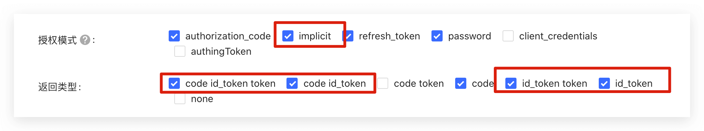

<IntegrationDetailCard :title="`Fill in OIDC Client configuration in ${$localeConfig.brandName}`">

You need to add the configuration of the application you created in the previous step in {{$localeConfig.brandName}}:

1. Enter the enterprise identity source configuration page in the [{{$localeConfig.brandName}} console](https://console.genauth.ai).

2. Find the **OIDC** identity source;

3. In the configuration form, fill in the following configuration as instructed:

- **Connection identifier**: The unique identifier of the connection, which must be unique within the user pool.

- **Display name**: If set, the {{$localeConfig.brandName}} login form will display a "Login with {displayName}" button.
- **Logo URL**: If set, the {{$localeConfig.brandName}} login form will display this logo on the "Login with {displayName}" button, which will be displayed as 20 \* 20.
- **Issuer URL**: The Issuer URL of the OpenID Connect provider you want to connect to
- **Client ID**: The Client ID of your OpenID Connect provider
- **Callback URL**: You need to set the callback URL of this OIDC IdP to `https://core.genauth.ai/connections/oidc/callback`, please check the documentation of your OIDC IdP.

Click the **Create button** to complete the creation.

There are two modes for connecting to OIDC identity sources:

- `Front Channel`: In this mode, the exchange of user information will be completed on the front end of the browser, using `response_mode=form_post` and `response_type=id_token` modes. Please make sure that your OIDC application has opened the `implicit` mode and that the **return type** has checked `id_token`

- `Back Channel`: In this mode, the exchange of user information will be carried out on the server of {{$localeConfig.brandName}}, using the `response_type=code` authorization code mode, so you need to provide the key of your OIDC application.

You can choose one of the modes according to your needs.

4. After the configuration is completed, click the "Create" button to complete the creation.

</IntegrationDetailCard>
