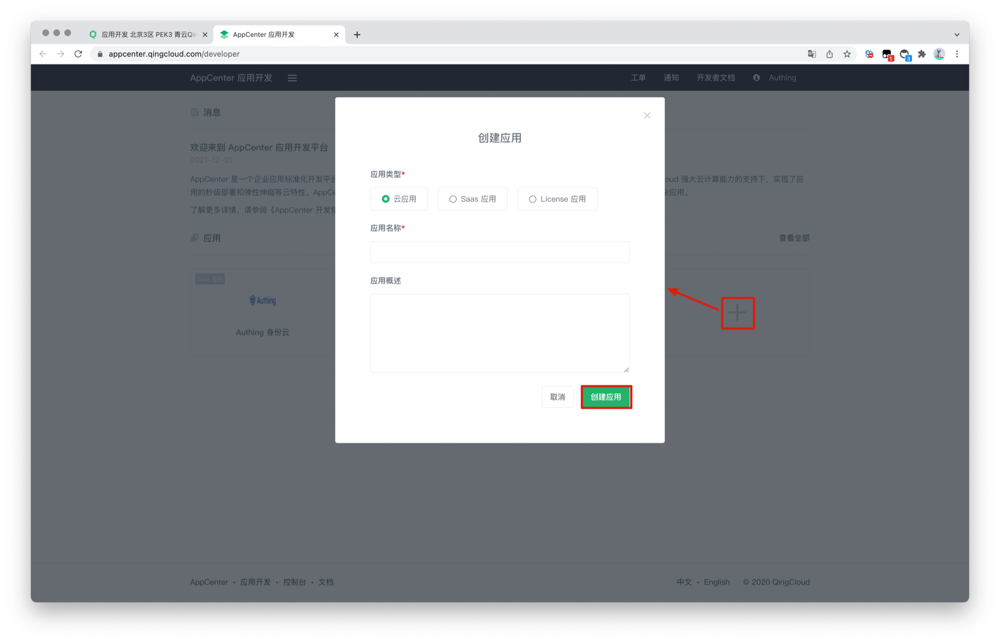

<IntegrationDetailCard title="Create an application on QingCloud Developer Platform">

Please follow the instructions in [QingCloud Document](https://docsv3.qingcloud.com/appcenter/dev-platform/saas-developer-guide/release/#%E5%88%9B%E5%BB%BA%E5%BA%94%E7%94%A8) to create an application. You need to record the **App ID** and **App Secret** of the application, which will be used later. You can refer to the following process.

Enter the console, click the avatar in the upper right corner, click Application Development, and click "here" under Application Development to enter the application list.

Click the "+" sign in the application list to create an application. Select the application type, fill in the application name, and click "Create Application".

Write down the Key ID (i.e., application ID) and Key of the QingCloud application.

During the application creation process, you need to configure the allowed callback addresses. Please use the following settings:

| Field                     |                                       Value                                       |
| ------------------------- | :-------------------------------------------------------------------------------: |
| Valid OAuth Redirect URIs | `https://core.genauth.ai/connection/social/qingcloud/<YOUR_USERPOOL_ID>/callback` |

> Replace <YOUR_USERPOOL_ID> with your user pool ID.

</IntegrationDetailCard>
