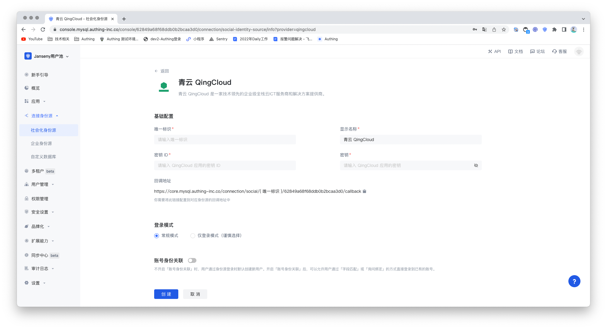

<IntegrationDetailCard :title="`Fill in QingCloud application configuration in ${$localeConfig.brandName}`">

You need to add the configuration of the application you created in the previous step in GenAuth:

1. In the [GenAuth console](https://console.genauth.ai/), enter the "Social Identity Source" configuration page and click "Create Social Identity Source" to start selecting and creating.

2. Among all the social identity source icons, find and enter **QingCloud** Social Login. Fill in the relevant information according to the configuration.

- `App ID`: QingCloud Key ID;

- `App Secret`: QingCloud Key;

3. After the configuration is completed, click the "Create" button to complete the creation.

</IntegrationDetailCard>
