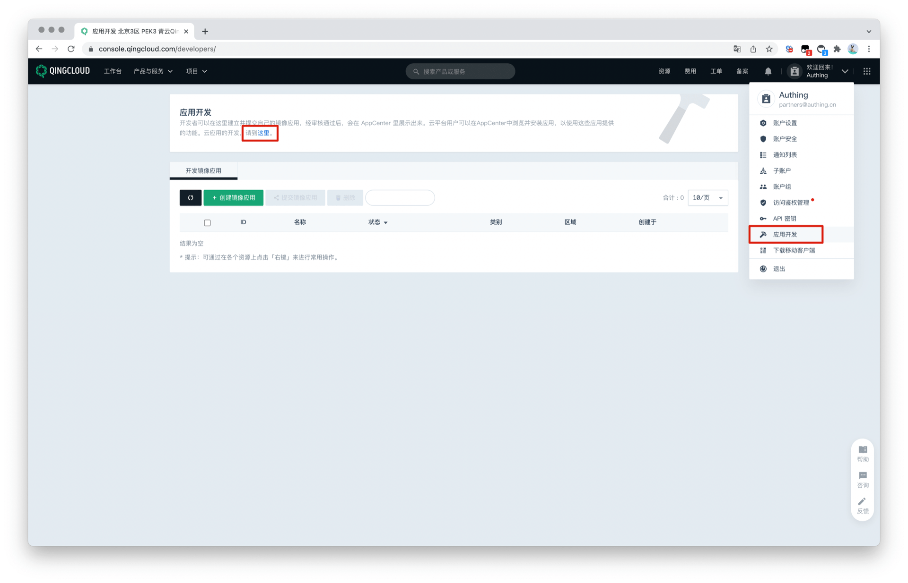
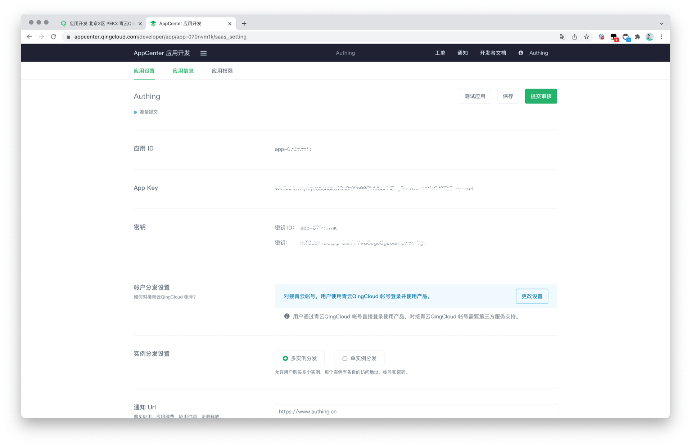

# QingCloud Social Login

<LastUpdated/>

## Scenario Introduction

- **Overview**: QingCloud is a technology-leading enterprise-level full-stack cloud ICT service provider and solution provider. QingCloud social login is a user's secure login to a third-party application or website with QingCloud as the identity source. Configure and enable QingCloud's social login in GenAuth to quickly obtain QingCloud's basic open information and help users achieve password-free login.
- **Application scenario**: PC website
- **Terminal user preview image**:

## Notes

- If you have not opened a QingCloud account, please go to the [QingCloud](https://www.qingcloud.com/) platform to register an account.
- You need to create an application that supports protocol authentication in [Application Development](https://appcenter.qingcloud.com/developer/) on QingCloud.
- If you have not opened a GenAuth console account, please go to [GenAuth Console](https://www.genauth.ai/) to register a developer account.

## Step 1: Create a QingCloud application

Go to QingCloud's [AppCenter Application Development Platform](https://appcenter.qingcloud.com/developer/). If you can't find it, you can follow the [QingCloud Document (opens new window)](https://docsv3.qingcloud.com/appcenter/dev-platform/saas-developer-guide/release/#Create an application) to create an application. You need to record the application's **App ID** and **App Secret**, which will be used later.

Enter the console, click the avatar in the upper right corner, click Application Development, and click "here" under Application Development to enter the application list.

Click the "+" sign in the application list to create an application. Select the application type, fill in the application name, and click "Create Application".

Record the Key ID (i.e. application ID) and Key of the QingCloud application.

## Step 2: Configure QingCloud in the GenAuth console

2.1 In the [GenAuth console](https://console.genauth.ai/), enter the "Social Identity Source" configuration page, and click "Create Social Identity Source" to start selecting and creating.

2.2 Find and enter **QingCloud** Social Login among all social identity source icons.

2.3 Please configure the relevant field information in the "Social Identity Source" - "QingCloud" page of the GenAuth Console.

- `App ID`: QingCloud key ID;

- `App Secret`: QingCloud key;

| Number | Field/Function               | Description                                                                                                                                                                                                                                                                                         |
| ------ | ---------------------------- | --------------------------------------------------------------------------------------------------------------------------------------------------------------------------------------------------------------------------------------------------------------------------------------------------- |
| 2.3.1  | Unique ID                    | a. The unique ID consists of lowercase letters, numbers, and -, and its length is less than 32 bits. b. This is the unique ID of this connection and cannot be modified after setting.                                                                                                              |
| 2.3.2  | Display Name                 | This name will be displayed on the button of the terminal user's login interface.                                                                                                                                                                                                                   |
| 2.3.3  | Key ID                       | The key ID needs to be obtained in the application created by the QingCloud open platform.                                                                                                                                                                                                          |
| 2.3.4  | Key                          | The key needs to be obtained in the application created by the QingCloud Open Platform.                                                                                                                                                                                                             |
| 2.3.5  | Callback Address             | QingCloud valid OAuth jump URI. This URL needs to be configured on the QingCloud Open Platform.                                                                                                                                                                                                     |
| 2.3.6  | Login Mode                   | After turning on "Login Only Mode", you can only log in to existing accounts, and cannot create new accounts. Please choose carefully.                                                                                                                                                              |
| 2.3.7  | Account Identity Association | When "Account Identity Association" is not turned on, a new user is created by default when a user logs in through an identity source. After turning on "Account Identity Association", users can be allowed to log in directly to an existing account through "Field Matching" or "Query Binding". |

2.4 After the configuration is completed, click the "Create" button to complete the creation.

## Step 3: Development Access

- **Recommended Development Access Method**: Use a Hosted Login Page

- **Pros and Cons Description**: Simple operation and maintenance, GenAuth is responsible for operation and maintenance. Each user pool has an independent secondary domain name; if you need to embed it in your application, you need to log in using the pop-up mode, that is, after clicking the login button, a window will pop up with the login page hosted by GenAuth, or redirect the browser to the login page hosted by GenAuth.

- **Detailed access method**:

  3.1 Create an application in the GenAuth console. For details, see: [How to create an application in GenAuth](/guides/app-new/create-app/create-app.md)

  3.2 On the created QingCloud identity source connection details page, open and associate an application created in the GenAuth console

3.3 Experience QingCloud third-party login on the login page

