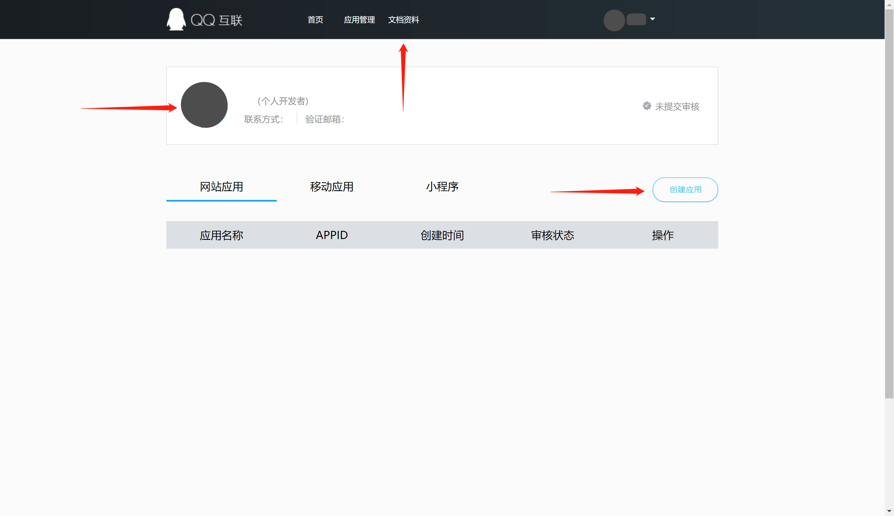

<IntegrationDetailCard title="Create a website application on QQ Open Platform">

Go to [QQ Connect Center](https://connect.qq.com/manage.html#/) to create a website application:  
Click on your personal QQ avatar on the upper left of the page to complete the registration and initiate the review, then click "Website Application" and "Create Application" to create a website application that uses QQ login. If you encounter any problems during the process, please refer to the QQ official "Documentation" at the top of the page.

During the application creation process, you need to configure the allowed callback address, please use the following settings:
`https://core.genauth.ai/connection/social/qq/:userPoolId/callback`

> Please replace `:userPoolId` with your user pool ID

</IntegrationDetailCard>
