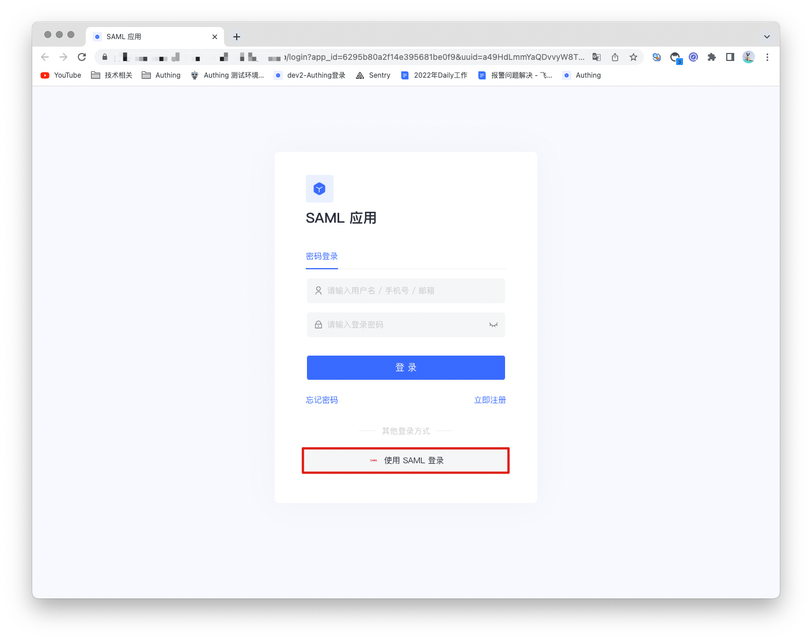
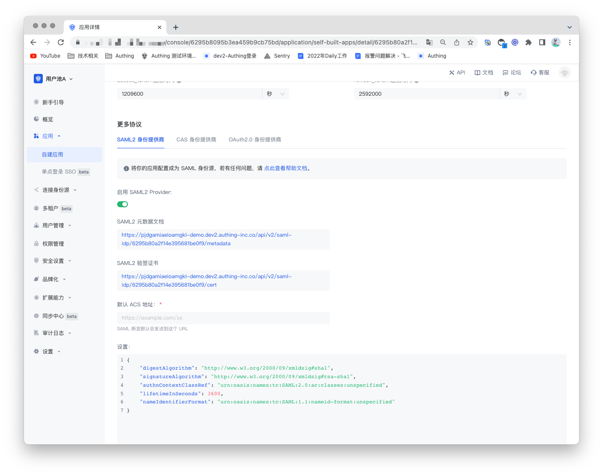
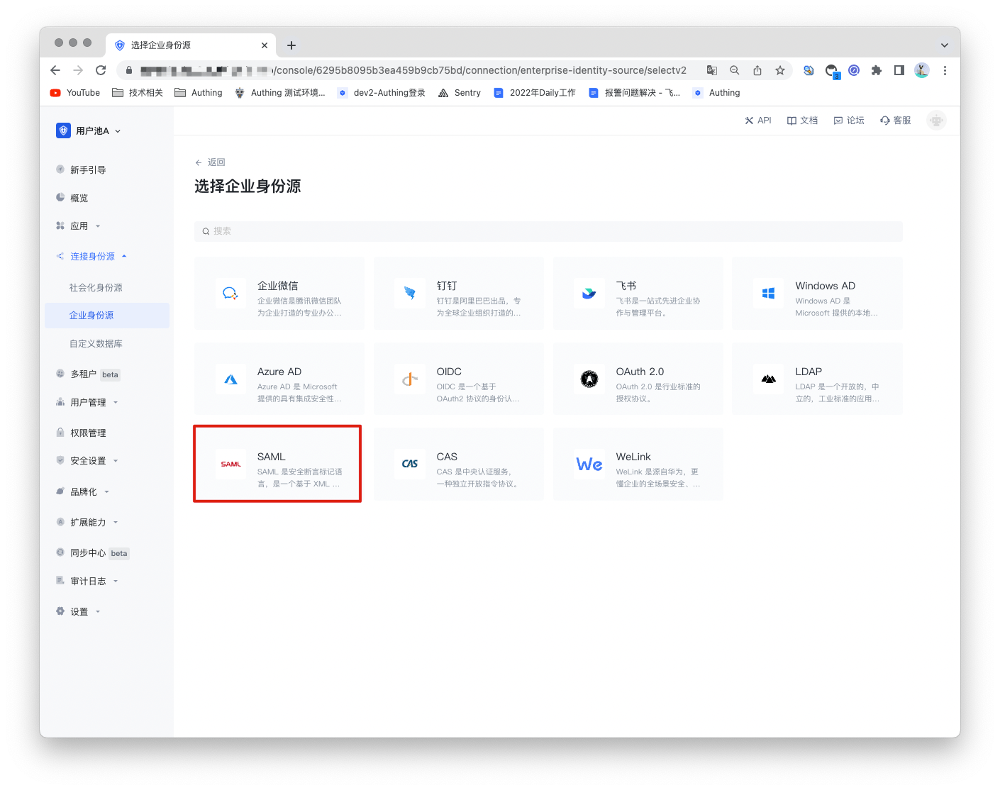
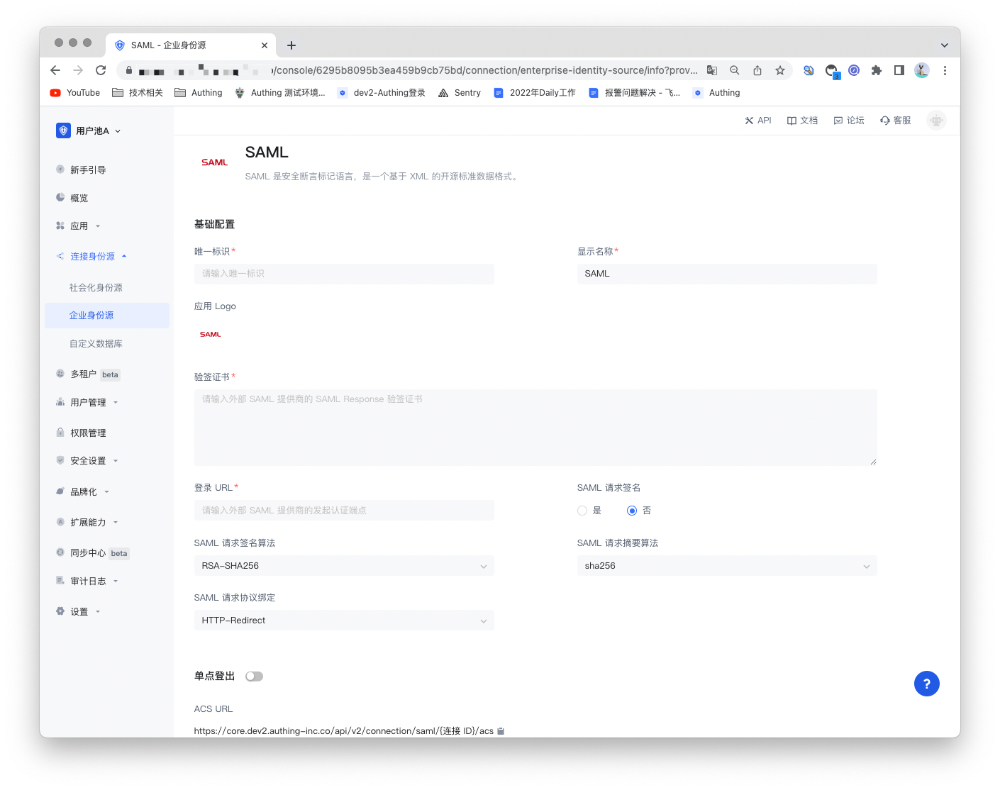
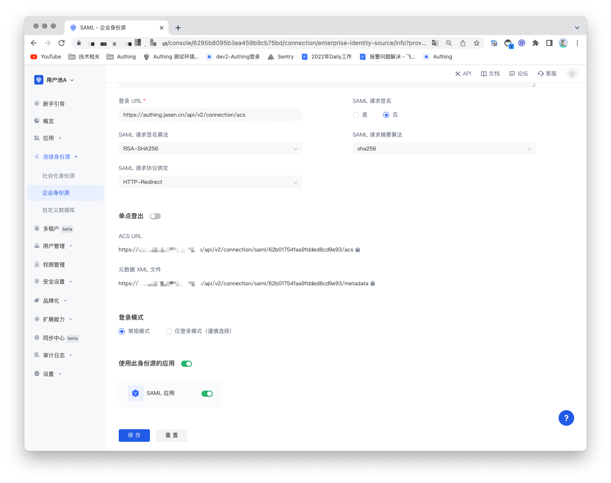

# SAML Identity Source

<LastUpdated/>

## Scenario Introduction

- **Overview**: Security Assertion Markup Language (SAML, pronounced sam-el) is an open source standard data format based on **XML** that exchanges authentication and authorization data between parties, especially between identity providers and service providers. SAML2.0 can implement cross-domain single sign-on (SSO) based on the network to reduce the management overhead of distributing multiple authentication tokens to a user.
- **Application scenario**: PC website
- **End user preview image**:

## Notes

- A service that supports SAML protocol capabilities is required;
- If you have not opened a GenAuth console account, please go to [GenAuth console](https://www.genauth.ai/) to register a developer account;

## Step 1: Create a SAML identity source

Open the SAML2 identity provider in GenAuth to provide **identity assertions** for other service providers. Make GenAuth a SAML identity source, and other systems can access GenAuth as an identity provider through the SAML protocol. For details, please refer to: [Become a SAML identity source](https://docs.genauth.ai/guides/federation/saml.html).

## Step 2: Configure SAML identity source in GenAuth console

2.1 Open **GenAuth console** and enter the user pool to which you want to connect the SAML identity source, which is called **"User Pool B"**. Select "Connect Identity Source" > "Enterprise Identity Source" in the left menu, and select "Create Enterprise Identity Source" in the right panel.

2.2 Find "SAML" in the right panel and click it.

2.3 Fill in the configuration content required by the SAML protocol according to the SAML configuration requirements.

| Number | Field/Function                   | Description                                                                                                                                                                            |
| ------ | -------------------------------- | -------------------------------------------------------------------------------------------------------------------------------------------------------------------------------------- |
| 2.3.1  | Unique ID                        | a. The unique ID consists of lowercase letters, numbers, and -, and its length is less than 32 bits. b. This is the unique ID of this connection and cannot be modified after setting. |
| 2.3.2  | Display Name                     | This name will be displayed on the button of the end user's login interface.                                                                                                           |
| 2.3.3  | Application Logo                 | The identity source logo displayed on the login interface button.                                                                                                                      |
| 2.3.4  | Verification Certificate         | The verification certificate of the SAML Identity Provider.                                                                                                                            |
| 2.3.5  | Login URL                        | The login URL of the SAML Identity Provider.                                                                                                                                           |
| 2.3.6  | SAML Request Signature           | Whether to encrypt the SAML request.                                                                                                                                                   |
| 2.3.7  | SAML Request Signature Algorithm | Defaults to rsa-sha256.                                                                                                                                                                |
| 2.3.8  | SAML Request Digest Algorithm    | Defaults to sha256.                                                                                                                                                                    |
| 2.3.9  | SAML Request Protocol Binding    | Defaults to HTTP-Redirect.                                                                                                                                                             |
| 2.3.10 | ACS URL                          | Assertion consumption address.                                                                                                                                                         |
| 2.3.11 | Metadata XML File                | Address of SAML Identity Provider metadata.                                                                                                                                            |
| 2.3.12 | Login Mode                       | After enabling "Login Only Mode", you can only log in to existing accounts, and cannot create new accounts. Please choose carefully.                                                   |

After configuration is complete, click the "Save" button to complete the creation.

## Step 3: Development Access

- **Recommended Development Access Method**: Use Hosted Login Page

- **Advantages and Disadvantages**: Simple operation and maintenance, GenAuth is responsible for operation and maintenance. Each user pool has an independent secondary domain name; if you need to embed it in your application, you need to log in using the pop-up mode, that is, after clicking the login button, a window will pop up with the login page hosted by GenAuth, or redirect the browser to the login page hosted by GenAuth.

- **Detailed access method**:

  3.1 Create an application in the GenAuth console. For details, see: [How to create an application in GenAuth](/guides/app-new/create-app/create-app.md).

  3.2 On the created SAML identity source connection details page, open and associate an application created in the GenAuth console.

3.3 Experience SAML enterprise login on the login page

