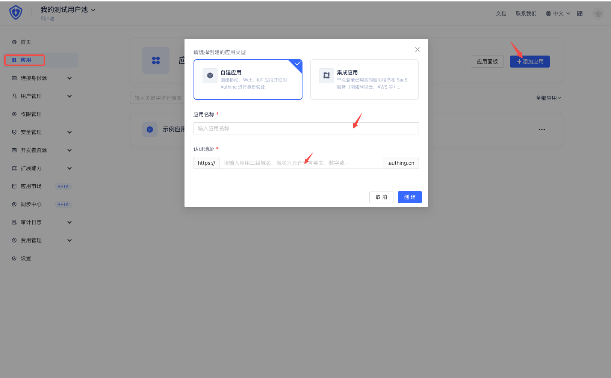
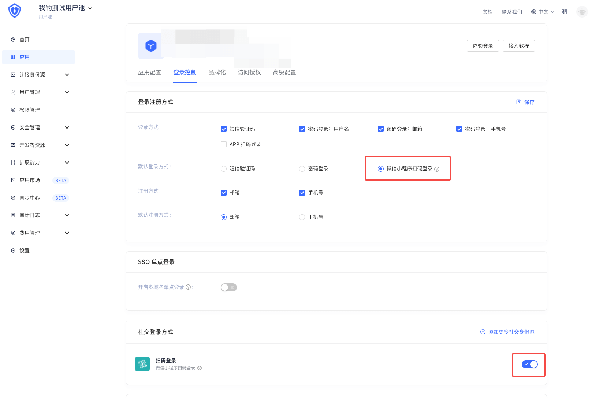

<IntegrationDetailCard :title="`Create an application in ${$localeConfig.brandName}`">

To connect your users to external identity providers, you need to create an application in the console.

Select the default login method and save

</IntegrationDetailCard>
