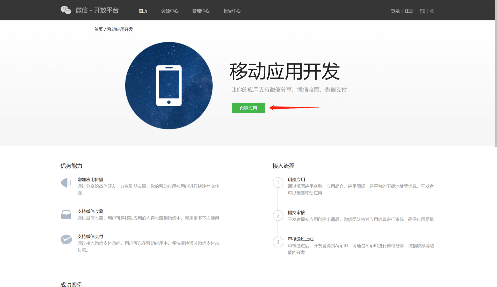
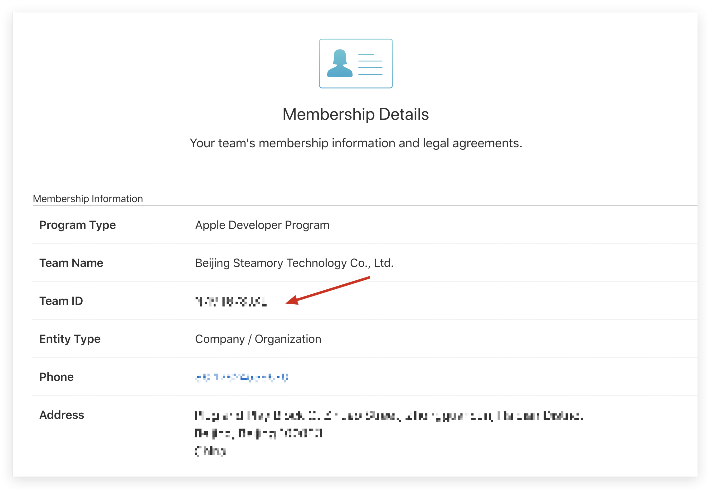
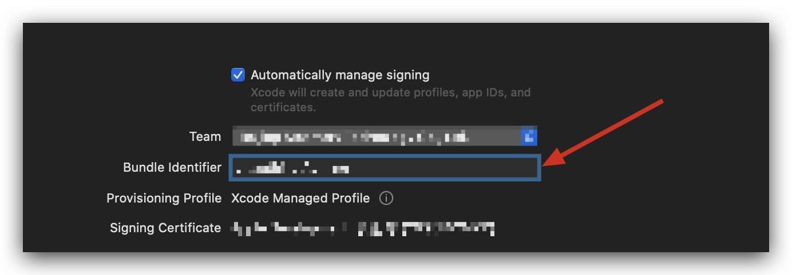
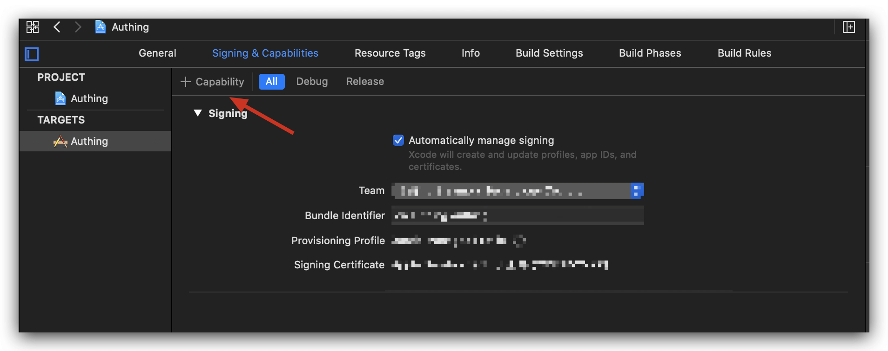
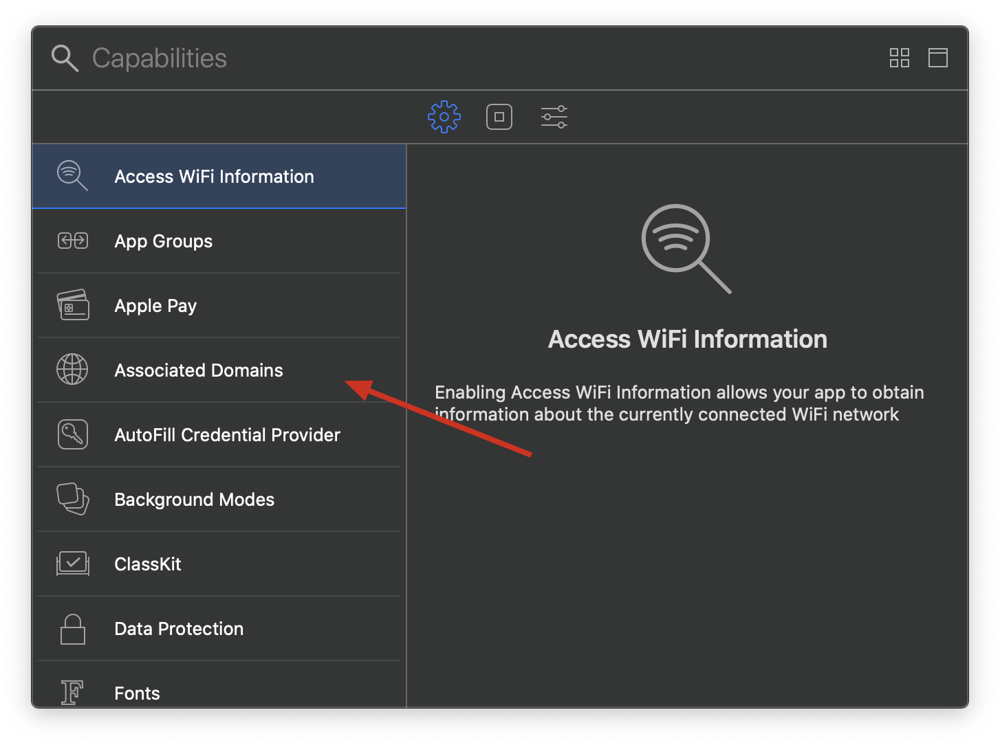
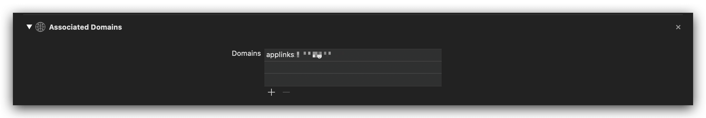
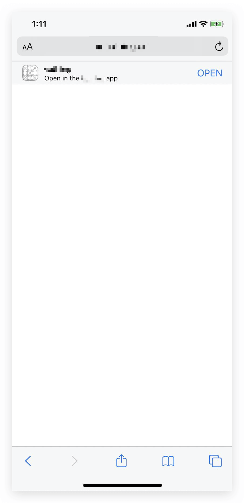
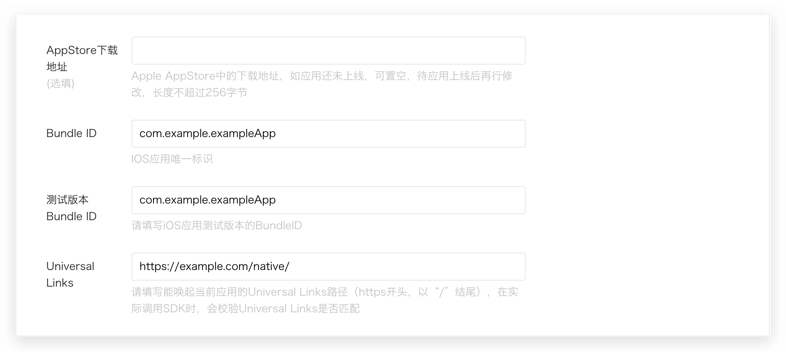

<IntegrationDetailCard title="Create a website app on WeChat Open Platform">

### Create an app on WeChat Open Platform

Please register and log in on [WeChat Open Platform](https://open.weixin.qq.com/cgi-bin/frame?t=home/app_tmpl&lang=zh_CN), then click "Create App" to start creating your mobile app.
You need to record the **App ID** and **App Secret** of the app, which will be needed later.


<br>

### Configure iOS Universal Links

> Starting from WeChat WechatOpenSDK 1.8.6, iOS mobile apps need to fill in Universal Links information. If you want to develop an Android app or have already configured it, you can skip this section. [Apple official documentation can be found here](https://developer.apple.com/documentation/uikit/inter-process_communication/allowing_apps_and_websites_to_link_to_your_content/enabling_universal_links).

#### Configure apple-app-site-association file

Find your Team ID on the **Membership** page of the Apple Developer console:



Find the Bundle Identifier in Xcode **Targets** -> **Signing & Capabilities**:



Next, create the apple-app-site-association file:

Assuming your Team ID is xxxxxxx, Bundle Identifier is com.example.exampleApp, and the Path of Universal Link is set to `/native/*`, then apple-app-site-association is as follows:

Assuming your Team ID is xxxxxxx, Bundle Identifier is com.example.exampleApp, and the Path of Universal Link is set to `/native/*`, then apple-app-site-association As follows:

```json
{
  "applinks": {
    "apps": [],
    "details": [
      {
        "appIDs": ["xxxxxxx.com.example.exampleApp"],
        "paths": ["/native/*"]
      }
    ]
  }
}
```

You need to deploy this file to the .well-known/apple-app-site-association link of your domain name. If your domain name is example.com, you need to access the file through https://example.com/.well-known/apple-app-site-association. The following points need to be noted:

- **Must use https**
- apple-app-site-association needs to be a valid JSON file, but **without the .json suffix**.
- content-type needs to be set to application/json
- Please **use the \* wildcard** for paths, as required by WeChat.

The following is an example of nginx configuration: (here, put the apple-app-site-association file in a .well-known folder)

```nginx
server {
listen 80;
listen 443 ssl;

server_name genauth.ai;

ssl_certificate /mnt/cerm/client/1_genauth.ai_bundle.crt;
ssl_certificate_key /mnt/cerm/client/2_genauth.ai.key;
ssl_session_timeout 5m;
ssl_ciphers ECDHE-RSA-AES128-GCM-SHA256:ECDHE:ECDH:AES:HIGH:!NULL:!aNULL:!MD5:!ADH:!RC4;
ssl_protocols TLSv1 TLSv1.1 TLSv1.2;
ssl_prefer_server_ciphers on;

location /.well-known {
alias /path/to/your/.well-known/folder;
try_files $uri $uri/ =404;
}
}
```

#### Configure Associated Domains in Xcode

Next, configure Associated Domains in Xcode. In Xcode **Targets** -> **Signing & Capabilities** page, click **+Capability** :



Select Associated Domains:



Assuming your domain name is example.com, fill in `applinks:example.com` :



#### Verify that Universal Links are effective

Assuming your domain name is example.com and Path is `/native/*`, after installing your app on your phone, use Safari browser to visit `https://example.com/native/`, and pull the web page online, you should be able to see your app:



Visit `https://example.com/native/xxx` again, and you can still see it.

#### Fill in Universal Links in WeChat Open Platform



</IntegrationDetailCard>
