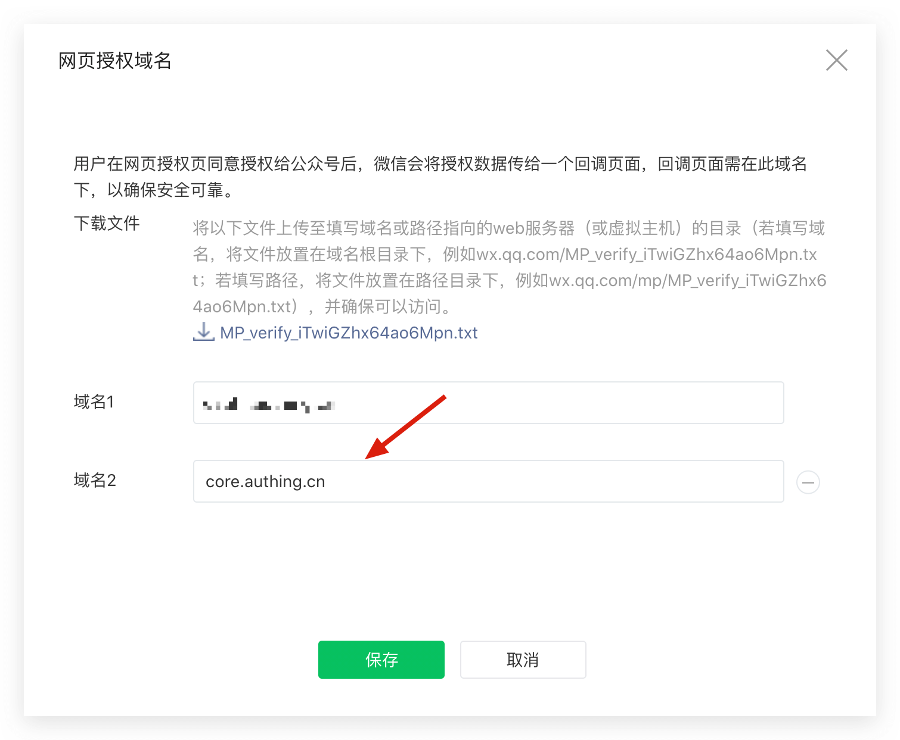

<IntegrationDetailCard title="Create a service account in WeChat public platform">

You can get **Developer ID (AppID)** and **Developer password (AppSecret)** in the Development -> Basic Configuration page of WeChat public platform backend.

After that, you need to set the web authorization scope name to `core.genauth.ai` in the **Settings** -> **Public Account Settings** -> **Function Settings** page of WeChat public platform backend:

</IntegrationDetailCard>
