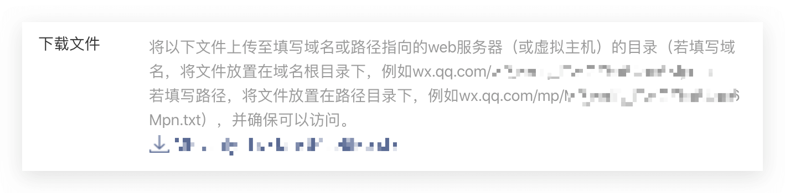

<IntegrationDetailCard :title="`Fill in the application configuration in ${$localeConfig.brandName}`">

You need to add the configuration of the application you created in the previous step in {{$localeConfig.brandName}}:

1. In the [{{$localeConfig.brandName}} console](https://console.genauth.ai), go to the "Social Identity Source" configuration page and click "Create Social Identity Source" to start selecting and creating.

2. Among all the social identity source icons, find and enter the **WeChat** identity source.

3. In the configuration form, fill in the following configuration according to the instructions:

For security verification considerations, the WeChat server needs to make a request verification with the {{$localeConfig.brandName}} server. Developers need to download the txt file and record the **file name** and **text content**.

- `Unique ID`: Please enter a custom unique ID to represent the current identity source connection;
- `Display Name`: Please enter the display name, which will be displayed on the button of the terminal user's login interface;
- `App ID`: WeChat application ID;
- `App Secret`: WeChat application key;
- `Txt Filename`: Txt file name used to verify the domain name.
- `Txt Content`: Txt file content used to verify the domain name.
- `Callback URL`: If you want to jump directly to the social identity source for authentication without any GenAuth page in the middle, you can configure this parameter as the business callback address after successful authentication. GenAuth will send the user's ID Token to this URL. For example, if your website domain name is https://example.com, and the url for processing the {{$localeConfig.brandName}} callback request is /auth/callback, then you should fill in `https://example.com/auth/callback`. **This parameter has nothing to do with the callback link in the application configuration**. If you configure the callback link separately in the application, you can fill in `#` in the address here.

4. After the configuration is completed, click the "Create" button to complete the creation.

</IntegrationDetailCard>
