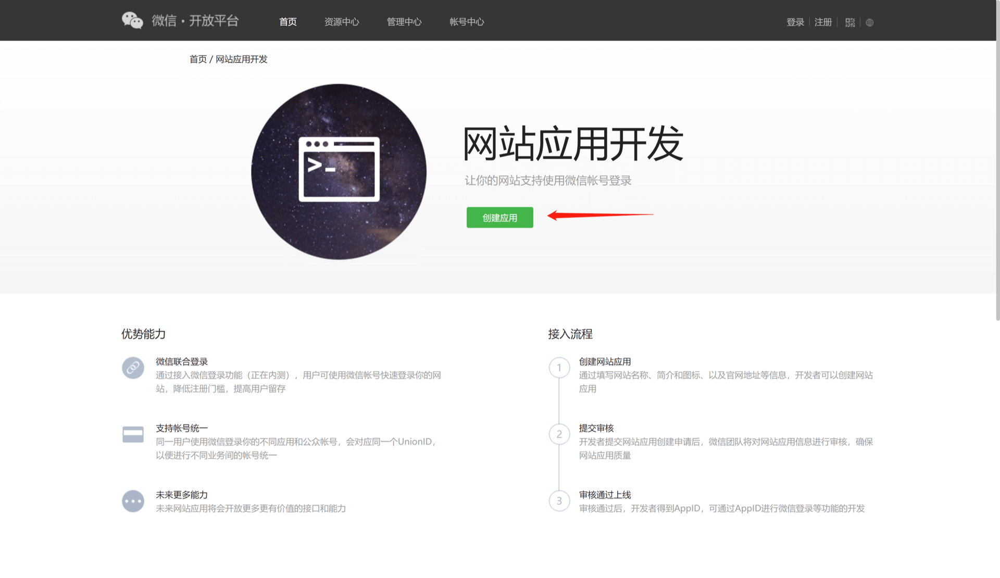
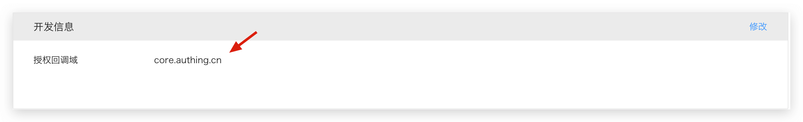

<IntegrationDetailCard title="Create a website application on WeChat Open Platform">

Please register and log in on [WeChat Open Platform](https://open.weixin.qq.com/cgi-bin/frame?t=home/web_tmpl&lang=zh_CN), then click "Create Application" to start creating your website application.
You need to record the **App ID** and **App Secret** of the application, which will be needed later.

Please make sure that the application has obtained the **WeChat login** permission.

Please set the authorization callback domain to `core.genauth.ai`:

</IntegrationDetailCard>
