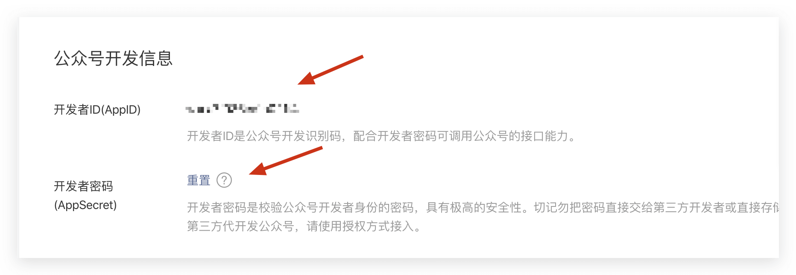
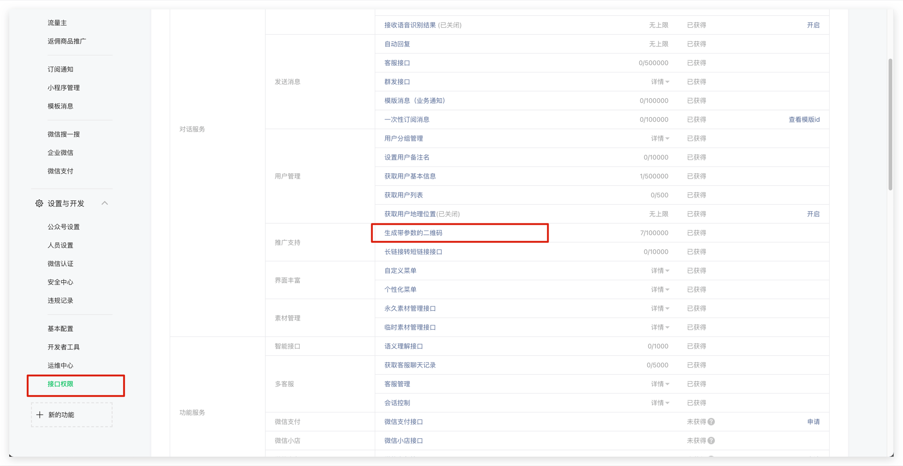

<IntegrationDetailCard title="Note before development">

Due to the requirements of the WeChat platform, only **service accounts** have the [Generate a QR code with parameters](https://developers.weixin.qq.com/doc/offiaccount/Account_Management/Generating_a_Parametric_QR_Code.html) API capability. Please make sure that your public account is of **service account** type.

</IntegrationDetailCard>

<IntegrationDetailCard title="Get public account development information">

You can get **Developer ID (AppID)** and **Developer Password (AppSecret)** on the **Develop** -> **Basic Configuration** page in the WeChat public platform backend.

</IntegrationDetailCard>

<IntegrationDetailCard title="Set IP whitelist">

You need to add the IP of the GenAuth server to the **IP whitelist** of the WeChat public account. You can [click here](https://core.genauth.ai/api/system/public-ips) to obtain the external IP list of the GenAuth server.

</IntegrationDetailCard>

<IntegrationDetailCard title="Add API permissions">

You need to add the [Generate a QR code with parameters](https://developers.weixin.qq.com/doc/offiaccount/Account_Management/Generating_a_Parametric_QR_Code.html) interface permission on the **Settings and Development**-**Interface Permission** page of the WeChat Official Account platform:

</IntegrationDetailCard>

<IntegrationDetailCard title="Select server configuration mode">

You can enable server configuration on the **Development** -> **Basic Configuration** page of the WeChat Official Account platform backend. When the user scans the official account QR code and follows the official account, GenAuth can receive the user's scan code and follow events to complete the login.

Since only one WeChat server configuration can be set, you need to choose two different modes according to your specific scenario:

- **Mode 1**: Set the server address to the GenAuth server endpoint. This mode is the simplest, but all events of the WeChat public account will be pushed to the GenAuth server, and you will lose other events except scanning and following.

- **Mode 2**: Set the server address to your own server, and then forward the scanning and following events to the GenAuth server endpoint. This mode requires some development work, but will not lose events, and is conducive to more expansion based on public account events in the future.

</IntegrationDetailCard>

<IntegrationDetailCard title="Mode 1: Set the server address to the GenAuth server endpoint">

- **URL**: Set to `https://core.genauth.ai/connections/social/<identifier>/<USERPOOL_ID>/events` (replace \<identifier\> with the unique identifier you entered in the GenAuth console configuration area, and replace \<USERPOOL_ID\> with your [User Pool ID](/guides/faqs/get-userpool-id-and-secret.md));
- **Token**: You can set the Token in the WeChat official account to any string. It must be English or numbers and 3-32 characters long. Make sure that the token you configure in the GenAuth console is consistent with the token provided by the official account you need to access.
- **EncodingAESKey**: The message encryption key consists of 43 characters and can be modified randomly. The character range is A-Z, a-z, 0-9;
- **Message encryption and decryption method**: Please select according to business needs. It is recommended to use **Secure mode**;

Do not click Save for now. You need to fill in the above configuration and AppID and AppSecret in the GenAuth console. Select **WeChat** in **Connect Identity Source** - **Social Login**, select **WeChat Official Account Scan Code to Follow Login** as the connection method, and fill in the above configuration:

Finally, click Submit, and you should be able to see a success prompt.

Finally, don’t forget to enable this server configuration:

</IntegrationDetailCard>

<IntegrationDetailCard title="Mode 2: Set the server address to your own server, and then forward the scan code and follow events to the GenAuth server endpoint">

The configuration process is exactly the same as mode 1. You only need to set the URL to your own server address. You need to complete the interface verification and message forwarding operations at the server endpoint you configured.

For the specific process and sample code, please see this Demo: [https://github.com/Authing/authing-wechat-official-account](https://github.com/Authing/authing-wechat-official-account).

</IntegrationDetailCard>
