<IntegrationDetailCard title="Before creating a development template, you need to become an enterprise WeChat service provider">

Enter the enterprise WeChat [service provider official website](https://open.work.weixin.qq.com), click to become an enterprise WeChat service provider

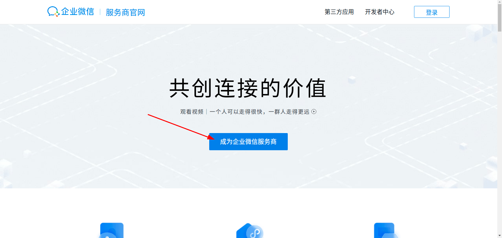

Enterprise WeChat administrator scans the code to confirm that you have become an enterprise WeChat service provider

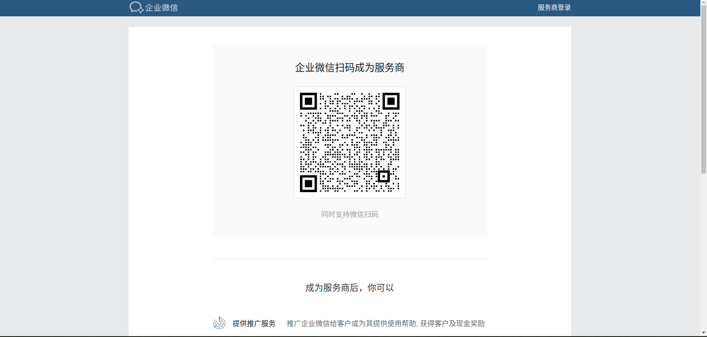

Enter the enterprise [WeChat service provider backend](https://open.work.weixin.qq.com/wwopen/login)

</IntegrationDetailCard>

<IntegrationDetailCard title="Create a development template">

Enter the application management at the top, click on application development, and click on create a development application template

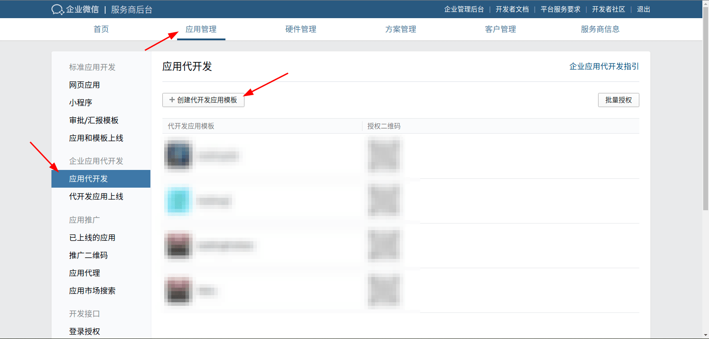

Configure the basic information of the development application template

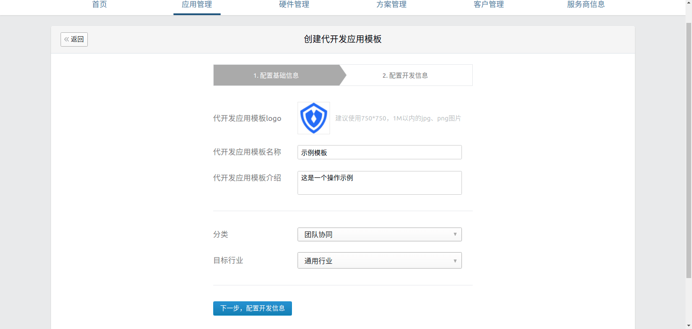

Configure development information

1. Fill in **unique identifier** and **display name** in {{$localeConfig.brandName}}

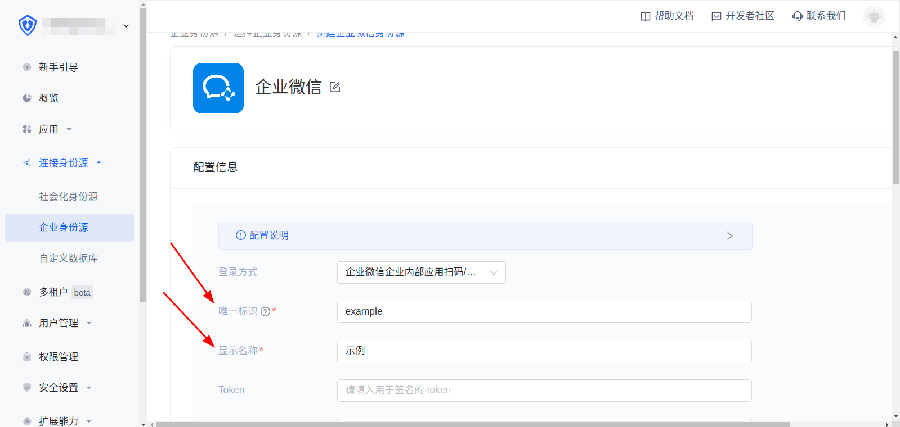

2. Set {{$localeConfig.brandName}} Copy the **Event Address** in **Development Template Callback URL**

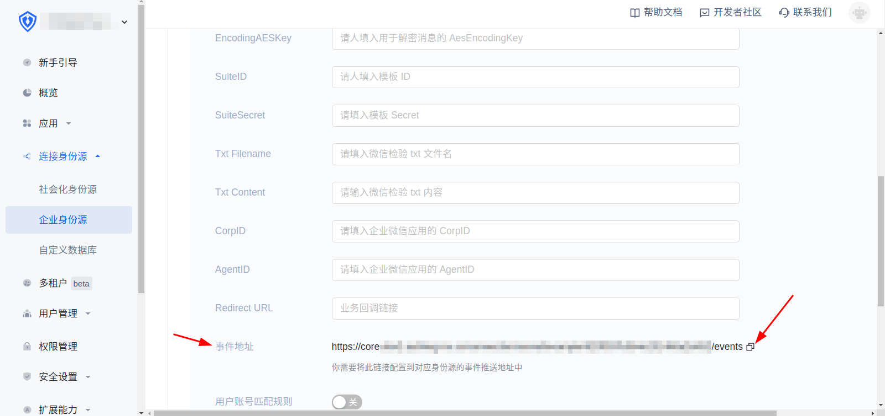

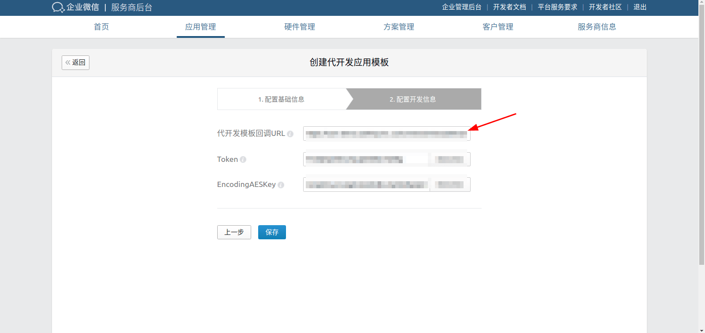

3. Randomly obtain **Token** and **EncodingAESKey** and fill the generated **Token** and **EncodingAES** into **Token** and **EncodingAESKey** in {{$localeConfig.brandName}}, and finally click Create

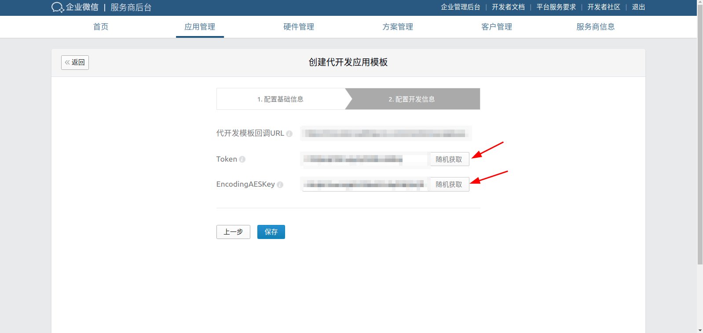

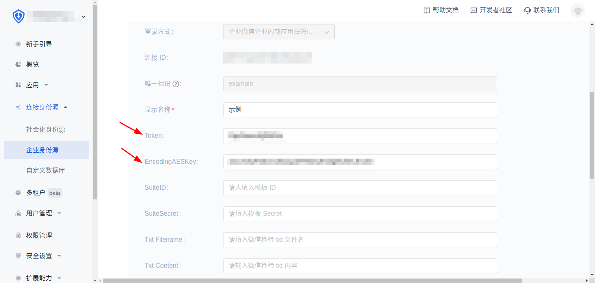

Click Create

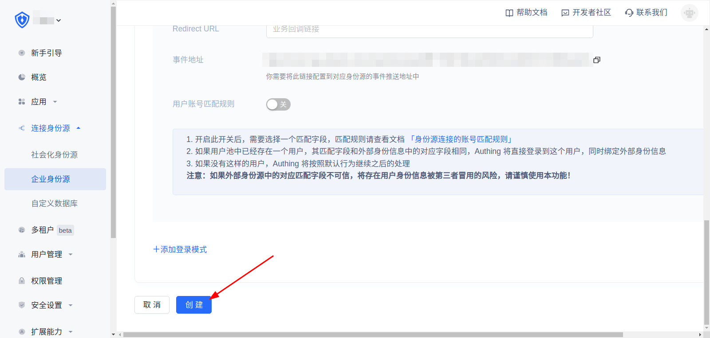

4. Click Save

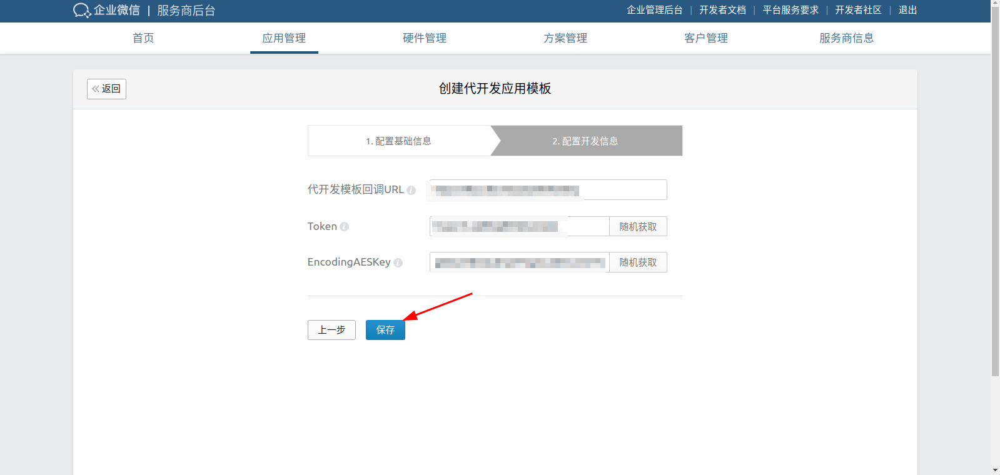

**During this process, the WeChat backend will verify whether the development template callback is available. Please follow the order strictly**

</IntegrationDetailCard>

<IntegrationDetailCard title="Online development template">

Under application management, click on the development application online and submit it online

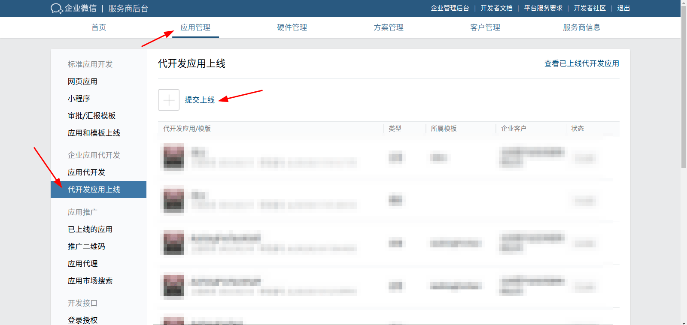

Select the development application template just created and click OK

After the review is passed, click on the development application template that was just submitted for review, and click Submit to go online

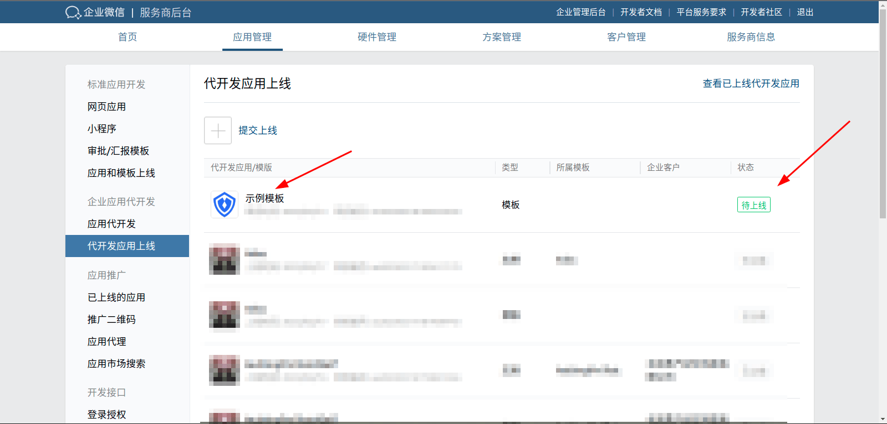

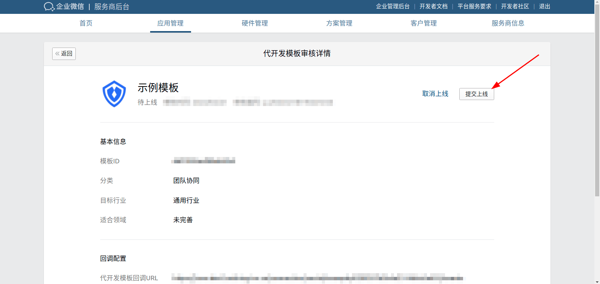

</IntegrationDetailCard>
