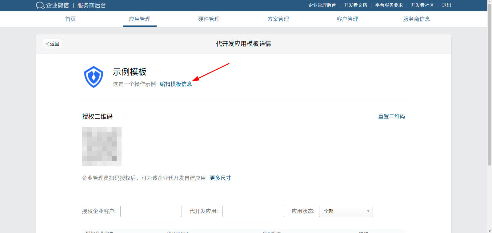
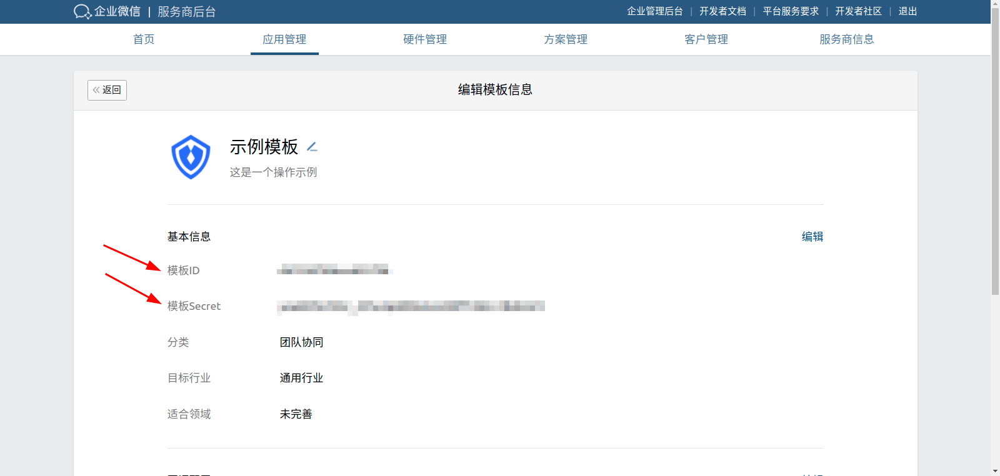
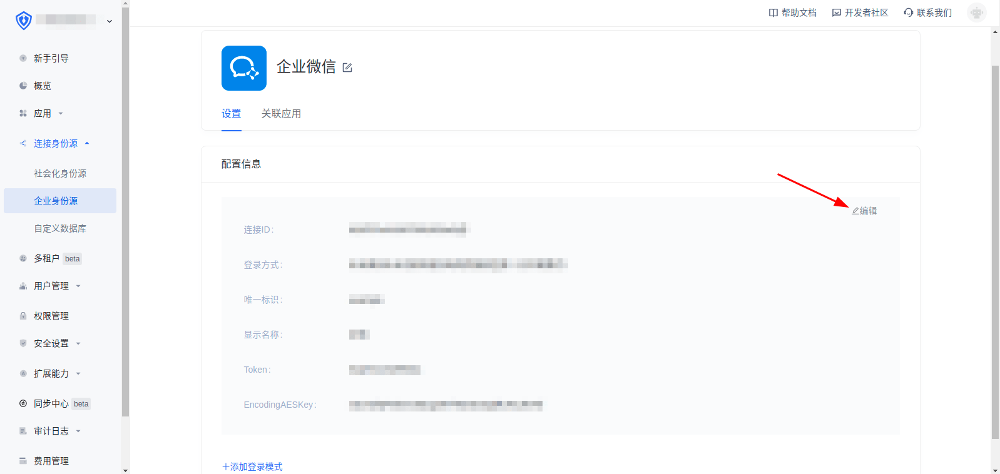
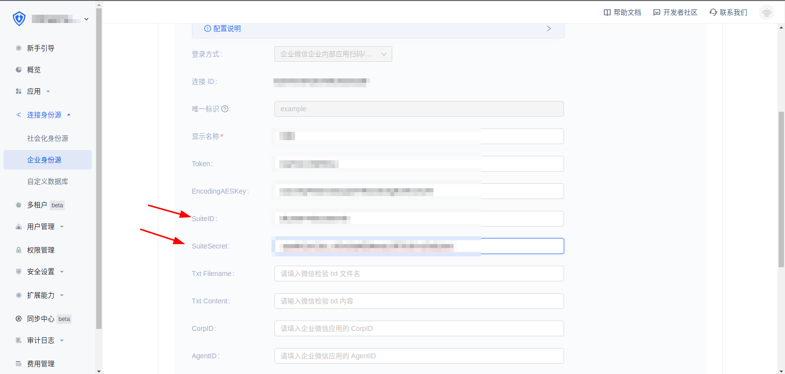

<IntegrationDetailCard title="Fill in the application template information for development">

Enter the service provider backend, application management, application development, click the application development template just created

Click to edit template information

Fill in the template ID and template Secret with the SuiteID and SuiteSecret and save   

</IntegrationDetailCard>
