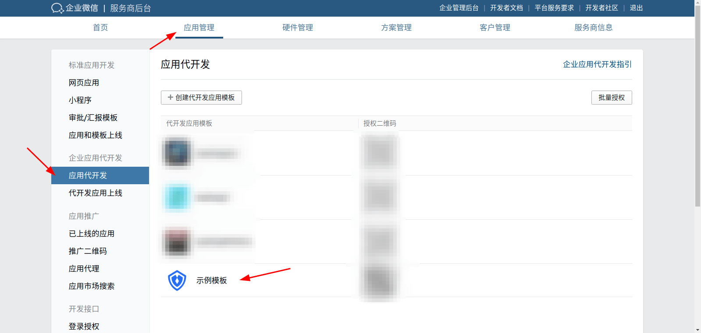
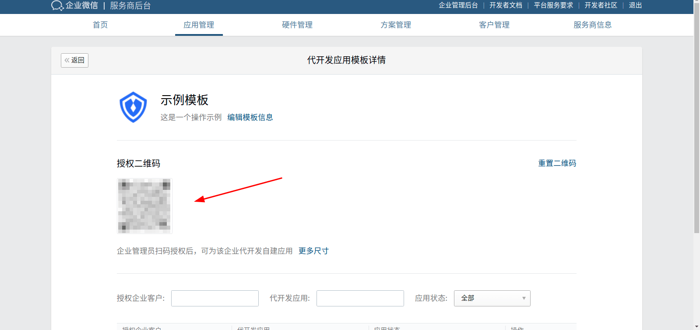
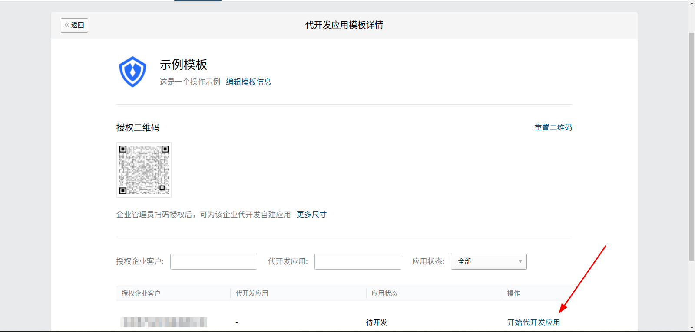
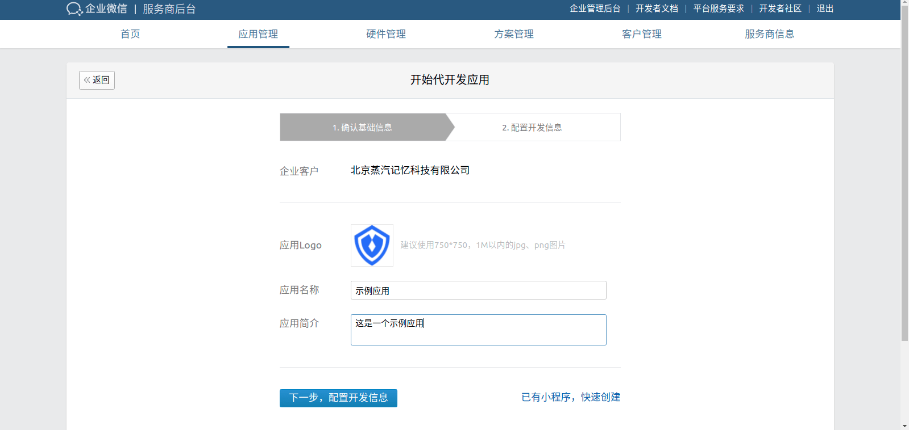
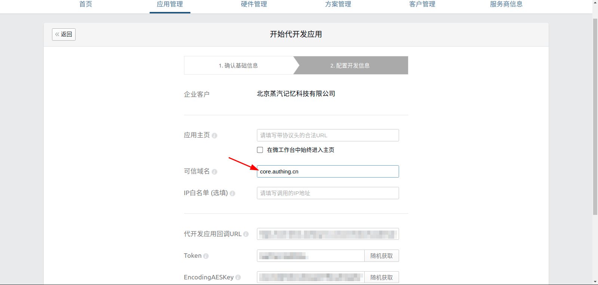

<IntegrationDetailCard title="Start application development">

In application development, click the application development template just created, and the enterprise administrator scans the authorization QR code

Refresh the page

The modern development application appears at the bottom of the page. Click to start the development application

Confirm the basic information

Configure the development information and fill in core.genauth.ai in the trusted domain name

Click Save

</IntegrationDetailCard>
