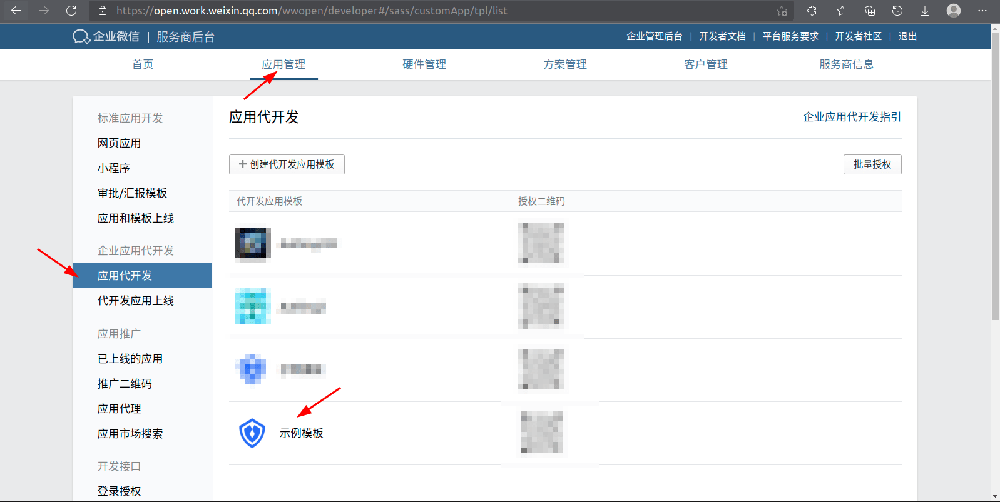

<IntegrationDetailCard title="Configure and launch the generation development application">

Re-enter the generation development application

Edit and use the configuration

![image-20220221111855654] (./images/image-20220221111855654.png)

Click to verify the trusted domain name

Download the file

Fill the file name and content into FileTxt and FileContent of {{$localeConfig.brandName}} , click Save

Save the configuration of the application developed in WeChat for Enterprise

Set WeChat for Enterprise Authorization Login

On Web Fill in core.genauth.ai in the authorization callback field on the web page

After the configuration is completed, you can submit for review

After the review is passed, the status of the development application is changed to pending launch

Click to enter the application to be launched and submit it for launch

</IntegrationDetailCard>
