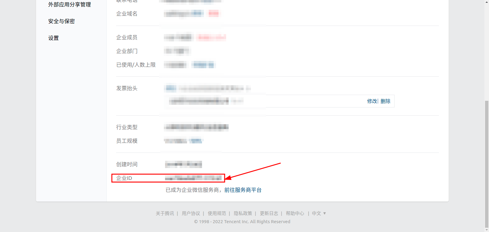
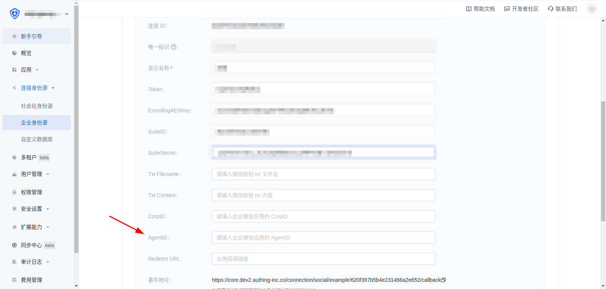

<IntegrationDetailCard title="Configure and launch agent development application AgentId">

In the enterprise management backend, **My Enterprise** View **Enterprise ID**

In **CorpID** in {{$localeConfig.brandName}}, fill in **Enterprise ID**

</IntegrationDetailCard>

<IntegrationDetailCard title="Configure and launch the AgentId for development application">

In the self-built application in the enterprise management backend, fill in the AgentId in {{$localeConfig.brandName}}

Click the visible range and select the visible range by yourself. Only the selected organization members can use {{$localeConfig.brandName}} Log in

Click on the authorization information

Select the member sensitive information allowed

</IntegrationDetailCard>
