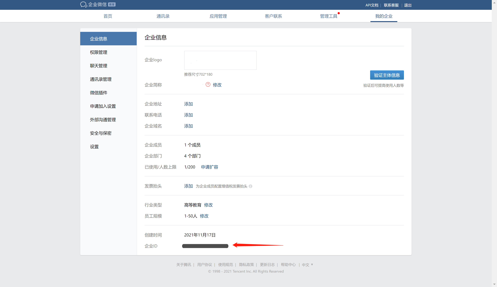
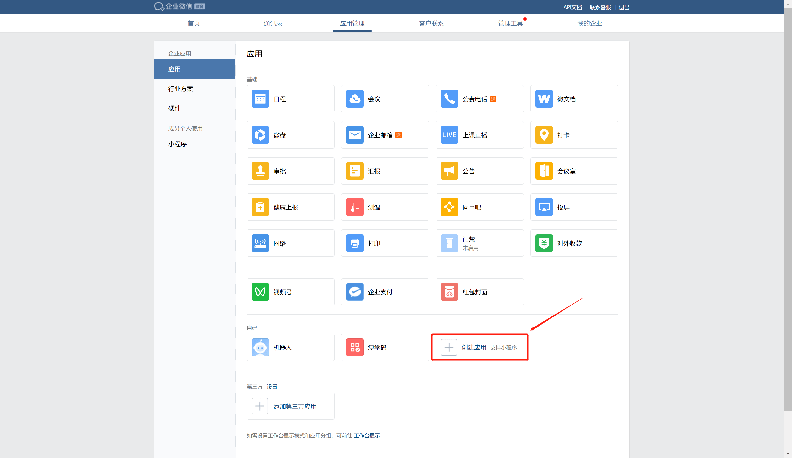
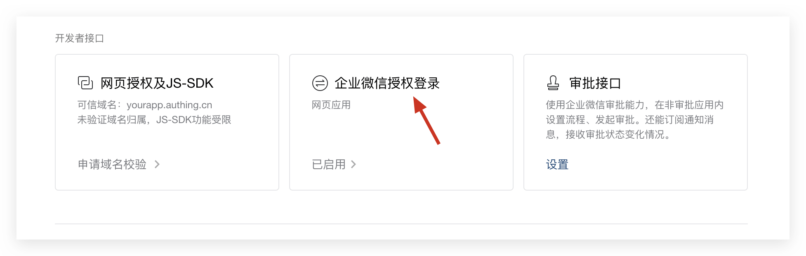
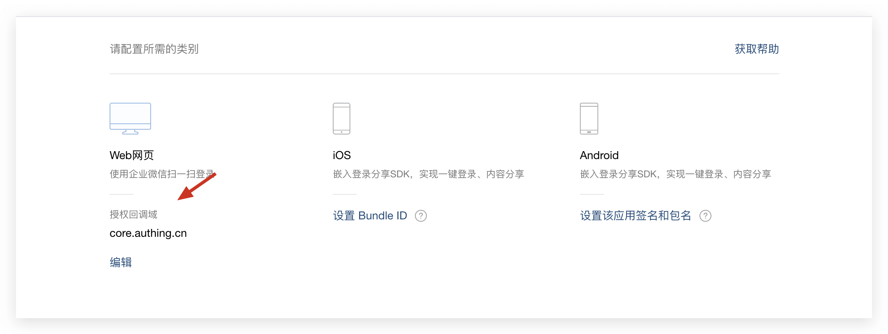

<IntegrationDetailCard title="Get the Enterprise ID (CorpID)">

Enter [Enter the WeChat backend](https://work.weixin.qq.com/wework_admin/frame#profile), and on the **My Enterprise** - **Enterprise Information** page, you can get the Enterprise ID:

</IntegrationDetailCard>

<IntegrationDetailCard title="Create a self-built application">

On the **Application Management** - **Application** page, create a self-built application:

</IntegrationDetailCard>

<IntegrationDetailCard title="Get AgentID and Secret">

On the application details page, you can get the application's **AgentId** and **Secret**:

</IntegrationDetailCard>

<IntegrationDetailCard title="Enable WeChat Enterprise Authorization Login">

On the application details page, click Set WeChat Enterprise Authorization Login:

On the newly opened page, set the authorization callback domain to core.genauth.ai.

</IntegrationDetailCard>

<IntegrationDetailCard title="Add Web Authorization Trust Domain Name">

On the application details page, set the web authorization and JS-SDK domain name, and fill in `core.genauth.ai` for the domain address.

</IntegrationDetailCard>
