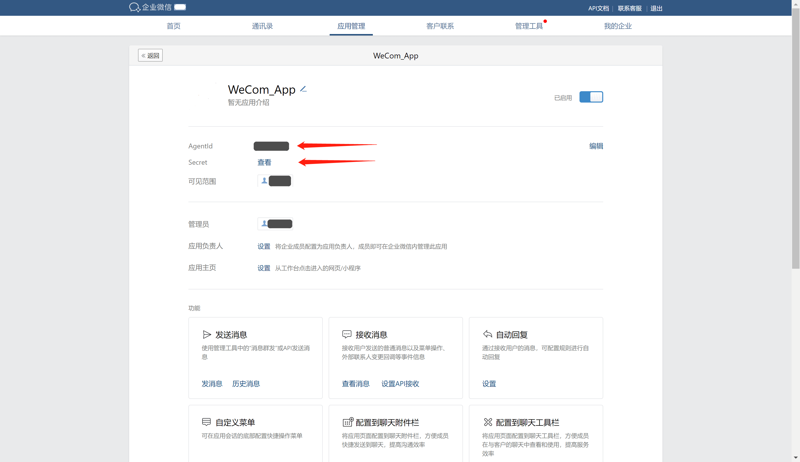

<IntegrationDetailCard title="Get the Enterprise ID (CorpID)">

Enter [Enter the WeChat backend](https://work.weixin.qq.com/wework_admin/frame#profile), and on the **My Enterprise** - **Enterprise Information** page, you can get the Enterprise ID:

</IntegrationDetailCard>

<IntegrationDetailCard title="Create a self-built application">

On the **Application Management** - **Application** page, create a self-built application:

</IntegrationDetailCard>

<IntegrationDetailCard title="Get AgentID and Secret">

On the application details page, you can get the application's **AgentId** and **Secret**:

</IntegrationDetailCard>

<IntegrationDetailCard title="Enable enterprise WeChat authorized login and obtain Schema">

On the application details page, click to set enterprise WeChat authorized login:

Click the IOS or Android option, obtain the schema and fill in the application signature and package name of the application

</IntegrationDetailCard>
